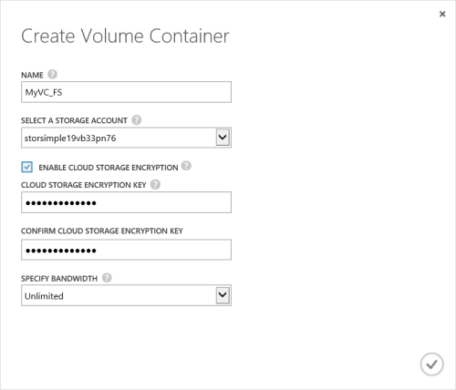

<!--author=SharS last changed: 9/17/15-->

#### Erstellen eines Containers Lautstärke

1. Klicken Sie auf **Hinzufügen eines Containers Lautstärke**, Gerät **Schnellstart** Seite. Das Dialogfeld **Lautstärke Container erstellen** wird angezeigt.

    

2. Klicken Sie im Dialogfeld **Container Datenträger erstellen** :
  1. Geben Sie einen **Namen** für Ihre Lautstärke Container. Der Name muss 3 bis 32 Zeichen lang sein.
  2. Wählen Sie eine **Speicher-Konto** dieses Volume Container zuordnen. Sie können das Standardkonto auswählen, das zum Zeitpunkt der Erstellung von Diensten generiert wird. Die Option **neue hinzufügen** können Sie auch ein Speicherkonto angeben, die nicht mit diesem Dienst-Abonnement verknüpft ist.
  3. Wählen Sie die **Cloud-Speicher-Verschlüsselung aktivieren** , um die Verschlüsselung der vom Gerät in der Cloud gesendeten Daten zu aktivieren.
  4. Bereitstellen Sie und bestätigen Sie eines **Verschlüsselungsschlüssels für Cloud-Speicher** , 8 bis 32 Zeichen lang ist. Dieser Schlüssel wird vom Gerät Zugriff auf verschlüsselte Daten verwendet.
  5. Wenn Sie alle verfügbare Bandbreite nutzen möchten, wählen Sie in der Dropdownliste **angeben Bandbreite** **unbeschränkt** . Sie können diese Option auf **benutzerdefinierte** Steuerelemente Bandbreite wendet festgelegt, und geben Sie einen Wert zwischen 1 und 1.000/s. 
  Wenn Sie Ihre Bandbreite Verwendungsinformationen zur Verfügung haben, möglicherweise Sie basierend auf einem Zeitplan, indem Sie angeben, **Wählen Sie eine Vorlage Bandbreite**Bandbreite zuordnen können. Eine schrittweise Anleitung wechseln Sie zum [Hinzufügen einer Vorlage Bandbreite](storsimple-manage-bandwidth-templates.md#add-a-bandwidth-template).
  6. Klicken Sie auf das Kontrollkästchen-Symbol  zum Speichern von diesem Volume Container, und beenden Sie den Assistenten. 

  Klicken Sie auf der Seite **Lautstärke Container** wird der neu erstellten Volume Container aufgeführt sein.

 **Video verfügbar**

Wenn Sie ein Video zur Verfügung, die das Erstellen eines Containers Lautstärke in Ihre Lösung StorSimple veranschaulicht, klicken Sie auf [hier](https://azure.microsoft.com/documentation/videos/create-a-volume-container-in-your-storsimple-solution/).