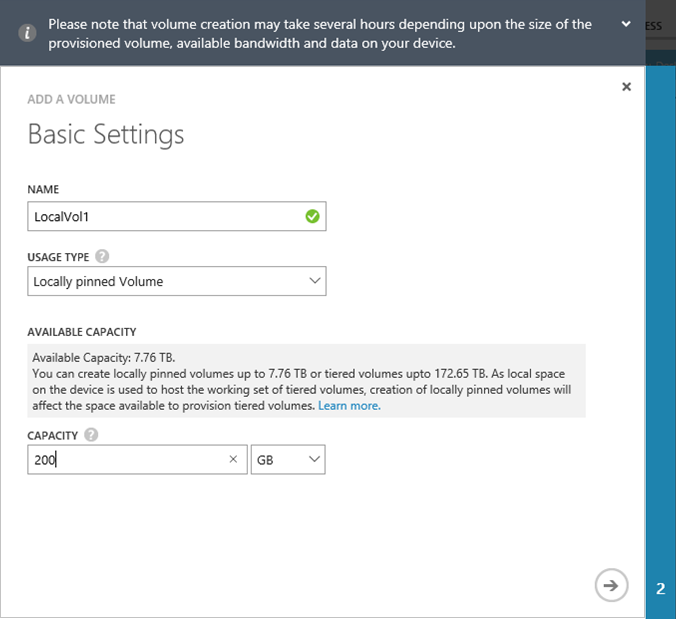
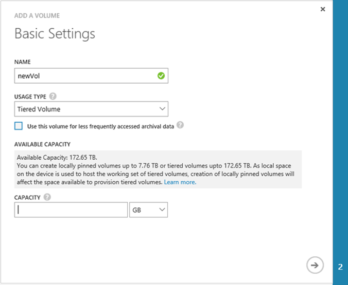
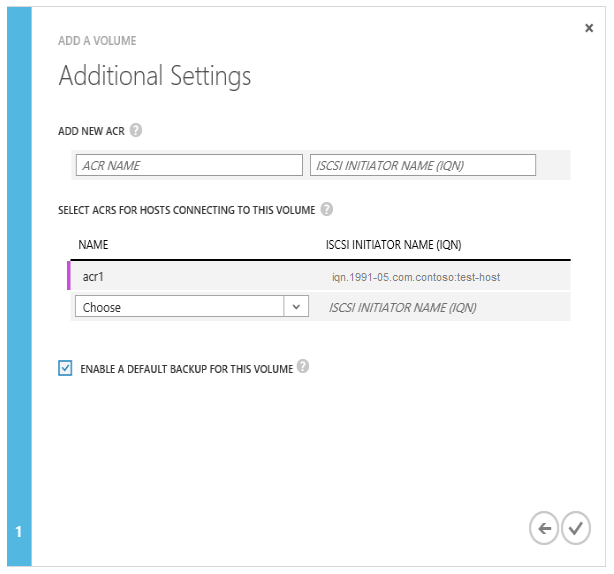

<!--author=alkohli last changed: 08/16/2016-->

#### So erstellen Sie einen Datenträger

1. Klicken Sie auf der Seite Geräte für **Schnellstart** auf **hinzufügen einen Datenträger** , um die Lautstärke Assistenten zum Hinzufügen von zu starten.

2. Hinzufügen eines Volumen-Assistenten, klicken Sie unter **Grundlegende Einstellungen**:

    4. Geben Sie einen **Namen** für die Lautstärke ein.
    5. Wählen Sie in der Dropdown-Liste den **Typ der Verwendung** für die Lautstärke ein. Wählen Sie für Auslastung, die lokale Garantien, niedrige Wartezeiten und bessere Leistung erfordern, ein Volume **lokal angehefteten** ein. Wählen Sie für alle anderen Daten ein **Tiered** Volume ein. Wenn Sie diesem Handbuch für archivierte Daten verwenden, aktivieren Sie **dieses Volume für weniger häufig verwendeter Archivierung Daten verwenden**. 
    
        Ein lokales angeheftete Volume Linienstärke bereitgestellt wird, und es wird sichergestellt, dass die primären Daten auf dem Datenträger lokal auf dem Gerät bleibt und werden nicht in der Cloud Effekts.  Wenn Sie ein lokales angeheftete Volume erstellen, überprüft das Gerät für den verfügbaren Speicherplatz auf den lokalen Ebenen, die Lautstärke der angeforderten Größe bereitzustellen. Der Vorgang des Erstellens eines lokal angeheftete Lautstärke kann umfassen Zwischenspeichern von vorhandenen Daten aus dem Gerät in der Cloud und die Verarbeitungszeit für die Lautstärke erstellen möglicherweise lang sein. Die Gesamtzeit, hängt von der Größe der bereitgestellte Lautstärke, verfügbaren Bandbreite und die Daten auf Ihrem Gerät. 

        Eine gestufte Lautstärke Thin Provisioning bereitgestellt wird, und kann schnell erstellt werden. Auswählen von **diesem Handbuch für weniger häufig verwendeter Archivierung Daten verwenden** für gestufte Lautstärke für Archivierung Daten vorgesehen sind ändert die Deduplication Textbaustein Größe für die Lautstärke auf 512 KB. Wenn dieses Feld nicht aktiviert ist, wird das entsprechende gestufte Volume eine Textbaustein Größe von 64 KB verwendet. Eine größere Deduplication Textbaustein Größe ermöglicht das Gerät, um die Übertragung von großen Archivierung Daten in der Cloud zu beschleunigen.

    3. Geben Sie die **Kapazität nach der Bereitstellung** für die Lautstärke an. Notieren Sie die Kapazität, die zur Verfügung basierend auf dem Datenträger ausgewählt. Die angegebene Volumegröße darf den verfügbaren Platz nicht überschreiten.

        Sie können lokal angeheftete Datenmengen Bereitstellung von bis zu 8.5 TB oder gestufte Datenmengen auf dem Gerät 8100 bis zu 200 TB. Klicken Sie auf das größere 8600 Gerät können Sie lokal angeheftete Datenmengen bereitstellen bis zu 22,5 TB oder gestufte Datenmengen bis zu 500 TB. Während der Arbeit Festlegen der gestufte Datenmengen hosten lokalen Speicherplatz auf dem Gerät erforderlich ist, wirkt sich Entstehung lokal angeheftete Datenmengen auf den verfügbaren Speicherplatz für die Bereitstellung gestufte Datenmengen aus. Daher, wenn Sie ein lokales angeheftete Volume erstellen, für die Erstellung von gestufte Datenmengen verfügbarer Speicherplatz verringert. Wenn ein gestufte Volume erstellt wird, wird auf ähnliche Weise der verfügbare Platz für die Erstellung von lokal angeheftete Datenmengen verringert.

        Wenn Sie eine lokal angeheftete Lautstärke 8.5 TB (maximal zulässige Größe) auf Ihrem Gerät 8100 bereitstellen, müssen Sie alle im lokalen Speicherplatz auf dem Gerät ausgelastet. Sie können werden keine gestufte Lautstärke an dieser Stelle zu erstellen, oder höher als kein lokale Platz des Geräts ist für die Arbeit Festlegen des Datenträgers gestufte hosten. Vorhandene gestufte Datenmengen wirken sich auch auf den verfügbaren Speicherplatz aus. Wenn Sie haben angehefteten einer 8100-Gerät, das bereits Datenmengen ungefähr 106 TB gestuft hat nur 4 TB Abstand lokal für verfügbar ist beispielsweise Datenmengen.

        Die folgende Abbildung zeigt das Dialogfeld **Grundlegende Einstellungen** für einen lokal angeheftete Datenträger.

         

        Die folgende Abbildung zeigt das Dialogfeld **Grundlegende Einstellungen** für ein gestufte Volume.

         

   4. Klicken Sie auf das Pfeilsymbol  um zur nächsten Seite zu wechseln.

3. Klicken Sie im Dialogfeld **Weitere Einstellungen** Hinzufügen eines neuen Datensatzes für Access-Steuerelement (ACR):

    1. Geben Sie einen **Namen** für Ihre ACR ein.
    2. Geben Sie unter **iSCSI Initiatornamen**, die iSCSI qualifizierte Namen (IQN) von Ihrem Windows-Host. Wenn Sie mit der IQN besitzen, wechseln Sie zum [Abrufen der IQN eines Windows Server-Hosts](#get-the-iqn-of-a-windows-server-host).
    3. Klicken Sie unter **Standardeinstellungen für die Sicherung für dieses Volume?**, aktivieren Sie das Kontrollkästchen **Aktivieren** . Die Standardeinstellungen für die Sicherung erstellt eine Richtlinie, die ausgeführt wird, um jeden Tag (Gerätezeit) 22:30 und erstellt eine Momentaufnahme der Cloud von diesem Handbuch.
     
     > [AZURE.NOTE] Nachdem die Sicherung hier aktiviert ist, kann es nicht wiederhergestellt werden. Sie müssen die Lautstärke zur Änderung dieser Einstellung zu bearbeiten.

     

4. Klicken Sie auf das Kontrollkästchen-Symbol . Ein Volume wird mit der angegebenen Einstellungen erstellt.

