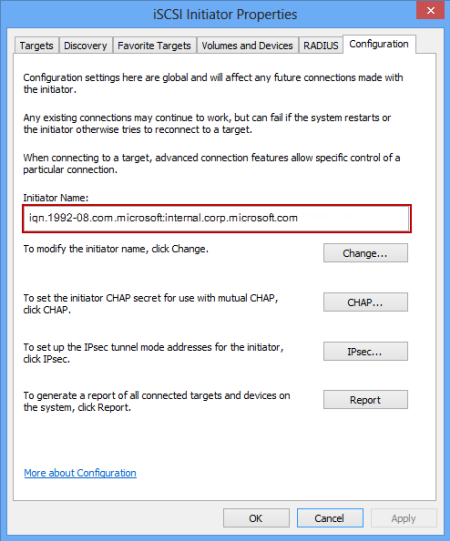

<!--author=SharS last changed: 9/17/15-->

#### Zum Abrufen der IQN von einem Windows-host

1. Starten Sie den Microsoft iSCSI Initiator auf Ihrem Windows-Host ein. Klicken Sie auf **Start** > **Verwaltung** > **iSCSI Initiator**.

2. Das Fenster **iSCSI-Initiatoreigenschaften** auf der Registerkarte **Konfiguration** wählen Sie und kopieren Sie die Zeichenfolge aus dem Feld **Initiatornamen** .
 
    

3. Speichern Sie diese Zeichenfolge an.
