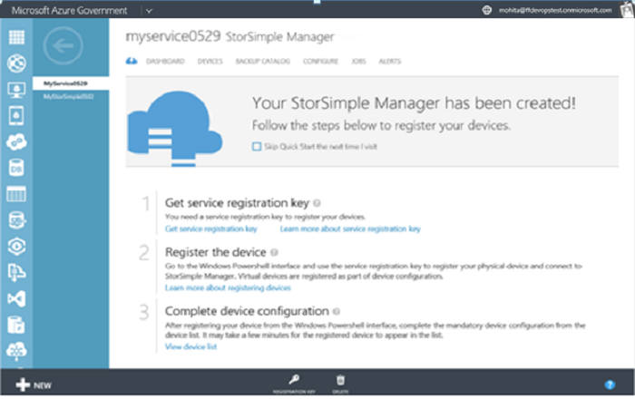
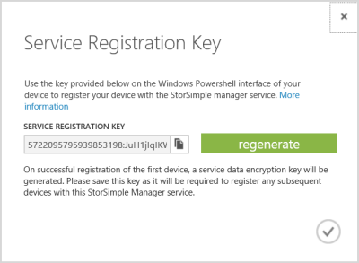

<!--author=SharS last changed: 9/17/15-->

#### Zum Abrufen der StorSimple-Service-Registrierungsschlüssel

1. Klicken Sie auf der Seite **StorSimple Manager-Dienst** auf den Dienst, den Sie erstellt haben. Dadurch gelangen Sie zur Seite **Schnellstart** . (Sie können klicken Sie auf das Symbol Schnellstart  auf die Seite **Schnellstart** zu einem beliebigen Zeitpunkt zugreifen.)

     

2. Klicken Sie auf **Dienst-Registrierungsschlüssel zu erhalten**. Sie können auch **Registrierungsschlüssel** am unteren Rand der Seite klicken. Sie müssen ein paar Minuten warten, während die Taste abgerufen wird. Das Dialogfeld **Dienst Registrierungsschlüssel** angezeigt wird.

     

3. Suchen Sie nach der Service-Registrierungsschlüssel.

4. Klicken Sie auf das Symbol "Kopieren"  Kopieren die Taste und zur späteren Verwendung zu speichern.

5. Klicken Sie auf das Symbol Kontrollkästchen  dieses Dialogfeld zu schließen und zur Seite **Schnellstart** zurückzukehren.

> [AZURE.NOTE] Der Dienst Registrierungsschlüssel wird verwendet, um die alle Geräte registrieren, die mit Ihrem Dienst StorSimple Manager registrieren müssen.

 