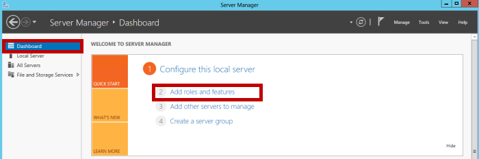
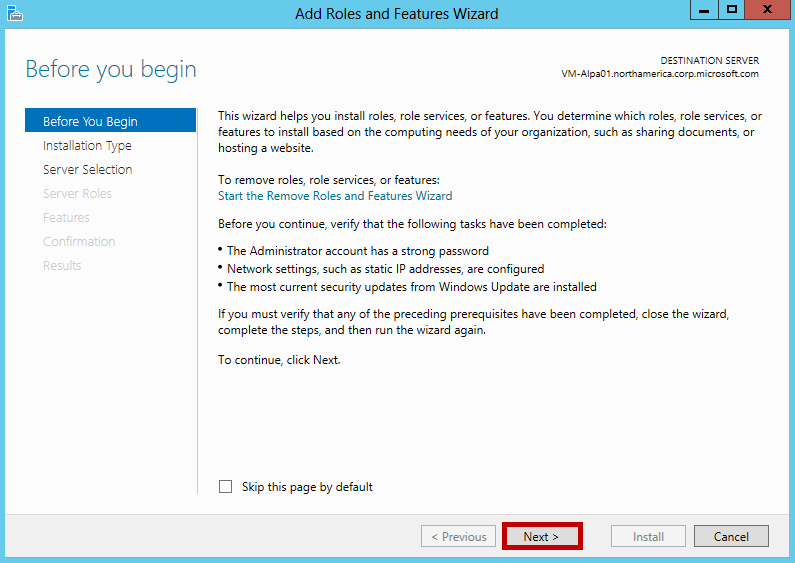
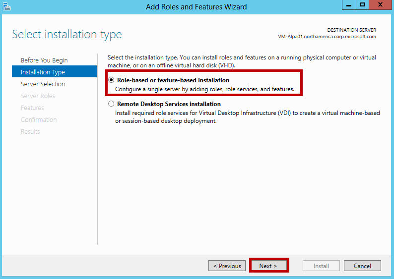
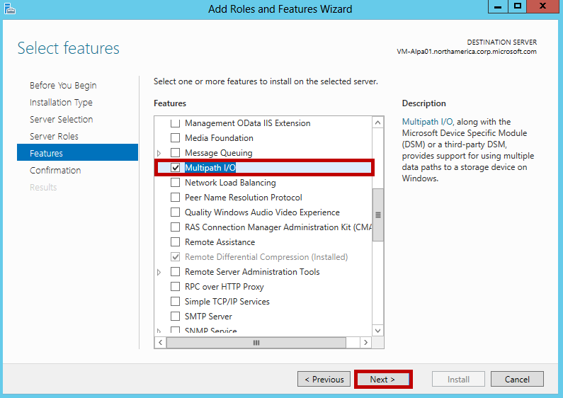
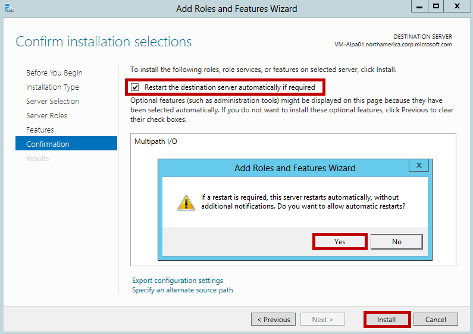
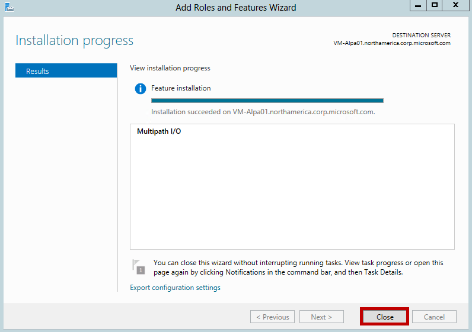

#### So installieren Sie MPIO auf dem host

1. Öffnen Sie Server-Manager auf Ihrem Windows Server-Host ein. Standardmäßig wird gestartet Server-Manager, wenn ein Mitglied der Gruppe Administratoren Protokolle an einem Computer, auf dem Windows Server 2012 R2 oder Windows Server 2012 ausgeführt wird. Wenn der Server-Manager noch nicht geöffnet ist, klicken Sie auf **starten > Server-Manager**.

    

2. Klicken Sie auf **Server-Manager > Dashboards > Hinzufügen von Rollen und Features**. Hierdurch wird der Assistent zum **Hinzufügen von Rollen und Features** .

    

3. Im Assistenten zum **Hinzufügen von Rollen und Features** folgendermaßen Sie vor:

    - Klicken Sie auf der Seite **, bevor Sie beginnen** auf **Weiter**.
    - Akzeptieren Sie die Standardeinstellung **rollenbasierte oder featurebasierten** -Installation, auf der Seite **Wählen Sie Installation aus** . Klicken Sie auf **Weiter**.
    
        
    - Wählen Sie auf der Seite **Wählen Sie Zielserver** aus, **Wählen Sie einen Server aus dem Serverpool**. Ihrem Servers sollte automatisch erkannt werden. Klicken Sie auf **Weiter**.
    - Klicken Sie auf der Seite **Serverrollen auswählen** auf **Weiter**.
    - Wählen Sie auf der Seite **Features auswählen** **Mehrere Pfade e/a**aus, und klicken Sie auf **Weiter**.
    
        
    - Klicken Sie auf der Seite **Confirm Installationsauswahl** bestätigen Sie die Auswahl und wählen Sie dann **den Zielserver neu starten, automatisch, falls erforderlich**, wie unten dargestellt. Klicken Sie auf **Installieren**.
    
        
    - Sie werden benachrichtigt, wenn die Installation abgeschlossen ist. Klicken Sie auf **Schließen** , um den Assistenten zu schließen.
    
        