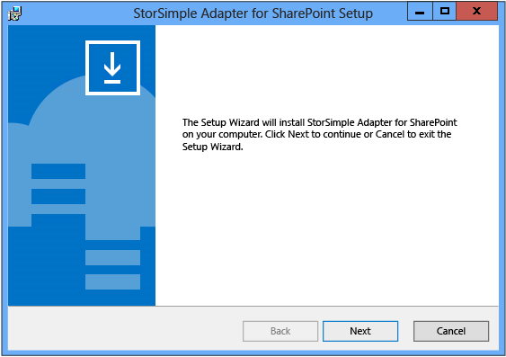
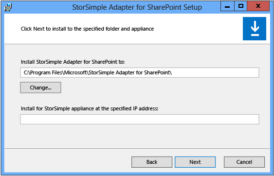
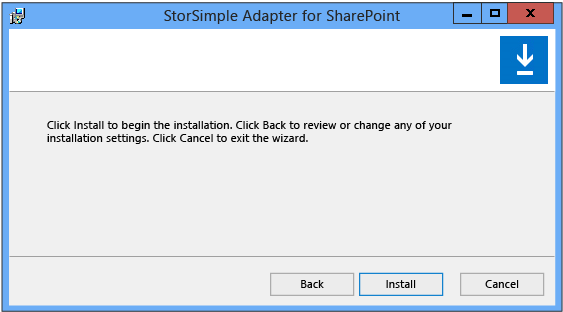
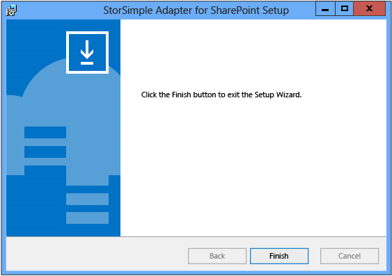

<!--author=SharS last changed: 9/17/15-->

#### So installieren Sie die Netzwerkadapter StorSimple für SharePoint

1. Kopieren Sie das Installationsprogramm auf der front-End (WFE) Webserver, der auch für die Ausführung der Webanwendung SharePoint-Zentraladministration konfiguriert ist. 

2. Verwenden Sie ein Konto mit Administratorrechten an den WFE-Server anzumelden.

3. Doppelklicken Sie auf das Installationsprogramm. Die StorSimple-Grafikkarte für SharePoint-Setup-Assistent wird gestartet. Klicken Sie auf **Weiter** , um zu der Installation zu beginnen.

    

4. Wählen Sie in der StorSimple Netzwerkadapter für SharePoint-Konfiguration Einrichtungsseite einen Installationsspeicherort, geben Sie die IP-Adresse der Schnittstelle 0 Daten auf Ihrem Gerät StorSimple, und klicken Sie dann auf **Weiter**. 

     

5. Klicken Sie in der Bestätigungsseite Setup auf **Installieren**.

     

6. Klicken Sie auf **Fertig stellen** , um den Setup-Assistenten zu schließen.

     

7. Öffnen der Seite SharePoint-Zentraladministration. Eine Gruppe StorSimple-Konfiguration, die die StorSimple-Grafikkarte für SharePoint Links enthält, sollte angezeigt werden.

8. Wechseln zum nächsten Schritt: [RSP konfigurieren](#configure-rbs).
