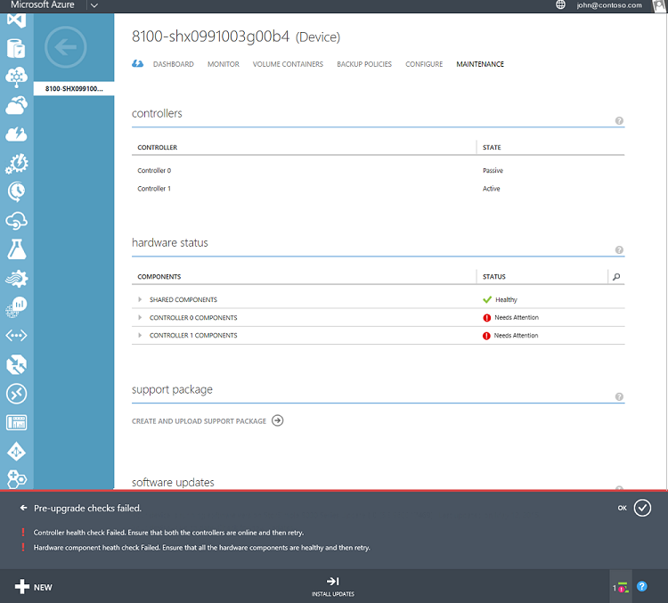

<!--author=alkohli last changed: 03/17/16-->

## Problembehandlung von Fehlern aktualisieren

**Was geschieht, wenn Sie eine Benachrichtigung angezeigt, die vor dem upgrade Prüfungen fehlgeschlagen sind?**

Wenn ein Häkchen vor dem fehlschlägt, stellen Sie sicher, dass Sie die detaillierte Benachrichtigungsleiste am unteren Rand der Seite besprochen haben. Dies erfahren Sie, welche vor dem Kontrollkästchen fehlgeschlagen ist. Die folgende Abbildung zeigt eine Instanz, in der eine solche Benachrichtigung angezeigt wird. In diesem Fall sind die Controller integritätsprüfung und Hardware-Komponente integritätsprüfung ausgefallen. Klicken Sie im Abschnitt **Hardware Status** können Sie sehen, dass sowohl **Controller 0** und **1 Controller** Komponenten Aufmerksamkeit benötigen.

  

Sie benötigen, um sicherzustellen, dass beide Controller fehlerfrei und online sind. Sie müssen außerdem sicherstellen, dass alle Hardware-Komponenten in das Gerät StorSimple angezeigt werden, klicken Sie auf der Seite zum Warten fehlerfrei sein. Sie können dann versuchen, Updates installieren. Wenn Sie nicht die Hardware Komponente Probleme beheben können, müssen Sie für die nächsten Schritte Microsoft-Support wenden.

**Was passiert, wenn Sie eine Fehlermeldung "Updates konnte nicht installiert werden", und die Empfehlungen erhalten, besteht darin, schlagen Sie das Update problembehandlungsleitfadens, um die Ursache des Fehlers zu ermitteln?**

Eine mögliche Ursache hierfür könnte, dass Sie keine Verbindung zu den Microsoft Update-Servern haben. Hierbei handelt es sich um eine manuelle Überprüfung, die ausgeführt werden soll. Wenn die Verbindung zum Update-Server unterbrochen, würde Ihre Arbeit Aktualisierung fehl. Sie können das folgende Cmdlet aus der Windows PowerShell-Benutzeroberfläche von Ihrem Gerät StorSimple ausgeführt, um die Konnektivität zu prüfen:

 `Test-Connection -Source <Fixed IP of your device controller> -Destination <Any IP or computer name outside of datacenter>`

Führen Sie das Cmdlet auf beide Controller aus.

Wenn Sie die Konnektivität vorhanden ist, und Sie dieses Problem finden Sie unter weiterhin überprüft haben, wenden Sie sich an den Microsoft-Support, für den nächsten Schritten fort.
