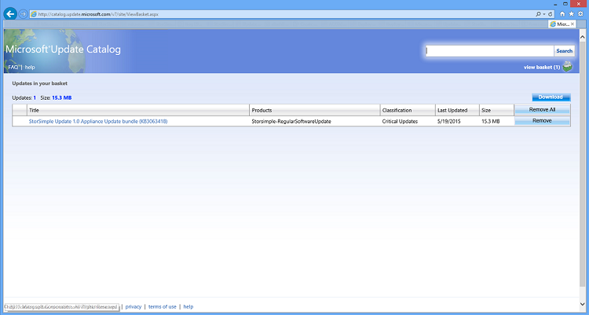

<!--author=SharS last changed: 03/17/2016-->

#### <a name="to-download-hotfixes"></a>Herunterladen von Updates

Führen Sie die folgenden Schritte aus, wenn Sie das Update herunterladen.

1. Starten Sie Internet Explorer, und navigieren Sie zu [http://catalog.update.microsoft.com](http://catalog.update.microsoft.com).

2. Ist dies zum ersten Mal Microsoft Update-Katalog auf diesem Computer verwenden, klicken Sie auf **Installieren** , wenn Sie aufgefordert werden, das Add-on Microsoft Update-Katalog zu installieren.
    

3. Geben Sie in das Suchfeld der Microsoft Update-Katalog die Anzahl der Knowledge Base (KB) des Updates, beispielsweise **3063418**, heruntergeladen werden sollen, und klicken Sie dann auf **Suchen**.

4. Das Paket **StorSimple Update 1.2 Einheit aktualisieren** wird angezeigt. Klicken Sie auf **Hinzufügen**. Das Update wird der Warenkorb hinzugefügt werden.

5. Suchen Sie nach einem beliebigen zusätzlichen Updates in der obigen Tabelle aufgeführten (**3043005** und **3063416**), und jedes fügen Sie Warenkorb hinzu.

5. Klicken Sie auf **Auswahlkorb anzeigen**.

    

6. Klicken Sie auf **herunterladen**. Geben Sie oder **Navigieren** Sie zu einem lokalen Speicherort, in dem die Downloads angezeigt werden soll. Die Updates an den angegebenen Speicherort heruntergeladen und in einem Unterordner mit demselben Namen wie die Aktualisierung platziert. Der Ordner kann auch auf eine Netzwerkfreigabe kopiert werden, die vom Gerät erreichbar ist.

>   [AZURE.NOTE]
Müssen beide Controller mögliche Fehlermeldungen vom Peer-Controller erkennen verfügbare Updates.

#### <a name="to-install-and-verify-regular-mode-hotfixes"></a>Installieren und normalen Modus Updates überprüfen
Führen Sie die folgenden Schritte aus, um zu installieren, und überprüfen die Updates normale-Modus. Wenn Sie bereits über das Azure-Portal installiert haben, fahren Sie mit [Installieren und Wartung Modus Updates überprüfen](#to-install-and-verify-maintenance-mode-hotfixes).

1. Zugriff auf der Windows PowerShell-Benutzeroberfläche an Ihre StorSimple Gerät seriellen Konsole, um das Update zu installieren. Anweisungen Sie die ausführliche in [Kitten verwenden, mit der seriellen Konsole verbinden](storsimple-deployment-walkthrough.md#use-putty-to-connect-to-the-device-serial-console). Drücken Sie die **EINGABETASTE**, an der Befehlszeile.

4. Wählen Sie **Option 1** , um das Gerät mit Vollzugriff sich anzumelden.

5. Geben Sie Folgendes ein, um das Update-Paket an der Befehlszeile zu installieren:

    `Start-HcsHotfix -Path <path to update file> -Credential <credentials in domain\username format>`

    Verwenden Sie IP-anstelle von DNS-Einträge in den Pfad für die Freigabe im obigen Befehl ein. Credential-Parameter dient nur, wenn Sie eine authentifizierte Freigabe zugreifen.

    Es empfiehlt sich, dass Sie den Credential-Parameter verwenden, um Freigaben zugreifen. Gerade Freigaben, die auf "Jeder" geöffnet sind, sind nicht in der Regel für nicht authentifizierte Benutzer geöffnet.

    Nachfolgend finden Sie eine Beispiel für die Ausgabe.

        ````
        Controller0>Start-HcsHotfix -Path \\10.100.100.100\share
        \hcsmdssoftwareupdate.exe -Credential contoso\John

        Confirm

        This operation starts the hotfix installation and could reboot one or
        both of the controllers. If the device is serving I/Os, these will not
        be disrupted. Are you sure you want to continue?
        [Y] Yes [N] No [?] Help (default is "Y"): Y

        ````

6. Geben Sie **Y** , um die Update-Installation zu bestätigen.

7. Überwachen die Aktualisierung mithilfe der `Get-HcsUpdateStatus` Cmdlet.

    Folgender Ausgabe zeigt das Update wird ausgeführt. Die `RunInprogress` werden `True` bei die Aktualisierung wird ausgeführt.

        ````
        Controller0>Get-HcsUpdateStatus
        RunInprogress       : True
        LastHotfixTimestamp : 9/02/2015 10:36:13 PM
        LastUpdateTimestamp : 9/02/2015 10:35:25 PM
        Controller0Events   :
        Controller1Events   :
        ````

     Der folgende Beispielausgabe zeigt an, dass die Aktualisierung abgeschlossen ist. Die `RunInProgress` werden `False` Wenn die Aktualisierung abgeschlossen ist.

        ````
        Controller1>Get-HcsUpdateStatus

        RunInprogress       : False
        LastHotfixTimestamp : 9/02/2015 10:56:13 PM
        LastUpdateTimestamp : 9/02/2015 10:35:25 PM
        Controller0Events   :
        Controller1Events   :

        ````

    > [AZURE.NOTE] Gelegentlich, die Cmdlet-Berichte `False` Wenn das Update noch in Bearbeitung ist. Um sicherzustellen, dass das Update abgeschlossen ist, warten Sie einige Minuten, führen Sie diesen Befehl erneut aus, und überprüfen Sie, ob die `RunInProgress` ist `False`. Es ist, hat das Update abgeschlossen.

8. Nach der Software Aktualisierung abgeschlossen ist, überprüfen die System-Software-Versionen. Geben Sie den folgenden Befehl ein:

    `Get-HcsSystem`

    Sie sollten die folgenden Versionen finden Sie unter:

    - HcsSoftwareVersion: 6.3.9600.17584
    - CisAgentVersion: 1.0.9049.0
    - MdsAgentVersion: 26.0.4696.1433

    Wenn die Versionsnummern nach dem Anwenden der Aktualisierung nicht ändern, gibt es an, dass das Update fehlgeschlagen ist, angewendet. Sie sollten dies mit dem [Microsoft-Support](storsimple-contact-microsoft-support.md) wenden Sie sich wegen weiterer Unterstützung an sehen.

9. Wiederholen Sie die Schritte 3 bis 5, um das verbleibende normale-Modus Update (KB3043005) zu installieren.

#### <a name="to-install-and-verify-maintenance-mode-hotfixes"></a>Installieren und Wartung Modus Updates überprüfen

Verwenden von KB3063416 auf dem Datenträger Firmwareupdates installieren. Diese Unterbrechung Updates werden und in Anspruch nehmen ungefähr 30-45 Minuten. Sie können diese Elemente in einem Fenster der geplanten Wartung durch Herstellen einer Verbindung mit der seriellen Gerät-Konsole installieren.

Gehen Sie wie folgt vor um den Datenträger Firmwareupdates installieren.

1. Platzieren Sie das Gerät im Modus Wartung. Beachten Sie, dass Sie Windows PowerShell Remote nicht verwenden sollten, bei der Verbindung mit einem Gerät im Modus Wartung. Sie benötigen, um dieses Cmdlet ausführen, auf dem Gerätecontroller Wenn über das Gerät serielle Konsole verbunden. Type:

    `Enter-HcsMaintenanceMode`

    Nachfolgend finden Sie eine Beispiel für die Ausgabe.

        Controller0>Enter-HcsMaintenanceMode
        Checking device state...

        In maintenance mode, your device will not service IOs and will be disconnected from the Microsoft Azure StorSimple Manager service. Entering maintenance mode will end the current session and reboot both controllers, which takes a few minutes to complete. Are you sure you want to enter maintenance mode?
        [Y] Yes [N] No (Default is "Y"): Y

        -----------------------MAINTENANCE MODE------------------------
        Microsoft Azure StorSimple Appliance Model 8100
        Name: Update1-8100-SHG0997879L76YD
        Software Version: 6.3.9600.17584
        Copyright (C) 2014 Microsoft Corporation. All rights reserved.
        You are connected to Controller0 - Passive
        ---------------------------------------------------------------
        Serial Console Menu
        [1] Log in with full access
        [2] Log into peer controller with full access
        [3] Connect with limited access
        [4] Change language
        Please enter your choice>

    Sowohl die Controller starten in Wartungsmodus klicken Sie dann erneut.

3. Um die Aktualisierung der Firmware zu installieren, geben Sie Folgendes ein:

    `Start-HcsHotfix -Path <path to update file> -Credential <credentials in domain\username format>`

    Nachfolgend finden Sie eine Beispiel für die Ausgabe.

        Controller1>Start-HcsHotfix -Path \\10.100.100.100\share\DiskFirmwarePackage.exe -Credential contoso\john
        Enter Password:
        WARNING: In maintenance mode, hotfixes should be installed on each controller sequentially. After the hotfix is installed on this controller, install it on the peer controller.
        Confirm
        This operation starts a hotfix installation and could reboot one or both of the controllers. Are you sure you want to continue?
        [Y] Yes [N] No (Default is "Y"): Y
        WARNING: Installation is currently in progress. This operation can take several minutes to complete.

1.  Überwachen der Installation des Vorgangsfortschritts mit `Get-HcsUpdateStatus` Befehl. Die Aktualisierung wurde abgeschlossen, wann die `RunInProgress` ändert sich in `False`.

2.  Nach Abschluss die Installation wird der Controller, auf dem das Wartung Modus Update installiert wurde, neu gestartet werden. Melden Sie sich als Option 1 mit Vollzugriff und überprüfen Sie die Datenträger Firmwareversion. Type:

    `Get-HcsFirmwareVersion`

    Die erwarteten Datenträger Firmwareversionen sind:

    `XMGG, XGEE, KZ50, F6C2, VR08`

    Führen Sie die `Get-HcsFirmwareVersion` Befehl auf dem zweiten Controller zu überprüfen, ob die Softwareversion aktualisiert wurde. Sie können den Wartungsmodus beenden. Geben Sie den folgenden Befehl für jeden Gerätecontroller:

    `Exit-HcsMaintenanceMode`

1. Der Controller neu zu starten, wenn Sie Wartungsmodus zu beenden. Nachdem die Festplatten-Software Updates erfolgreich angewendet, und das Gerät Wartungsmodus klassischen Azure-Portal zurück beendet wurde. Beachten Sie, dass im Portal möglicherweise nicht anzeigen, dass Sie die Wartung Modus Updates für 24 Stunden installiert haben.
