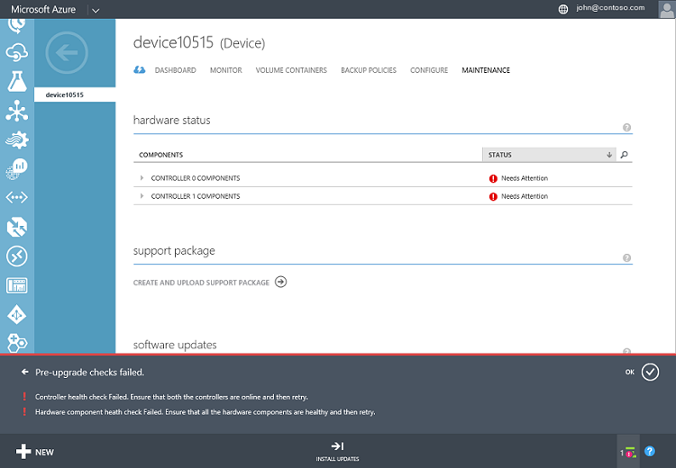
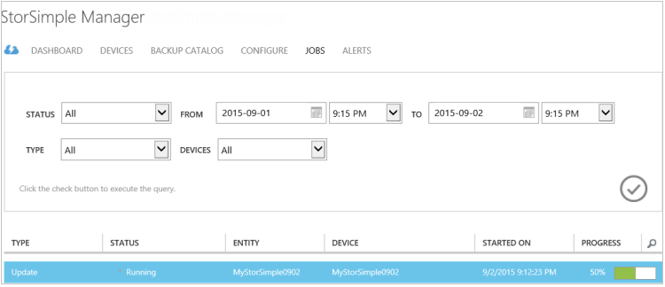
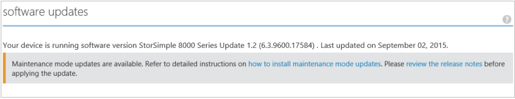

<!--author=SharS last changed: 01/15/2016-->

#### So installieren Sie Update 1.2 vom klassischen Azure-portal

1. Wählen Sie auf der Seite StorSimple Dienst Ihr Gerät aus. Navigieren Sie zu **Geräte** > **Wartung**.

2. Klicken Sie am unteren Rand der Seite auf **Updates überprüfen**. Zum Suchen nach verfügbaren Updates wird ein Projekt erstellt. Sie werden benachrichtigt, wenn Sie der Auftrag erfolgreich abgeschlossen wurde.

3. Im Abschnitt **Softwareupdates** auf derselben Seite sehen Sie sich, dass neue Softwareupdates verfügbar sind. Es empfiehlt sich, dass die Versionsinformationen überprüfen, bevor Sie auf Ihrem Gerät Update 1.2 anwenden.

    

4. Klicken Sie am unteren Rand der Seite auf **Updates installieren**.

5. Sie werden zur Bestätigung aufgefordert werden. Klicken Sie auf **OK**.

6. Ein Dialogfeld **Updates installieren** wird angezeigt. Ihr Gerät sollte die Prüfungen, die in diesem Dialogfeld aufgeführt erfüllen. Bevor Sie das Update wurden diese Schritte ausgeführt. Wählen Sie **ich grundlegende Informationen zu den oben angegebenen Anforderung und bin bereit, die auf meinem Gerät zu aktualisieren**. Klicken Sie auf das Symbol überprüfen.

    

7. Eine Reihe von automatischen Pre überprüft wird jetzt gestartet. Hierzu gehören:

    - **Controller Gesundheit überprüft** , um sicherzustellen, dass sowohl die Gerätecontroller fehlerfrei und online sind.
    
    - **Hardware-Komponente Gesundheit überprüft** , um sicherzustellen, dass alle Hardware-Komponenten auf Ihrem Gerät StorSimple fehlerfrei sind.
    
    - **Daten 0 überprüft** , um sicherzustellen, dass Daten 0 auf Ihrem Gerät aktiviert ist. Wenn diese Schnittstelle nicht aktiviert ist, müssen Sie zum Aktivieren der Arbeitsmappe, und führen Sie dann erneut.
    
    - **Daten 2 und 3 von Daten überprüft** , um sicherzustellen, dass Daten 2 und 3 von Daten Netzwerk-Schnittstellen nicht aktiviert sind. Wenn diese Schnittstellen aktiviert sind, müssen Sie diese zu deaktivieren, und versuchen Sie dann auf Ihrem Gerät zu aktualisieren. Mit dieser Prüfung wird ausgeführt, nur, wenn Sie auf einem Gerät mit GA-Software aktualisieren. Geräte, auf denen Versionen 0.1, 0,2 und 0,3 werden mit dieser Prüfung nicht benötigt werden.
    
    - **Gateway aktivieren** , auf jedem Gerät eine Version vor Update 1 ausgeführt. Mit dieser Prüfung auf dem Gerät, die für die Ausführung vor dem Update 1 Software ausgeführt wird, jedoch schlägt auf Geräten, die ein Gateway für einen Netzwerkadapter als Daten 0 konfiguriert haben.
 
    Update 1.2 wird nur angewendet werden, wenn alle oben vor dem Update Prüfungen erfolgreich abgeschlossen werden. Sie werden benachrichtigt, dass vor dem Update überprüft wird ausgeführt werden.
  
    

    Im folgenden finden ein Beispiel, in dem vor dem upgrade Fehler bei der Überprüfung. Sie benötigen, um sicherzustellen, dass sowohl die Gerätecontroller fehlerfrei und online sind. Sie müssen auch die Integrität der Hardware-Komponenten zu überprüfen. In diesem Beispiel benötigen Controller 0 und 1 Controller Komponenten Aufmerksamkeit. Möglicherweise müssen Sie den Microsoft-Support wenden Sie sich an, wenn Sie diese Probleme nicht, indem Sie sich selbst beheben können.

     

    > [AZURE.NOTE] Nachdem Sie auf Ihrem Gerät StorSimple Update 1.2 angewendet haben, werden Daten 2 und 3 von Daten überprüft und den Gateways nicht mehr für zukünftige Updates erforderlich. Pre Prüfungen werden weiterhin benötigt.

8. Wenn vor dem upgrade Prüfungen erfolgreich abgeschlossen sind, wird ein Update Auftrag erstellt. Sie werden benachrichtigt, wenn die Aktualisierung erfolgreich erstellt wurde.
 
    

    Das Update wird Klicken Sie dann auf Ihrem Gerät installiert werden.
 
9. Klicken Sie auf **Ansicht Auftrag**, zum Überwachen des Fortschritts des Projekts aktualisieren. Klicken Sie auf der Seite **Projekte** sehen Sie den Aktualisierungsfortschritt. 

    

10. Die Aktualisierung wird ein paar Stunden dauern. Sie können die Details des Projekts zu einem beliebigen Zeitpunkt anzeigen.

    

11. Nachdem das Projekt abgeschlossen ist, navigieren Sie zu der Seite **zum Warten** , und führen Sie einen Bildlauf nach unten bis zum **Softwareupdates**.

12. Stellen Sie sicher, dass Ihr Gerät **StorSimple 8000 Reihe Update 1.2 (6.3.9600.17584)**ausgeführt wird. Auch sollte das **Datum der letzten Aktualisierung** geändert werden.

    

13. Sie sehen nun, dass die Wartung Modus Updates verfügbar sind. Diese Updates stehen Unterbrechung Updates, die dazu führen, dass Gerät Ausfallzeiten und können nur über die Windows PowerShell-Benutzeroberfläche von Ihrem Gerät angewendet werden. Folgen Sie den Anweisungen in [Wartung Modus Updates installieren](storsimple-update-device.md#install-maintenance-mode-updates-via-windows-powershell-for-storsimple) , diese Updates über die Windows PowerShell für StorSimple zu installieren.

> [AZURE.NOTE] In bestimmten Fällen möglicherweise die Nachricht, die angibt, Wartung Modus Updates verfügbar sind nach oben angezeigt werden, auf 24 Stunden, nachdem die Wartung Modus Updates auf dem Gerät erfolgreich angewendet wurden.  

