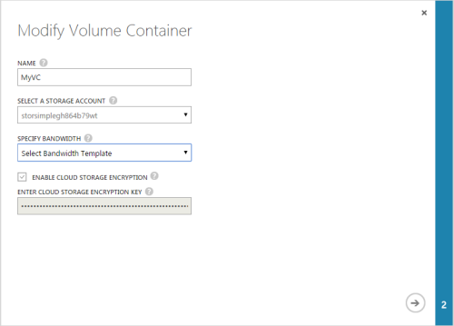
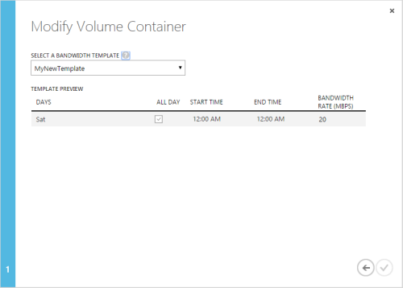

<!--author=SharS last changed: 1/7/2016-->

#### So ändern Sie einen Container Lautstärke

1. Klicken Sie auf der Seite **Geräte** wählen Sie das Gerät, doppelklicken Sie darauf, und klicken Sie dann auf der Registerkarte **Lautstärke Container** .

2. Klicken Sie in der tabellarischen Auflistung der Lautstärke Container, wählen Sie die Einstellung, die Sie ändern möchten, und klicken Sie auf **Ändern**.

3. Klicken Sie im Dialogfeld **Container ändern Lautstärke** folgendermaßen Sie vor:

    1. Ändern Sie des Namens des Containers Lautstärke, und ändern Sie die Einstellung zugeordneten Bandbreite. 

        

    2. Das Verschlüsselung Schlüssel und Speicher-Konto kann nicht geändert werden, nachdem sie angegeben sind. Wenn Sie **Wählen Sie eine Vorlage Bandbreite**angegeben haben, klicken Sie auf den Pfeil, um zur nächsten Seite zu gelangen.

4. Auf der nächsten Seite des Dialogfelds **Lautstärke Container ändern** :

    1. Wählen Sie in der Dropdown-Liste aus einer vorhandenen Bandbreite Vorlage.

    2. Überprüfen der Terminplan Einstellungen für die angegebene Bandbreite Vorlage.

        

    3. Klicken Sie auf das Symbol Kontrollkästchen  die aktualisierten Einstellungen speichern. Die **Lautstärke Container** Seite wird aktualisiert, sodass die Änderungen übernommen wurden.

 

