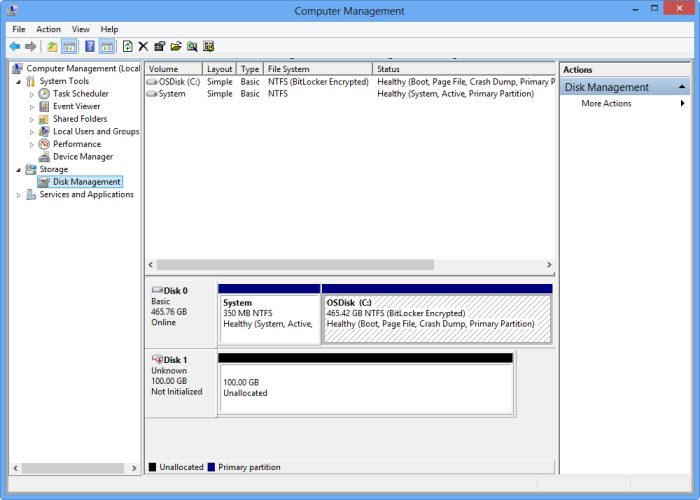

<!--author=SharS last changed: 9/17/15-->

#### Bereitstellen, Initialisierung und formatieren einen Datenträger

1. Starten Sie den Microsoft iSCSI Initiator.

2. Klicken Sie im Fenster **iSCSI Initiatoreigenschaften** auf der Registerkarte **Suche** auf **Portal ermitteln**.

3. Klicken Sie im Dialogfeld **Ermitteln Target Portal** Geben Sie die IP-Adresse Ihre iSCSI aktivierten Netzwerk-Oberfläche an, und klicken Sie dann auf **OK**. 

4. Suchen Sie im Fenster **iSCSI Initiatoreigenschaften** auf der Registerkarte **Ziele** der **ermittelte Ziele**aus. Der Gerätestatus sollte als **inaktiv**angezeigt werden.

5. Markieren Sie das Gerät, und klicken Sie dann auf **Verbinden**. Nachdem das Gerät angeschlossen ist, sollte der Status auf **verbunden**ändern. (Weitere Informationen zur Verwendung von Microsoft iSCSI Initiator, finden Sie unter [Installieren und Konfigurieren von Microsoft iSCSI Initiator][1]).

6. Klicken Sie auf Ihrem Windows-Host drücken Sie die Windows-Logo-Taste + X, und klicken Sie dann auf **Ausführen**. 

7. Geben Sie **im Dialogfeld** **Diskmgmt.msc**aus. Klicken Sie auf **OK**, und das Dialogfeld **Datenträger Verwaltung** angezeigt wird. Im rechte Bereich wird die Datenmengen auf dem Host angezeigt werden.

8. Im Fenster **Datenträger Verwaltung** werden der aktivierten Datenträger angezeigt, wie in der folgenden Abbildung gezeigt. Mit der rechten Maustaste in der ermittelten Lautstärke (klicken Sie auf den Datenträgernamen), und klicken Sie dann auf **Online**.

      

9. Mit der rechten Maustaste in der Lautstärke (klicken Sie auf den Datenträgernamen) erneut, und klicken Sie dann auf **Initialisierung**.

10. Um einen einfachen Datenträger formatieren möchten, führen Sie die folgenden Schritte aus:
  1. Wählen Sie die Lautstärke der rechten Maustaste auf ihn (klicken Sie im rechten Bereich auf), und klicken Sie auf **Neues einfaches Volume**.
  2. Im Assistenten Neues einfaches Volume Geben Sie den Lautstärke Größe und Laufwerk Buchstaben und konfigurieren Sie die Lautstärke als ein NTFS-Dateisystem.
  3. Geben Sie die Größe der Zuordnungseinheiten einer 64 KB sein. Dieser Größe der Zuordnungseinheiten funktioniert auch mit der Deduplication Algorithmen Lösung StorSimple verwendet.
  4. Führen Sie eine Symbolleiste Format ein.

 **Video verfügbar**

Wenn Sie ein Video zur Verfügung, die veranschaulicht, wie bereitstellen, Initialisierung und ein StorSimple Volume zu formatieren, klicken Sie auf [hier](https://azure.microsoft.com/documentation/videos/mount-initialize-and-format-a-storsimple-volume/).

<!--Link references-->
[1]: https://technet.microsoft.com/library/ee338480(WS.10).aspx
