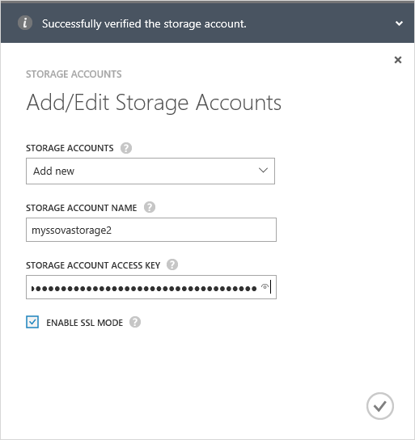

<!--author=alkohli last changed: 01/28/16-->

#### Hinzufügen ein neuen Kontos mit Speicher 

1. Klicken Sie auf der Startseite StorSimple Verwaltungsdienst wählen Sie den Dienst, und doppelklicken Sie darauf. Dadurch gelangen Sie zur Seite **Schnellstart** . Wählen Sie die Seite **Konfigurieren** .

2. Klicken Sie auf **Add/Edit Speicher-Konto**.

3. Klicken Sie im Dialogfeld **Add/Edit Speicherkonto** folgendermaßen Sie vor:

  1. Klicken Sie auf **neue hinzufügen**.
  2. Geben Sie den Namen Ihres Kontos Azure-Speicher.
  3. Die primäre **Zugriffstaste** für Ihr Konto Azure-Speicher angeben. Um diesen Schlüssel zu erhalten, wechseln Sie zu der Speicherdienst, wählen Sie Ihr Speicherkonto, und klicken Sie auf **Konto-Schlüssel verwalten**. Sie können nun die **primäre Zugriffstaste**kopieren.
  4. Wählen Sie **SSL-Modus aktivieren** , um einen sicheren Kanal für die Kommunikation zwischen Ihrem Gerät StorSimple und in der Cloud zu erstellen. Nur, wenn Sie in eine private Cloud betreiben, deaktivieren Sie das Kontrollkästchen **SSL-Modus aktivieren** .
  5. Klicken Sie auf das Kontrollkästchen-Symbol . Sie werden benachrichtigt, nachdem das Speicherkonto erfolgreich erstellt wurde.

        

4. Das Speicherkonto neu erstellten wird auf der Seite **Konfigurieren** , klicken Sie unter **Speicherkonten**angezeigt. 
