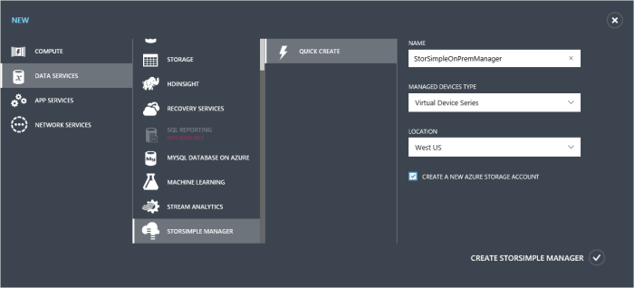
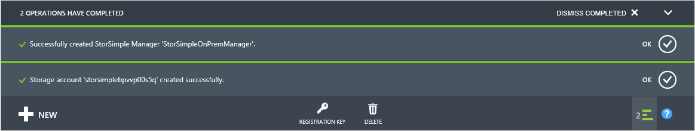

#### So erstellen eine neue Dienstleistung

1.  Mit Microsoft-Konto Anmeldeberechtigungen, melden Sie sich im klassischen Azure-Portal unter dieser URL: [https://manage.windowsazure.com/](https://manage.windowsazure.com/). Wenn Sie das Gerät Government Portal bereitstellen, melden Sie sich bei: [https://manage.windowsazure.us/](https://manage.windowsazure.us/)

2.  Klicken Sie im Portal auf **Neu > Data Services > StorSimple-Manager > Symbolleiste erstellen**.

3.  Im Formular, das angezeigt wird, führen Sie die folgenden Schritte aus:

    1.  Geben Sie einen eindeutigen **Namen** für den Dienst. Dies ist einen Anzeigenamen ein, der zum Identifizieren des Dienstes verwendet werden kann. Der Namen kann zwischen 2 und 50 Zeichen enthalten, die Buchstaben, Zahlen und Bindestriche werden können. Der Name muss beginnen und enden mit einem Buchstaben oder einer Zahl zurück.

    2.  Wählen Sie **virtuellen Gerät Reihe**für einen Dienst ein StorSimple virtuelles Gerät, aus der Dropdownliste für **verwaltete Geräte Typ**verwalten aus.

    3.  Geben Sie einen **Speicherort** für Ihren Dienst. Speicherort bezieht sich auf die geografische Region, in dem Sie Ihr Gerät bereitstellen möchten.

     -   Wenn Sie aufgrund der Ergebnisse in Azure, die Sie mit Ihrem Gerät StorSimple bereitstellen möchten verfügen, empfehlen wir, dass Sie die Datacenter verwenden.

     -   StorSimple-Manager und Azure-Speicher kann in zwei verschiedenen Speicherorten sein. In diesem Fall müssen Sie das StorSimple-Manager und Azure-Speicherkonto separat erstellen. Zum Erstellen eines Kontos Azure-Speicher wechseln Sie zu der Azure-Speicherdienst-Portal, und führen Sie die Schritte in [Erstellen eines Kontos Azure-Speicher](storage-create-storage-account.md#create-a-storage-account). Nach diesem Konto erstellt wurde, fügen Sie dieses Konto zum Dienst StorSimple-Manager hinzu, indem Sie die Schritte in [Konfigurieren eines neuen Speicherkonto für den Dienst](#optional-step-configure-a-new-storage-account-for-the-service).
     
     -   Wenn das virtuelle Gerät im Portal Government bereitstellen zu können, ist der StorSimple Manager-Dienst an uns Iowa und uns Virginia Speicherorten verfügbar.
     
        
    1.  Wählen Sie ein **Abonnement** aus der Dropdownliste aus. Bei Ihrem Konto Abrechnung wird das Abonnement verknüpft. Dieses Feld ist nicht vorhanden ist, wenn Sie nur ein Abonnement haben.

    1.  Wählen Sie **erstellen ein neues Azure-Speicherkonto** um ein Speicherkonto automatisch mit dem Dienst zu erstellen. Dieses Speicherkonto muss einen besonderen Namen wie "storsimplebwv8c6dcnf". Wenn Sie Ihre Daten in einem anderen Speicherort benötigen, deaktivieren Sie dieses Kontrollkästchen.

    1.  Klicken Sie auf **StorSimple-Manager erstellen** , um den Dienst zu erstellen.

        

    Sie gelangen zur Startseite **Dienst** . Die Erstellung von Diensten wird ein paar Minuten dauern. Nachdem der Dienst erfolgreich erstellt wurde, werden Sie entsprechend benachrichtigt.

    

    Der Status des Diensts ändert sich in **aktiv**.
