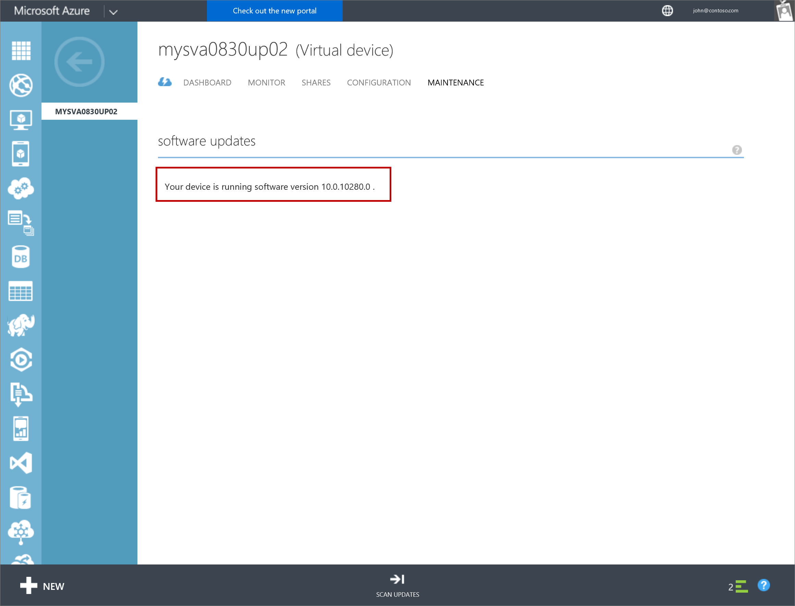
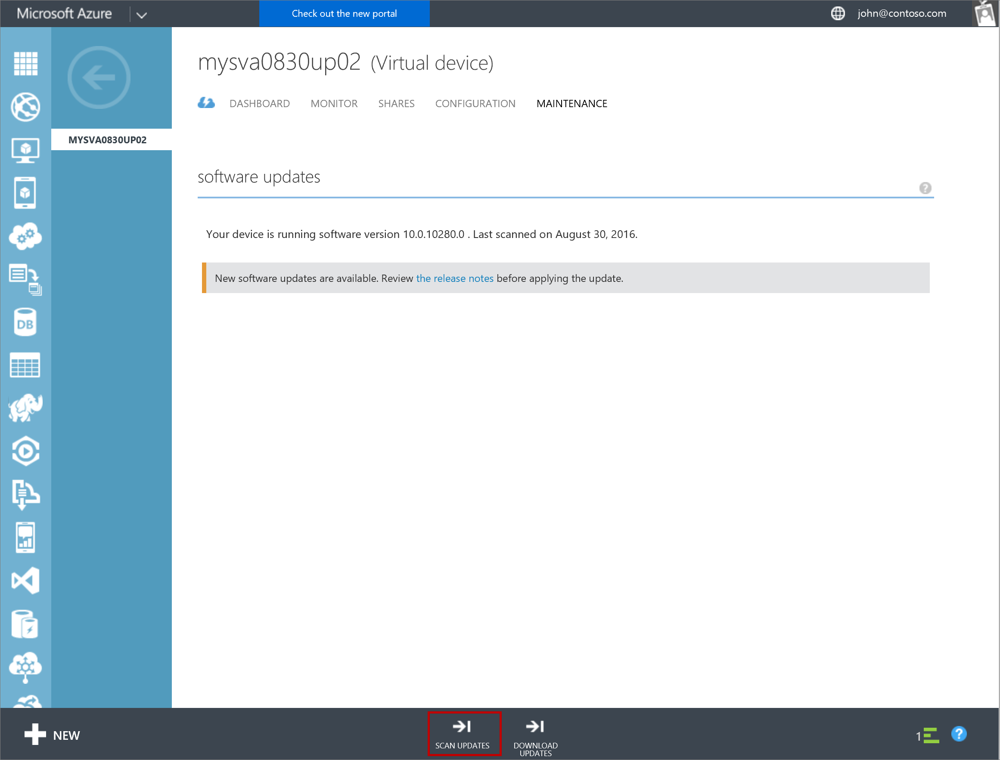
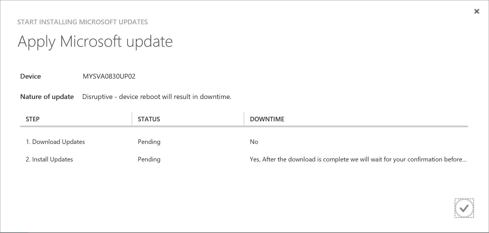
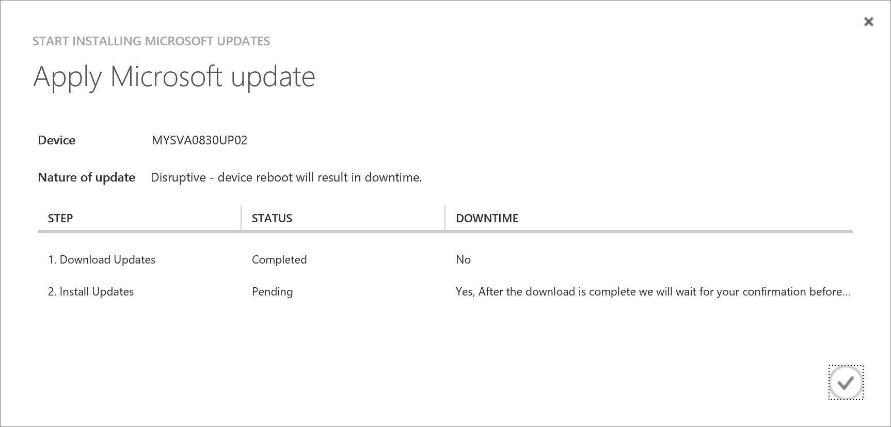
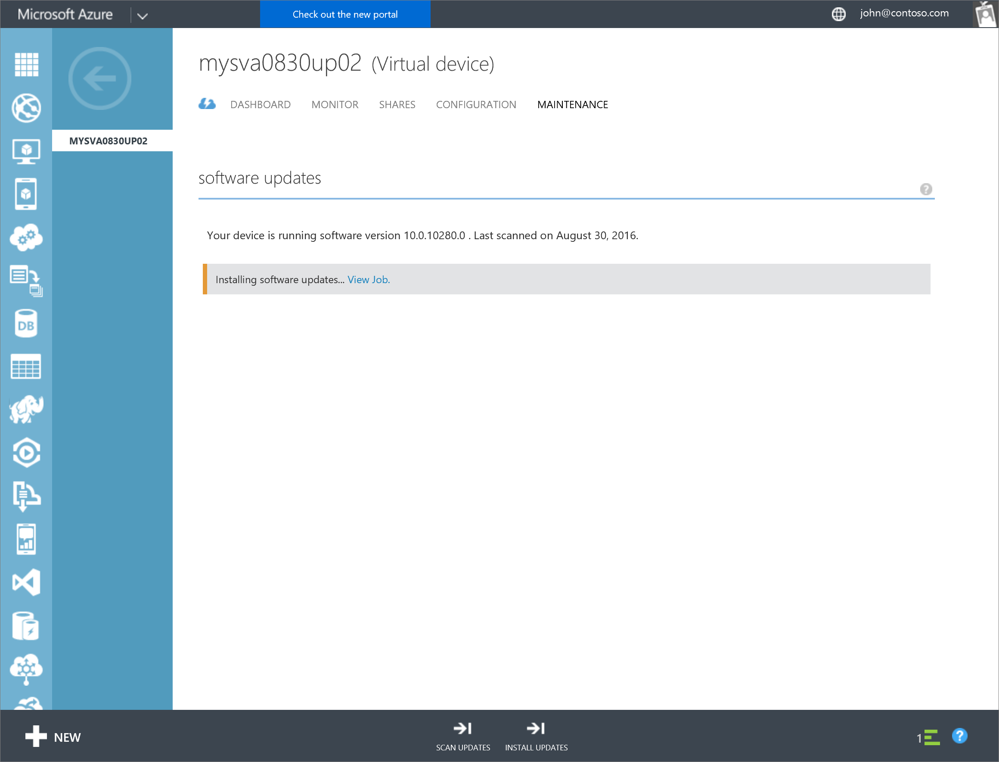
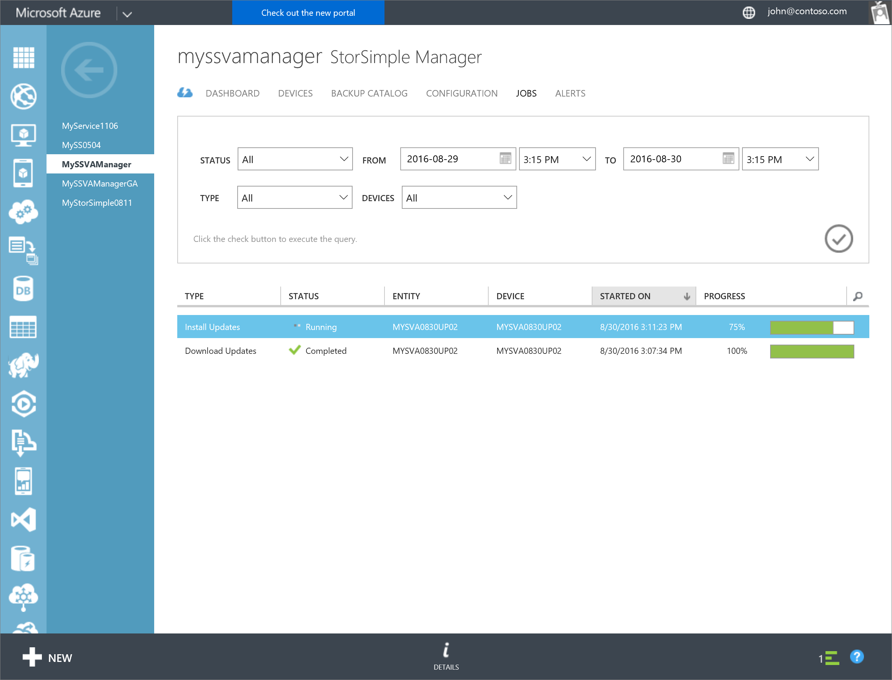

<!--author=alkohli last changed: 09/02/16 -->

#### So installieren Sie Updates über das klassische Azure-portal

1. Wählen Sie auf der Seite **Geräte** das Gerät, das Sie auf Updates installieren.

2. Navigieren Sie zu **Geräte > Wartung > Softwareupdates**.

      

3. Eine Meldung wird angezeigt, wenn die Softwareupdates verfügbar sind. Wenn Sie nach Updates suchen, können Sie auch **Scannen Updates** am unteren Rand der Seite klicken.

    

4. Vom unteren Rand der Seite klicken Sie auf **Updates herunterladen**. Ein Dialogfeld benachrichtigt den Benutzer, ob die Aktualisierung Unterbrechung ist. Wenn die virtuelle StorSimple Array liegt einem einzelnen Knoten Gerät Neustart des Geräts nach der Aktualisierung Dies unterbricht e wird ausgeführt. Klicken Sie auf das Kontrollkästchen Symbol zum Starten eines Auftrags zum Herunterladen der verfügbaren Updates. 

    

5. Sie werden benachrichtigt, wenn die Updates heruntergeladen werden. 

    

6. Vom unteren Rand der Seite klicken Sie auf **Updates installieren** , um die Aktualisierung des Geräts zu beginnen. Im Dialogfeld wird Ihnen erneut angezeigt. Klicken Sie auf das Symbol Kontrollkästchen zum Starten eines Auftrags aus, um die Updates installieren. 

     

7. Sie werden benachrichtigt, nachdem das Projekt erstellt wurde. 

    

8. Klicken Sie auf **Ansicht Auftrag** Link zum Wechseln Sie zu der Seite Projekte und Überwachen des Status installieren. Sie können **Details** zu einem beliebigen Zeitpunkt zu enthält ausführliche Informationen zu den Aktualisierungsauftrag klicken. 

    