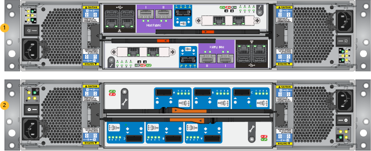
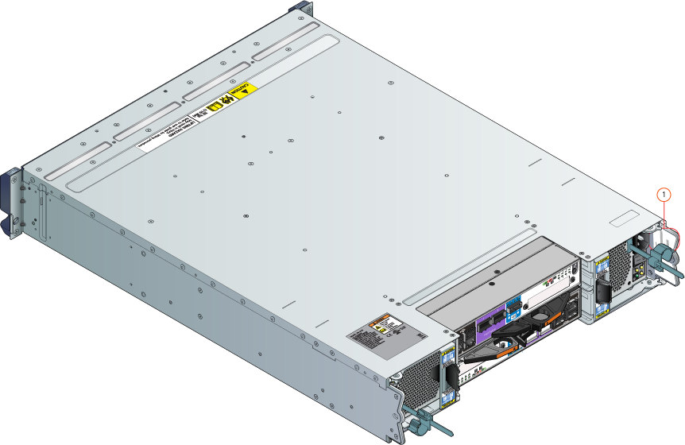
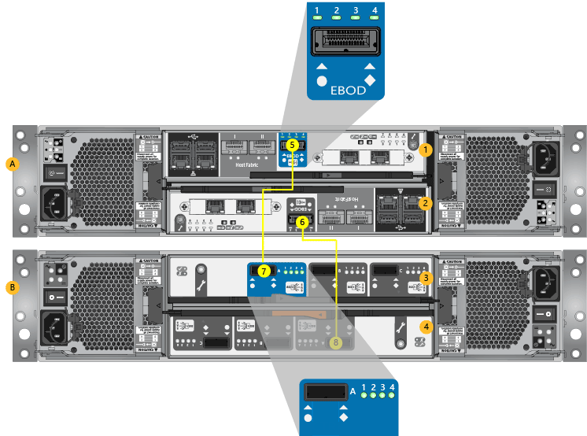

<!--author=alkohli last changed:02/22/16-->

#### Um die SAS-Kabel Anfügen

1. Identifizieren der primären und den EBOD Einheiten. Die zwei Anlagen können ihren zurück Ebenen betrachtet identifiziert werden. Die folgende Abbildung für Anleitungen finden Sie unter. 

    

    **Sichern der primären und EBOD Anlagen anzeigen**

    |Beschriftung|Beschreibung|
    |:----|:----------|
    |1|Primäre Einheit|
    |2|EBOD Einheit|

2. Suchen Sie nach der fortlaufenden Zahlen auf der primären und den EBOD Einheiten. Der fortlaufende Zahl Aufkleber wird auf dem Zurücksenden Halt der einzelnen Einheit angebracht. Die fortlaufende Zahlen müssen auf beide Einheiten identisch sein. [Microsoft-Support wenden](../articles/storsimple/storsimple-contact-microsoft-support.md) sofort, wenn der fortlaufenden Zahlen nicht übereinstimmen. Siehe nachstehende Abbildung der fortlaufenden Zahlen zu suchen.

    

    **Speicherort der Seriennummer Aufkleber**

    |Beschriftung|Beschreibung|
    |:----|:----------|
    |1|Halt der Einheit|

3. Verwenden Sie die bereitgestellten SAS-Kabel EBOD Einheit wie folgt mit der primären Einheit verbinden:

    1. Identifizieren Sie die vier SAS-Ports auf die primäre Einheit und die Anlage EBOD. Die SAS Ports sind auf der primären Einheit als EBOD gekennzeichnet und Anschluss A Klicken Sie auf die Anlage EBOD wie in der Abbildung unten Kabel SAS dargestellt entsprechen.

    2. Verwenden Sie die bereitgestellten SAS-Kabel der EBOD Ports a Verbindung

    3. Der Port EBOD auf Controller 0 sollte mit den Port A auf EBOD Controller 0 verbunden sein. Der Port EBOD auf Controller 1 sollte mit den Port A auf EBOD Controller 1 verbunden sein. Die folgende Abbildung für Anleitungen finden Sie unter. 
                                                                    
     

     **SAS-Kabel**

    |Beschriftung|Beschreibung|
    |:----|:----------|
    |A|Primäre Einheit|
    |B|EBOD Einheit|
    |1|Controller 0|
    |2|Controller 1|
    |3|EBOD Controller 0|
    |4|EBOD Controller 1|
    |5, 6|SAS Ports zu primären Einheit (beschriftete EBOD)|
    |7, 8|SAS Ports zu EBOD Einheit (Port A)|
