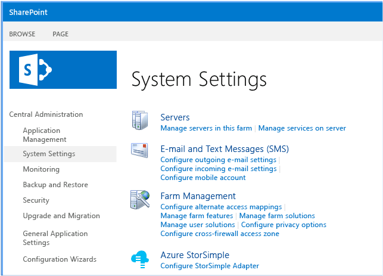
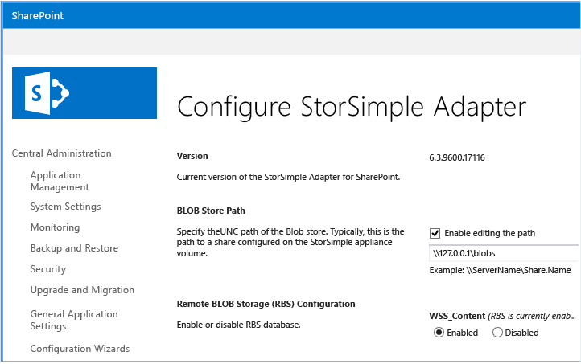
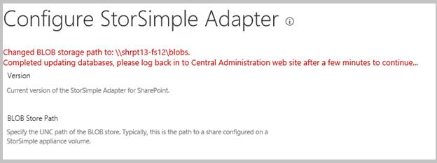
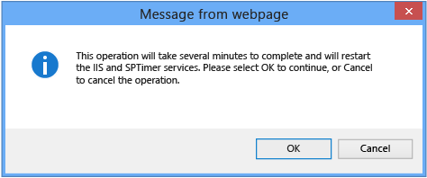

<!--author=SharS last changed: 1/14/2016 -->

>[AZURE.NOTE] Wenn Sie Änderungen an der StorSimple Netzwerkadapter für SharePoint RBS Konfiguration vornehmen möchten, müssen Sie mit einem Benutzerkonto angemeldet sein, die Domänen-Admins gehört. Darüber hinaus müssen Sie die Konfigurationsseite über einen Browser, der auf dem gleichen Host als Zentraladministration zugreifen.

#### So konfigurieren Sie RSP-Code

1. Öffnen Sie die Seite SharePoint-Zentraladministration, und navigieren Sie zu **Systemeinstellungen**. 

2. Klicken Sie im Abschnitt **Azure StorSimple** auf **StorSimple Netzwerkadapter konfigurieren**.

     

3. Auf der Seite **StorSimple Netzwerkadapter konfigurieren** :

    1. Stellen Sie sicher, dass das Kontrollkästchen **Bearbeitung Pfad aktivieren** aktiviert ist.

    2. Geben Sie im Textfeld den Pfad Universal Naming Convention (UNC), der den BLOB-Speicher ein.

          >[AZURE.NOTE] Die Lautstärke der BLOB-Speicher muss auf einem iSCSI-Volume so konfiguriert, dass auf dem Gerät StorSimple gehostet werden.

    3. Klicken Sie auf die Schaltfläche **Aktivieren** unterhalb jeder Inhaltsdatenbanken, die Sie für den remote-Speicher konfigurieren möchten.

          >[AZURE.NOTE] Der BLOB-Speicher muss erreichbar und freigegebene von allen Front-End-(WFE) Webservern, und das Benutzerkonto, das für die SharePoint-Serverfarm konfiguriert ist, müssen Zugriff auf die Freigabe.

          

           When you enable or disable RBS, you will also see the following message.

          

    4. Klicken Sie auf die Schaltfläche **Aktualisieren** , um die Konfiguration zu übernehmen. Wenn Sie auf die Schaltfläche **Aktualisieren** klicken, wird der Status der RSP-Konfiguration auf allen WFE-Servern aktualisiert werden, und die gesamte Farm wird RSP aktiviert sein. Die folgende Meldung angezeigt wird.

           

           >[AZURE.NOTE] Wenn Sie RSP-Code für eine SharePoint-Farm mit einer großen Anzahl von Datenbanken (größer als 200) konfigurieren, möglicherweise die SharePoint-Zentraladministration Webseite Timeout an. In diesem Fall aktualisieren Sie die Seite aus. Dies wirkt sich nicht auf den Konfigurationsprozess aus.
 
4. Überprüfen Sie die Konfiguration aus:

    1. Melden Sie sich bei der SharePoint-Zentraladministration-Website, und navigieren Sie zu der Seite **StorSimple Netzwerkadapter konfigurieren** .

    2. Überprüfen Sie die Konfigurationsdetails, um sicherzustellen, dass sie die Einstellungen entsprechen, die Sie eingegeben haben. 

5. Stellen Sie sicher, dass RSP ordnungsgemäß funktioniert:

    1. Hochladen eines Dokuments in SharePoint. 

    2. Navigieren Sie zu der FERNEN Pfad, den Sie konfiguriert. Stellen Sie sicher, dass die Struktur der RSP Directory erstellt wurde und das hochgeladene Objekt enthält.

6. (Optional) Der Microsoft-RBS können `Migrate()` PowerShell-Cmdlet Lieferumfang von SharePoint, um vorhandene BLOB-Inhalt auf dem Gerät StorSimple migrieren. Weitere Informationen finden Sie unter [Migrieren von Inhalten in oder aus RSP in SharePoint 2013] [ 6] oder [Migrieren der Inhalte oder ausblenden RSP (SharePoint Foundation 2010)][7].

7. (Optional) Klicken Sie auf Test-Installationen stellen Sie sicher, dass die BLOBs aus der Inhaltsdatenbank verschoben wurden: 

    1. Starten Sie SQL Management Studio.

    2. Führen Sie die Abfrage ListBlobsInDB_2010.sql oder ListBlobsInDB_2013.sql wie folgt aus.

     **ListBlobsInDB_2013.sql**

         WSS_Content Gehe zu verwenden
    
         Wählen Sie DocStreams.DocId, LeafName AS Name, Inhalt, AllDocs.Size AS OrigSizeOfContent, Länge (CAST (Inhalt so VARBINARY(MAX))) wie SizeOfContentInDB, DocStreams.RbsId, TimeLastModified
    
         AUS DocStreams innere Verknüpfung AllDocs auf DocStreams.DocId = AllDocs.Id Reihenfolge nach TimeLastModified DESC Gehe zu

     **ListBlobsInDB_2010.sql**

         WSS_Content Gehe zu verwenden

         Wählen Sie AllDocStreams.Id, LeafName AS Name, Inhalt, AllDocs.Size AS OrigSizeOfContent, Länge (CAST (Inhalt so VARBINARY(MAX))) wie SizeOfContentInDB, RbsId, TimeLastModified aus AllDocStreams innere Verknüpfung AllDocs auf AllDocStreams.Id = AllDocs.Id Reihenfolge nach TimeLastModified DESC Gehe zu

     Wenn RSP ordnungsgemäß konfiguriert wurde, sollte ein NULL-Wert in der Spalte SizeOfContentInDB für ein beliebiges Objekt angezeigt, das hochgeladen und erfolgreich mit RSP externalisiert wurde.

8. (Optional) Nachdem Sie RSP konfigurieren und alle BLOB-Inhalt auf dem Gerät StorSimple verschieben, können Sie die Inhaltsdatenbank am Gerät verschieben. Wenn Sie auswählen, um die Inhaltsdatenbank zu wechseln, empfehlen wir, dass Sie die Inhaltsdatenbank Speicherplatz auf dem Gerät als primäre Volume konfigurieren. Klicken Sie dann hergestellt verwenden SQL Server bewährte Methoden zum Migrieren von der Inhaltsdatenbank zu dem Gerät StorSimple. 

     >[AZURE.NOTE] Verschieben der Inhaltsdatenbank auf dem Gerät wird nur für die Reihe StorSimple 8000 unterstützt (es ist nicht für die Reihe 5000 oder 7000 unterstützt).
 
     Wenn Sie BLOBs und der Inhaltsdatenbank in separaten Datenmengen auf dem Gerät StorSimple speichern, wird empfohlen, dass Sie sie in der gleichen Lautstärke Container konfigurieren. Dadurch wird sichergestellt, dass sie zusammen gesichert werden.

       >[AZURE.WARNING] Wenn Sie rsp nicht aktiviert haben, empfehlen wir nicht, die Inhaltsdatenbank am Gerät StorSimple verschieben. Dies ist eine Konfiguration nicht getestet.
 
9. Wechseln zum nächsten Schritt: [Garbagecollection konfigurieren](#configure-garbage-collection).

[6]: https://technet.microsoft.com/library/ff628254(v=office.15).aspx
[7]: https://technet.microsoft.com/library/ff628255(v=office.14).aspx
