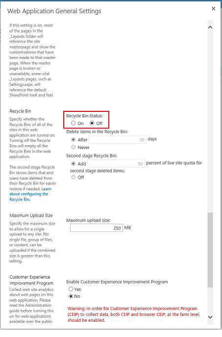

<!--author=SharS last changed: 9/17/15-->

In diesem Verfahren werden Sie folgende Aufgaben ausführen:

1. [Vorbereiten der Ausführung der ausführbare Maintainer](#to-prepare-to-run-the-maintainer) .

2. [Vorbereiten der Inhaltsdatenbank und Papierkorb für Löschvorgang sofort von verwaisten BLOBs](#to-prepare-the-content-database-and-recycle-bin-to-immediately-delete-orphaned-blobs).

3. [Führen Sie Maintainer.exe](#to-run-the-maintainer).

4. [Wiederherstellen der Inhaltsdatenbank und Papierkorb Einstellungen](#to-revert-the-content-database-and-recycle-bin-settings).

#### So bereiten Sie die Maintainer ausführen

1. Öffnen Sie auf der Front-End-Webserver die SharePoint 2013-Verwaltungsshell als Administrator aus.

2. Navigieren Sie zu dem Ordner *Boot-Laufwerk*: \Programme\Microsoft SQL Remote-Blob-Speicher 10.50\Maintainer\.

3. Benennen Sie **Microsoft.Data.SqlRemoteBlobs.Maintainer.exe.config** in **web.config**ein.

4. Verwenden Sie `aspnet_regiis -pdf connectionStrings` in der Datei web.config entschlüsseln.

5. In der Datei web.config entschlüsselt unter der `connectionStrings` Knoten, die Verbindungszeichenfolge für SQL Server-Instanz und den Namen der Inhaltsdatenbank hinzufügen. Im folgende Beispiel wird angezeigt.

    `<add name=”RBSMaintainerConnectionWSSContent” connectionString="Data Source=SHRPT13-SQL12\SHRPT13;Initial Catalog=WSS_Content;Integrated Security=True;Application Name=&quot;Remote Blob Storage Maintainer for WSS_Content&quot;" providerName="System.Data.SqlClient" />`

6. Verwenden Sie `aspnet_regiis –pef connectionStrings` Standardinstanzennamen erneuten verschlüsseln. 

7. Benennen Sie web.config in Microsoft.Data.SqlRemoteBlobs.Maintainer.exe.config ein. 

#### Um den Inhalt vorbereiten verwaiste Datenbank und Papierkorb sofort löschen BLOBs

1. Führen Sie auf dem SQL Server in SQL Management Studio, die folgenden Aktualisierungsabfragen für die Zieldatenbank Inhalt aus: 

       `use WSS_Content`

       `exec mssqlrbs.rbs_sp_set_config_value ‘garbage_collection_time_window’ , ’time 00:00:00’`

       `exec mssqlrbs.rbs_sp_set_config_value ‘delete_scan_period’ , ’time 00:00:00’`

2. Klicken Sie auf im Web Front-End-Server, klicken Sie unter **Zentraladministration**bearbeiten auf **Allgemeine Einstellungen** für die gewünschte Inhaltsdatenbank Papierkorb vorübergehend deaktivieren. Diese Aktion wird auch leeren des Papierkorbs für alle Websitesammlungen zugehörigen. Klicken Sie hierzu auf **Zentraladministration** -> **Anwendungsverwaltung** -> **Webanwendungen (Webanwendungen verwalten)** -> **SharePoint - 80** -> **Allgemeine Einstellungen der Anwendung**. Der **Status des Papierkorbs** auf **OFF**festgelegt.

    

#### Zum Ausführen der Maintainer

- Führen Sie auf dem Front-End-Webserver in der SharePoint 2013-Verwaltungsshell, die Maintainer wie folgt aus:

      `Microsoft.Data.SqlRemoteBlobs.Maintainer.exe -ConnectionStringName RBSMaintainerConnectionWSSContent -Operation GarbageCollection -GarbageCollectionPhases rdo`

    >[AZURE.NOTE] Nur die `GarbageCollection` Vorgang wird zu diesem Zeitpunkt für StorSimple unterstützt. Beachten Sie auch, dass die Parameter für Microsoft.Data.SqlRemoteBlobs.Maintainer.exe ausgestellt Groß-/Kleinschreibung beachtet werden. 
 
#### Wiederherstellen der Inhaltsdatenbank und Papierkorb Einstellungen

1. Führen Sie auf dem SQL Server in SQL Management Studio, die folgenden Aktualisierungsabfragen für die Zieldatenbank Inhalt aus:

      `use WSS_Content`

      `exec mssqlrbs.rbs_sp_set_config_value ‘garbage_collection_time_window’ , ‘days 30’`

      `exec mssqlrbs.rbs_sp_set_config_value ‘delete_scan_period’ , ’days 30’`

      `exec mssqlrbs.rbs_sp_set_config_value ‘orphan_scan_period’ , ’days 30’`

2. Klicken Sie auf im Web Front-End-Server, in der **Zentraladministration**bearbeiten auf **Allgemeine Einstellungen** für die gewünschte Inhaltsdatenbank zu dem Papierkorb wieder zu aktivieren. Klicken Sie hierzu auf **Zentraladministration** -> **Anwendungsverwaltung** -> **Webanwendungen (Webanwendungen verwalten)** -> **SharePoint - 80** -> **Allgemeine Einstellungen der Anwendung**. Festlegen des Papierkorb Papierkorb Status **auf**.
