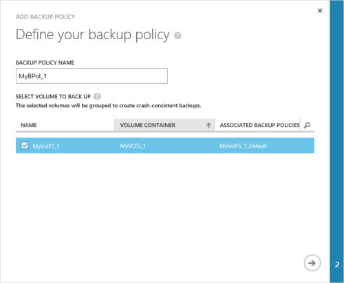
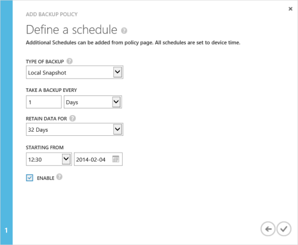

<!--author=alkohli last changed: 9/17/15-->

### Eine Sicherung ausführen.

1. Klicken Sie auf **Hinzufügen einer Sicherung Richtlinie**, klicken Sie auf der Seite Geräte für **Schnellstart** . Dadurch wird die Sicherung Richtlinie hinzufügen-Assistent gestartet. 

2. Auf der Seite **Ihre Sicherung Richtlinie definieren** :
  1. Geben Sie einen Namen, der zwischen 3 und 150 Zeichen für die Sicherungsdatei Richtlinie enthält.
  2. Wählen Sie die Datenmengen gesichert werden müssen. Wenn Sie mehrere Lautstärke auswählen, werden diese Datenträger gruppiert um eine konsistente Sicherung erstellen.
  3. Klicken Sie auf das Pfeilsymbol . 
  
    

3. Auf der Seite **Definieren eines Zeitplans** :
  1. Wählen Sie die Art der Sicherung aus der Dropdownliste aus. Wählen Sie für schnellere Wiederherstellung **Lokale Snapshot**ein. Wählen Sie für Daten Stabilität **Cloud Momentaufnahme**ein.
  2. Geben Sie die Sicherungsdatei Häufigkeit in Minuten, Stunden, Tagen oder Wochen ein.
  3. Wählen Sie eine Aufbewahrungszeit aus. Die Aufbewahrung hängen der Sicherung Häufigkeit. Tägliche Richtlinie, kann beispielsweise der Aufbewahrungsrichtlinien in Wochen angegeben werden Aufbewahrungsrichtlinien für eine monatliche Richtlinie in Monaten ist.
  4. Wählen Sie die Startzeit und das Datum für die Sicherungsdatei Richtlinie ein.
  5. Wählen Sie das Kontrollkästchen **Aktivieren** , um die Sicherungsdatei Richtlinie zu aktivieren. 
  6. Klicken Sie auf das Kontrollkästchen-Symbol  um die Richtlinie zu speichern.

    
 
     Sie verfügen jetzt über eine zusätzliche Richtlinie, die geplante Sicherungskopien der Lautstärke Daten erstellt wird.

Sie haben die Gerätekonfiguration abgeschlossen. 

 **Video verfügbar**

Wenn Sie ein Video zur Verfügung, die veranschaulicht, wie eine StorSimple Sicherung durchgeführt werden soll, klicken Sie auf [hier](https://azure.microsoft.com/documentation/videos/take-a-storsimple-backup/).