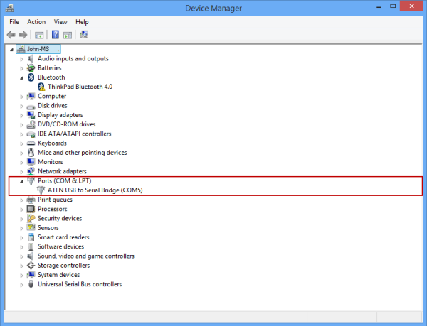
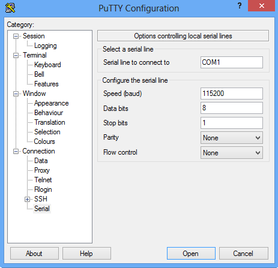

<!--author=SharS last changed: 9/17/15-->

#### Herstellen einer Verbindung über die serielle Konsole

1. Schließen Sie das serielle Kabel mit dem Gerät (direkt oder indirekt über einen USB-Seriell Netzwerkadapter).

2. Öffnen Sie die **Systemsteuerung**, und klicken Sie dann öffnen Sie den **Geräte-Manager**zu.

3. Benennen Sie den COM-Anschluss aus, wie in der folgenden Abbildung gezeigt.

     

4. Starten Sie kitten. 

5. Ändern Sie im rechten Bereich den **Verbindungstyp** **Seriell**ein.

6. Geben Sie im rechten Bereich des entsprechenden COM-Anschluss. Stellen Sie sicher, dass die Parameter serielle Konfiguration wie folgt festgelegt sind:
  - Geschwindigkeit: 115,200
  - Datenbits: 8
  - Beenden der Bits: 1
  - Unstimmigkeit: keine
  - Steuerelement Datenfluss: keine

    Diese Einstellungen werden in der folgenden Abbildung gezeigt.

      

    > [AZURE.NOTE] Versuchen Sie der Standard-strömungsregelung festlegen nicht funktioniert, das Steuerelement Fluss auf XON/XOFF festlegen aus.

7. Klicken Sie auf **Öffnen** um eine serielle Sitzung zu starten.
 