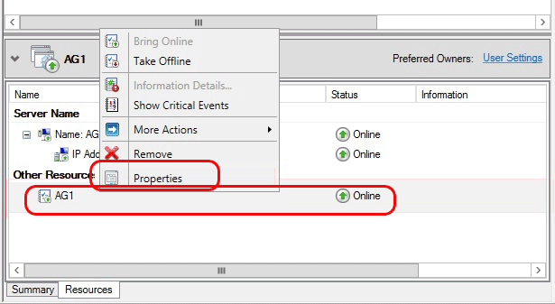
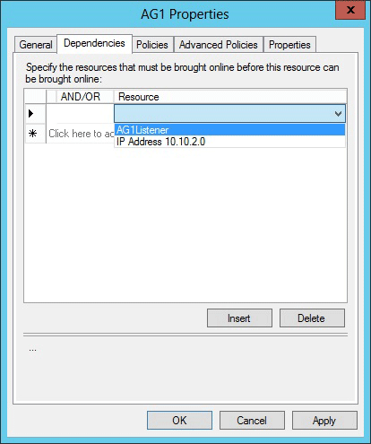

1. Navigieren Sie wieder zum Failovercluster-Manager.  Erweitern Sie **Rollen** , und markieren Sie die Gruppe Verfügbarkeit.  Klicken Sie auf der Registerkarte **Ressourcen** mit der rechten Maustaste in des Zuhörer Namens, und klicken Sie auf Eigenschaften.

1. Klicken Sie auf der Registerkarte **Abhängigkeiten** . Falls mehrere Ressourcen aufgeführt sind, stellen Sie sicher, dass die IP-Adressen oder nicht verfügen und, Abhängigkeiten.  Klicken Sie auf **OK**.

1. Mit der rechten Maustaste in des Zuhörer Namens, und klicken Sie auf **Online schalten**.

1. Sobald die Zuhörer online und über die Registerkarte **Ressourcen ist** , mit der rechten Maustaste in der Gruppe Verfügbarkeit, und klicken Sie auf **Eigenschaften**.

    

1. Erstellen Sie eine Abhängigkeit für die Ressource Zuhörer Namen (nicht die IP-Adresse Ressourcenname) ein. Klicken Sie auf **OK**.

    

1. Starten von **SQL Server Management Studio** und an die primäre verbinden.

1. Navigieren Sie zu **AlwaysOn hohen Verfügbarkeit** | **Verfügbarkeit Gruppen** | **<AvailabilityGroupName>** | **Verfügbarkeit Gruppe Listener**. 

3. Den Namen der Zuhörer sollte nun angezeigt werden, den Sie im Failovercluster-Manager erstellt. Mit der rechten Maustaste in des Zuhörer Namens, und klicken Sie auf **Eigenschaften**.

1. Geben Sie im Feld **Port** die Port-Nummer für die Verfügbarkeit Gruppe Zuhörer mithilfe der $EndpointPort früheren verwendet (in diesem Lernprogramm wurde 1433 die Standardeinstellung), klicken Sie dann auf **OK**.
