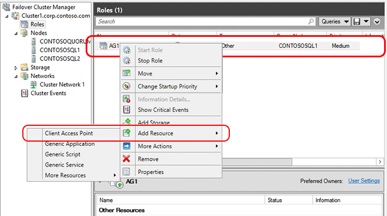

In diesem Schritt erstellen Sie manuell die Verfügbarkeit Gruppe Zuhörer Failovercluster-Manager und SQL Server Management Studio (SSMS) aus.

1. Öffnen Sie aus dem Knoten Hostinganbieter primäre Replikat Failovercluster-Manager.

1. Wählen Sie den Knoten **Netzwerke** aus, und notieren Sie den Namen der Cluster-Netzwerk. Dieser Name wird in der Variablen $ClusterNetworkName in der PowerShell-Skript verwendet werden.

1. Erweitern Sie den Clusternamen, und klicken Sie dann auf **Rollen**.

1. Klicken Sie im Bereich **Rollen** mit der rechten Maustaste in des Verfügbarkeit Gruppennamen ein, und wählen Sie dann auf **Ressource hinzufügen** > **Client Access Point**.

    

1. Erstellen Sie im Feld **Name** einen Namen für diese neue Zuhörer, und dann klicken Sie zweimal auf **Weiter** , und klicken Sie dann auf **Fertig stellen**. Schalten Sie die Zuhörer oder Ressource online an diesem Punkt.

1. Klicken Sie auf der Registerkarte **Ressourcen** , und klicken Sie dann erweitern Sie den soeben erstellten Client Access-Point. Sie sehen die Ressource **IP-Adresse** für den einzelnen Clusternetzwerken in Ihren Cluster. Ist dies eine nur Azure-Lösung, sehen Sie nur eine IP-Adressenressource.

1. Wenn Sie eine Lösung Hybrid konfigurieren, fahren Sie mit diesen Schritt. Wenn Sie eine einzige Azure-Lösung konfigurieren, fahren Sie mit dem nächsten Schritt fort. 
     - Mit der rechten Maustaste in der IP-Adresse Ressource, die mit Ihrem lokalen Subnetz entspricht, und wählen Sie **Eigenschaften**aus. Notieren Sie den Namen IP-Adresse und Netzwerk-Namen ein.
     - Wählen Sie **Statische IP-Adresse**, weisen Sie eine nicht verwendete IP-Adresse ein, und klicken Sie dann auf **OK**.

1. Mit der rechten Maustaste in der IP-Adresse Ressource, die Ihrem Subnetz gehören, Azure entspricht, und wählen Sie dann auf Eigenschaften.
    >[AZURE.NOTE] Wenn die Zuhörer später online aufgrund einer in Konflikt stehende IP-Adresse von DHCP aktiviert ist, fehlschlägt, können Sie eine gültige statische IP-Adresse in diesem Eigenschaftenfenster konfigurieren.

1. Ändern Sie im Eigenschaftenfenster gleichen **IP-Adresse** den **Namen IP-Adresse**ein. Diese IP-Adressnamen werden in der Variablen **$IPResourceName** der PowerShell-Skript verwendet werden. Wiederholen Sie diesen Schritt für jede IP-Ressource, wenn Ihre Lösung mehrere Azure VNets umfasst.