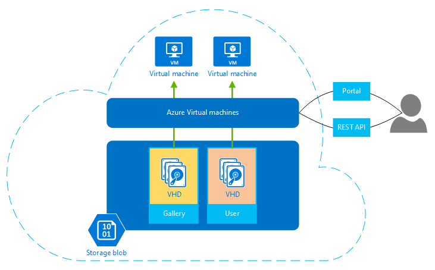

## Infos zu virtuellen Computern

Azure-virtuellen Computern können Sie das Erstellen und Verwenden von virtuellen Computern in der Cloud. Bereitstellen des sogenannte *Infrastructure as a Service (IaaS)*, kann in verschiedene Arten virtuellen Computern Technologie verwendet werden. Einige Beispiele für sind:

- **Virtuellen Computern (virtuelle Computer) für die Entwicklung und testen.** Entwicklungsgruppen zu virtuellen Computern häufig verwenden, weil sie eine schnelle und einfache Möglichkeit bieten auf einen Computer mit bestimmten Konfigurationen erforderlich, um die Code erstellen und Testen der Anwendung. Azure-virtuellen Computern bietet eine einfache und preisgünstige Möglichkeit, diese virtuelle Computer erstellen, verwenden sie dann löschen, wenn sie nicht mehr benötigt werden.
- **Ausführen von Applications in der Cloud.** Ist es sinnvoll economic auf der öffentlichen Cloud einige Programme ausgeführt werden. Ein Beispiel ist eine Anwendung, die Spitzen der Nachfrage hat. Obwohl Sie ausstatten konnte wenig eigene Data Center mit genügend Hardware Höchstwert Demand, verarbeitet, die Hardware möglicherweise viel von der Zeit genutzt. Ausführen dieser Anwendung auf Azure ermöglicht, die Sie zusätzliche virtuellen Computern nur, wenn Sie benötigen, und fahren, wenn Sie nicht bezahlen. Oder nehmen Sie an, dass Sie eine Start befinden, die bei Bedarf computing-Ressourcen keine Zusicherung und schnell erledigen. Azure kann erneut, die richtige Wahl sein.
- **Erweitern Sie Ihre eigenen Datacenter in der öffentlichen Cloud.** Wenn Sie Azure-virtuellen Netzwerk verwenden, kann Ihrer Organisation ein virtuelles Netzwerk (VNET) erstellen, das ist eine Erweiterung des lokalen Netzwerks und Hinzufügen von virtuellen Computern zu dieser VNET, werden kann. Dadurch wie [SharePoint](../articles/virtual-machines/virtual-machines-windows-sharepoint-farm.md), [SQL Server](../articles/virtual-machines/virtual-machines-windows-sql-server-iaas-overview.md) und andere Applikationen eine Azure-virtuellen Computers ausgeführt wird. Dieser Ansatz ist möglicherweise leichter bereitstellen oder kostengünstiger als ausgeführt werden können virtuellen Computern eigene Datacenter.   
- **Wiederherstellung.** Statt Zahlen kontinuierlich für eine Sicherung Datencenters, der die hat kaum verwendet, IaaS-basierte Disaster Wiederherstellung ermöglicht, den Sie Zahlen für die computing-Ressourcen, die Sie benötigen nur dann, wenn Sie wirklich benötigen.  Beispielsweise, wenn Ihre primäre Datacenter nach unten geht, können Sie auf Windows Azure zur Ausführung grundlegende Anwendung ausgeführte virtuelle Computer erstellen und dann beendet, wenn sie nicht mehr benötigt werden.

Wie die anderen virtuellen Computern ein virtuellen Computers in Azure verfügt über ein Betriebssystem, Speicher und networking-Funktionen und eine Vielzahl von Applications ausgeführt werden kann. Sie können Verwenden eines Bilds von Azure oder einen seiner Partner bereitgestellt oder Ihr eigenes verwenden. Beispiele für verschiedene Versionen, Editionen und Konfigurationen:
 
- Linux-Servern, wie z. B. SuSE-, Ubuntu- und CentOS
- WindowsServer 
- SqlServer
- BizTalk Server 
- SharePoint Server

Virtuellen Computern verwenden virtuellen Festplatten (virtuelle Festplatten), um ihre Betriebssystem (BS) und die Daten zu speichern. Virtuelle Festplatten werden auch für die Bilder verwendet, die, denen Sie auswählen können, um ein Betriebssystem zu installieren. Die folgende Abbildung zeigt, sowie zwei der Tools zum Erstellen und Verwalten Ihrer virtuellen Computer.

**Abbildung: Azure-virtuellen Computern bietet Infrastruktur als Dienst an.**

Virtuellen Computern können mithilfe einer browserbasiertes Portal Befehlszeile Tools mit Unterstützung für Scripting sicher sind, oder direkt über die REST-API verwaltet werden. Microsoft-Partner wie RightScale und ScaleXtreme bieten auch Management Services, die auf die REST-API aufsetzen. 

Umfassen zusammen mit der OS andere Konfigurationsoptionen, die Sie mit virtuellen Computern haben:

- Die Größe, wodurch bestimmt wird, dass Faktoren wie z. B., wie viele Datenträger anfügen können und die Leistung. Azure bietet eine Vielzahl von Größen zur Unterstützung von viele Arten von verwendet werden. Weitere Informationen finden Sie unter [Größen für virtuelle Computer](../articles/virtual-machines/virtual-machines-linux-sizes.md).  
- Der Azure Region, wo Ihre neue virtueller Computer gehostet werden, wie in den USA, Europa oder Asien. 
- Virtueller Computer Erweiterungen, die Ihre virtuellen Computern Zusatzfunktionen, wie z. B. Anti-Virus ausführen, oder verwenden die Konfiguration des gewünschten Features von Windows PowerShell geben.

Weitere Vorteile für virtuelle Computer zu berücksichtigen sind:

**Nutzungsbasierte** – Azure Gebühren einen stündlichen Preis basierend auf Größe und Betriebssystem des virtuellen Computers. Teilweise Stunden Azure Gebühren nur für die Anzahl der Minuten verwenden. Speicher ist Preis und separat in Rechnung gestellt. Weitere Informationen finden Sie unter [Virtuellen Computern Preise](https://azure.microsoft.com/pricing/details/virtual-machines/).

**Stabilität** – Azure überwacht die physische Hardware, die jeder laufenden virtuellen Computer hostet. Wenn ein physische Server Ausführen eines virtuellen Computers fehlschlägt, Azure, bemerkt bewegt sich der virtuellen Computer auf neue Hardware und startet den virtuellen Computer neu. Dieses Verfahren wird Dienst Reparatur bezeichnet. Azure Datenschutz auch des virtuellen Computers, indem redundante Kopien der virtuellen Festplatten im BLOB-Speicher gehalten. 

