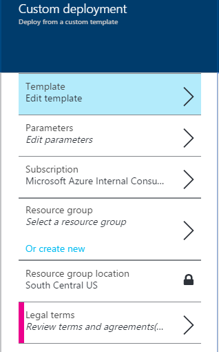

## Applikationen

Aus dieser Tabelle, die Sie weitere Informationen zu den Parametern, die verwendet werden in der Vorlage finden können, können Sie die Vorlage überprüfen, bevor Sie er bereitstellen oder Sie können die Vorlage direkt vom Azure-Portal bereitstellen.

| Anwendung | Weitere Informationen | Anzeigen der Vorlage | Stellen Sie es jetzt |
|:---|:---:|:---:|:---:|
| Active Directory | [Katalog](https://azure.microsoft.com/documentation/templates/active-directory-new-domain-ha-2-dc/) | [GitHub](https://github.com/Azure/azure-quickstart-templates/tree/master/active-directory-new-domain-ha-2-dc) |  |
| Apache | [Katalog](https://azure.microsoft.com/documentation/templates/apache2-on-ubuntu-vm/) | [GitHub](https://github.com/Azure/azure-quickstart-templates/tree/master/apache2-on-ubuntu-vm) | 
| Couchbase | [Katalog](https://azure.microsoft.com/documentation/templates/couchbase-on-ubuntu/) | [GitHub](https://github.com/Azure/azure-quickstart-templates/tree/master/couchbase-on-ubuntu) |  |
| DataStax | [Katalog](https://azure.microsoft.com/documentation/templates/datastax-on-ubuntu/) | [GitHub](https://github.com/Azure/azure-quickstart-templates/tree/master/datastax-on-ubuntu) |  |
| Django | [Katalog](https://azure.microsoft.com/documentation/templates/django-app/) | [GitHub](https://github.com/Azure/azure-quickstart-templates/tree/master/django-app) |  |
| Docker | [Katalog](https://azure.microsoft.com/documentation/templates/docker-simple-on-ubuntu/) | [GitHub](https://github.com/Azure/azure-quickstart-templates/tree/master/docker-simple-on-ubuntu) |  |
| Elasticsearch | [Katalog](https://azure.microsoft.com/documentation/templates/elasticsearch/) | [GitHub](https://github.com/Azure/azure-quickstart-templates/tree/master/elasticsearch) |  |
| Jenkins | [Katalog](https://azure.microsoft.com/documentation/templates/jenkins-on-ubuntu/) | [GitHub](https://github.com/Azure/azure-quickstart-templates/tree/master/jenkins-on-ubuntu) |  |
| Kafka | [Katalog](https://azure.microsoft.com/documentation/templates/kafka-ubuntu-multidisks/) | [GitHub](https://github.com/Azure/azure-quickstart-templates/tree/master/kafka-on-ubuntu) |  |
| LAMPE | [Katalog](https://azure.microsoft.com/en-us/documentation/templates/lamp-app/) | [GitHub](https://github.com/Azure/azure-quickstart-templates/tree/master/lamp-app) |  |
| MongoDB | [Katalog](https://azure.microsoft.com/documentation/templates/mongodb-on-ubuntu/) | [GitHub](https://github.com/Azure/azure-quickstart-templates/tree/master/mongodb-on-ubuntu) |  |
| Redis | [Katalog](https://azure.microsoft.com/documentation/templates/redis-high-availability/) | [GitHub](https://github.com/Azure/azure-quickstart-templates/tree/master/redis-high-availability) |  |
| SharePoint | [Katalog](https://azure.microsoft.com/documentation/templates/sharepoint-three-vm/) | [GitHub](https://github.com/Azure/azure-quickstart-templates/tree/master/sharepoint-three-vm) |  |
| Spark | [Katalog](https://azure.microsoft.com/documentation/templates/spark-ubuntu-multidisks/) | [GitHub](https://github.com/Azure/azure-quickstart-templates/tree/master/spark-ubuntu-multidisks) |  |
| Tomcat | [Katalog](https://azure.microsoft.com/documentation/templates/openjdk-tomcat-ubuntu-vm/) | [GitHub](https://github.com/Azure/azure-quickstart-templates/tree/master/openjdk-tomcat-ubuntu-vm) |  |
| WordPress | [Katalog](https://azure.microsoft.com/documentation/templates/wordpress-single-vm-ubuntu/) | [GitHub](https://github.com/Azure/azure-quickstart-templates/tree/master/wordpress-single-vm-ubuntu) |  |
| ZooKeeper | [Katalog](https://azure.microsoft.com/documentation/templates/zookeeper-cluster-ubuntu-vm/) | [GitHub](https://github.com/Azure/azure-quickstart-templates/tree/master/zookeeper-cluster-ubuntu-vm) |  |

Neben diesen Vorlagen können Sie über den [Office-Vorlagen](https://azure.microsoft.com/documentation/templates/)suchen.

## Azure-portal

Bereitstellen einer Vorlage mithilfe des Azure-Portals ist einfach zu erreichen, indem Sie einfach eine URL zu senden. Sie benötigen den Namen der Vorlagendatei bereitzustellen. Sie können den Namen suchen, indem Sie die Seiten im Vorlagenkatalog oder durch Suchen in der Github Repository. Ändern Sie diese URL {Vorlagenname} auf den Namen der Vorlage, die Sie bereitstellen, und geben ihn dann in Ihrem Browser möchten:

    https://portal.azure.com/#create/Microsoft.Template/uri/https%3A%2F%2Fraw.githubusercontent.com%2FAzure%2Fazure-quickstart-templates%2Fmaster%2F{template name}%2Fazuredeploy.json

Das benutzerdefinierte Bereitstellung Blade sollte angezeigt werden:

1.  Klicken Sie im Bereich **Vorlage** auf **Speichern**.
2.  Klicken Sie auf **Parameter**. Im Bereich **Parameter** Geben Sie neue Werte ein, wählen Sie aus der zulässigen Werte oder akzeptieren Sie Standardwerte, und klicken Sie dann auf **OK**.
3.  Falls erforderlich, klicken Sie auf **Abonnement** , und wählen Sie das richtige Azure-Abonnement.
4.  Klicken Sie auf die **Ressourcengruppe** , und wählen Sie eine vorhandene Ressourcengruppe. Alternativ klicken Sie auf **, oder erstellen Sie neue** zum Erstellen eines neuen Kontos für diese Bereitstellung.
5.  Falls erforderlich, klicken Sie auf die **Stelle** , und wählen Sie den richtigen Azure Speicherort.
6.  Falls erforderlich, klicken Sie auf **Vertragsbedingungen** So prüfen Sie die Begriffe und den Vertrag für die Verwendung der Vorlage.
7.  Klicken Sie auf **Erstellen**.

Je nach Vorlage kann es eine Weile für die Ressourcen bereitgestellt Azure dauern.

## Azure PowerShell

Führen Sie diese Befehle zum Erstellen der Ressourcengruppe und die Bereitstellung, nachdem Sie den Text in Klammern mit Gruppe Ressourcenname, Speicherort, Bereitstellung Namen und Vorlagenname ersetzen:

    New-AzureRmResourceGroup -Name {resource-group-name} -Location {location}
    New-AzureRmResourceGroupDeployment -Name {deployment-name} -ResourceGroupName {resource-group-name} -TemplateUri "https://raw.githubusercontent.com/azure/azure-quickstart-templates/master/{template-name}/azuredeploy.json"

Wenn Sie den Befehl **Neu-AzureRmResourceGroupDeployment** ausführen, werden Sie aufgefordert, zum Eingeben von Werten für die Parameter in der Vorlage. Je nach Vorlage kann es einige Zeit für die Ressourcen bereitgestellt Azure dauern.

## Azure CLI

[Azure CLI installieren](../articles/xplat-cli-install.md), melden Sie sich an, und stellen Sie sicher, dass Sie Ressourcenmanager Befehle aktivieren. Informationen hierzu finden Sie unter [Verwenden der Azure CLI für Mac, Linux, und Windows Azure-Ressourcenmanager](../articles/xplat-cli-azure-resource-manager.md).

Führen Sie diese Befehle zum Erstellen der Ressourcengruppe und die Bereitstellung, nachdem Sie den Text in Klammern mit Ressourcengruppennamen, Speicherort, Bereitstellung Namen und Vorlagenname ersetzen:

    azure group create {resource-group-name} {location}
    azure group deployment create --template-uri https://raw.githubusercontent.com/azure/azure-quickstart-templates/master/{template-name}/azuredeploy.json {resource-group-name} {deployment-name}

Wenn Sie den **Bereitstellung von Azure Gruppe erstellen** Befehl ausführen, werden Sie aufgefordert, zum Eingeben von Werten für die Parameter in der Vorlage. Je nach Vorlage kann es eine Weile für die Ressourcen bereitgestellt Azure dauern.

## Nächste Schritte

Ermitteln Sie alle Vorlagen zur Verfügung, die auf [GitHub](https://github.com/Azure/azure-quickstart-templates).

Weitere Informationen zu [Azure Ressourcenmanager](../articles/resource-group-template-deploy.md).
