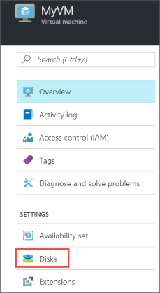
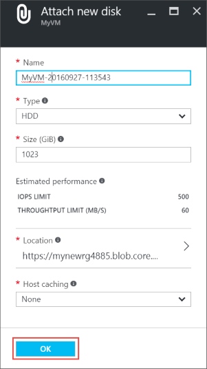
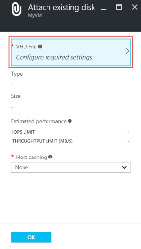
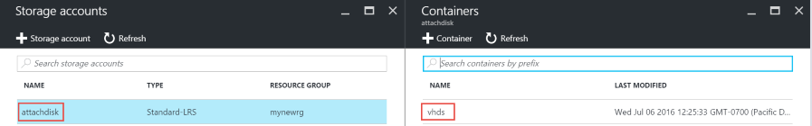

## Suchen des virtuellen Computers

1. Melden Sie sich mit dem [Azure-Portal](https://portal.azure.com/)aus.

2. Klicken Sie im Menü Hub auf **virtuellen Computern**.

3.  Wählen Sie den virtuellen Computer aus der Liste aus.

4. Klicken Sie auf virtuellen Computern vorher, in **Essentials** **Festplatten**.

    

Durch folgenden Anweisungen für Anfügen entweder eine neue oder eine vorhandene Datenträger fortsetzen.

## Option 1: Fügen Sie einen neuen Datenträger

1.  Klicken Sie auf dem **Datenträger** Blade auf **neue anfügen**.

2.  Überprüfen Sie die Standardeinstellungen, nach Bedarf aktualisieren Sie und dann auf **OK**.

    

3.  Nachdem Azure den Datenträger erstellt und an den virtuellen Computer angefügt, wird der neue Datenträger in des virtuellen Computers Datenträger Einstellungen unter **Daten Datenträger**aufgeführt.

## Option 2: Fügen Sie einen vorhandenen Datenträger

1.  Klicken Sie auf dem **Datenträger** Blade auf **vorhandene anfügen**.

2.  Klicken Sie unter **vorhandene Datenträger anfügen**klicken Sie auf **Datei virtuelle Festplatte**.

    

3.  Wählen Sie unter **Speicher-Konten**das Konto und Container, auf die VHD-Datei ein.

    

4.  Wählen Sie die VHD-Datei ein.

5.  Klicken Sie unter **Anfügen vorhandenen Datenträger**wird die soeben ausgewählte Datei unter **Virtuelle Festplatte Datei**aufgeführt. Klicken Sie auf **OK**.

6.  Nachdem Azure den Datenträger virtuellen Computer hängt, wird es in des virtuellen Computers Datenträger Einstellungen unter **Daten Datenträger**aufgeführt.

