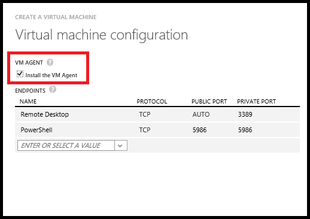

Virtueller Computer Erweiterungen helfen Ihnen:

-   Ändern der Sicherheit und Identität Features wie zurücksetzen Kontowerte und das Modul verwenden
-   Starten, beenden oder die Überwachung und Diagnose konfigurieren
-   Zurücksetzen oder Connectivity Features wie RDP und SSH installieren
-   Diagnostizieren, überwachen und Verwalten von Ihrem virtuellen Computern

Es gibt viele andere Features. neue Erweiterung virtueller Computer-Features werden regelmäßig veröffentlicht. In diesem Artikel werden die Azure-virtuellen Computer-Agents für Windows und Linux und wie virtueller Computer Erweiterung Funktionalität unterstützen. Eine Liste der Erweiterungen virtueller Computer nach Kategorie Feature, finden Sie unter [Azure-virtuellen Computer-Erweiterungen und Funktionen](../articles/virtual-machines/virtual-machines-windows-extensions-features.md).

##Azure-virtuellen Computer-Agents für Windows und Linux

Der Azure-virtuellen Computern-Agent (virtueller Computer Agent) ist ein abgesichert "Light"-Version Prozess, der installiert, konfiguriert und virtueller Computer Erweiterungen Instanzen von Azure virtuellen Computern aus der Bildergalerie und Instanzen von benutzerdefinierten virtuellen Computer entfernt, wenn sie die virtuellen Computer Agent installiert haben. Der Agent virtueller Computer fungiert als sichere lokale Steuerungsdienst Ihre Azure-virtuellen Computer. Die Extensions, in dem der Agent lädt stellen bestimmte Features Produktivität mithilfe der Instanz bereit.

Es gibt zwei Azure-virtuellen Computer-Agents, eine für Windows-virtuellen Computern und eine für Linux virtuelle Computer. Standardmäßig wird der Agent virtueller Computer automatisch installiert, wenn Sie einen virtuellen Computer aus der Bildergalerie erstellen, aber Sie können auch des virtuellen Computer-Agents nach dem Erstellen die Instanz installieren oder es in einer benutzerdefinierten virtuellen Computer-Bild, das Sie selbst dann hochladen.

>[AZURE.IMPORTANT] Diese virtuellen Computer-Agents sind sehr leicht, Dienste, die virtuellen Computern Instanzen abgesichert verwaltet werden können. Möglicherweise gibt es Fälle, in denen nicht der virtuellen Computer-Agent werden sollen. In diesem Fall müssen Sie Erstellen von virtuellen Computern, die keine der virtuellen Computer Agent installiert haben. Obwohl die Agent virtueller Computer physisch entfernt werden kann, ist das Verhalten der Verlängerung virtueller Computer für die Instanz nicht definiert. Entfernen des virtuellen Computer-Agents aus, nach der Installation wird daher zurzeit nicht unterstützt.

Virtueller Computer-Agent ist in den folgenden Situationen aktiviert:

-   Wenn Sie eine Instanz eines virtuellen Computers mithilfe der Methode zum **Schnellen Erstellen** in der klassischen Azure-Portal erstellen oder nach der Methode **Benutzerdefinierte erstellen** in der klassischen Azure-Portal verwenden, und dafür sorgen, dass das Kontrollkästchen **der Agent virtueller Computer installieren** ausgewählt ist (wie in der nachstehenden Abbildung gezeigt). Weitere Informationen finden Sie unter [So erstellen Sie eine benutzerdefinierte virtuellen Computern](../articles/virtual-machines/virtual-machines-windows-classic-createportal.md).

    

-   Wenn Sie eine Instanz eines virtuellen Computers mithilfe der [Neu-AzureVM](https://msdn.microsoft.com/library/azure/dn495254.aspx) oder das Cmdlet [AzureQuickVM neu](https://msdn.microsoft.com/library/azure/dn495183.aspx) erstellen. Sie können einen virtuellen ohne des virtuellen Computer-Agents installiert, indem Sie den Parameter **– DisableGuestAgent** an das Cmdlet [Hinzufügen-AzureProvisioningConfig](https://msdn.microsoft.com/library/azure/dn495299.aspx) erstellen.

-   Mit einem manuell herunterladen und Installieren der virtuellen Computer-Agent (Windows oder Linux Version) eines vorhandenen virtuellen Computers auf Instanz festlegen und dann den **ProvisionGuestAgent** Wert **true** mithilfe der PowerShell oder ein REST. (Wenn Sie nach der Installation von manuell des virtuellen Computer-Agents nicht diesen Wert festlegen, wird die Erweiterung des virtuellen Computer-Agents nicht ordnungsgemäß erkannt.) Im folgenden Code wird gezeigt, wie mithilfe der PowerShell dazu, in dem die `$svc` und `$name` Argumente haben bereits festgestellt wurde.

        $vm = Get-AzureVM –ServiceName $svc –Name $name
        $vm.VM.ProvisionGuestAgent = $TRUE
        Update-AzureVM –Name $name –VM $vm.VM –ServiceName $svc

-   Durch das Erstellen von virtuellen Computer Bild eines, des virtuellen Computer-Agents installiert sein, bevor Sie sie in Azure hochladen. Ein Windows virtueller Computer herunterladen Sie die [Windows virtueller Computer Agent MSI-Datei](http://go.microsoft.com/fwlink/?LinkID=394789) nicht und installieren Sie den Agent virtueller Computer. Für eine VM Linux installieren Sie es aus dem GitHub Repository am <https://github.com/Azure/WALinuxAgent>. Weitere Informationen zum Installieren des virtuellen Computer-Agents auf Linux, finden im [Azure Linux virtueller Computer Agent-Benutzerhandbuch](../articles/virtual-machines/virtual-machines-linux-agent-user-guide.md).

>[AZURE.NOTE]In PaaS des virtuellen Computer-Agents heißt **WindowsAzureGuestAgent**, und ist immer auf Web und Worker Rolle virtuellen Computern zur Verfügung. (Weitere Informationen finden Sie unter [Azure Rolle Architektur](http://blogs.msdn.com/b/kwill/archive/2011/05/05/windows-azure-role-architecture.aspx)). Der Agent virtueller Computer für die Rolle virtuellen Computern können nun Erweiterungen in der Cloud-Service-virtuellen Computern auf die gleiche Weise hinzufügen, die für beständigen virtuellen Computern bedeutet. Der größte Unterschied zwischen virtuellen Computer Erweiterungen auf virtuellen Computern und beständigen virtuellen Computern, die mit der Rolle virtuellen Computern ist, werden Erweiterungen auf die erste Cloud-Dienst und dann auf die Bereitstellungen in die Cloud-Dienst hinzugefügt.

>Verwenden Sie das Cmdlet " [Get-AzureServiceAvailableExtension](https://msdn.microsoft.com/library/azure/dn722498.aspx) ", um alle verfügbaren Rolle virtueller Computer Erweiterungen aufzulisten.

##Suchen nach, hinzufügen, aktualisieren und Entfernen von Erweiterungen virtueller Computer  

Details zu diesen Aufgaben finden Sie unter [Hinzufügen, finden Sie die Aktualisierung, und Azure-virtuellen Computer-Erweiterungen entfernen](../articles/virtual-machines/virtual-machines-windows-classic-manage-extensions.md).
