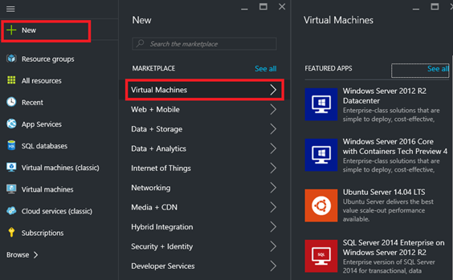
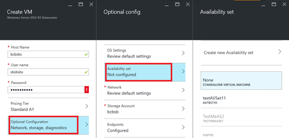

Eine Verfügbarkeit festlegen hilft behalten Sie Ihre virtuellen Computer zur Verfügung, während Ausfallzeiten, wie bei der Wartung. Platzieren zwei oder mehr ähnlich konfigurierten virtuellen Computern in einem Satz Verfügbarkeit erstellt die Redundanz benötigt, um die Verfügbarkeit der Applikationen oder Dienstleistungen, die Ihre virtuellen Computern ausgeführt wird. Weitere Informationen darüber, wie dies funktioniert finden Sie unter [Verwalten der Verfügbarkeit von virtuellen Computern] [].

Es ist eine bewährte Methode, die sowohl Verfügbarkeit Sätze und den Lastenausgleich Endpunkte verwenden, um sicherzustellen, dass die Anwendung immer verfügbar und aktiv effizient ist. Details zum Lastenausgleich Endpunkte finden Sie unter [Lastenausgleich für Azure-Infrastrukturdiensten] [].

Sie können klassische virtuellen Computern in einer Verfügbarkeit festlegen, indem Sie eine der beiden Optionen hinzufügen:

- [Option 1: Erstellen eines virtuellen Computers und eine Verfügbarkeit zur gleichen Zeit festlegen] []. Fügen Sie neue virtuellen Computern klicken Sie dann auf den Satz, wenn Sie diese virtuelle Computer erstellen.
- [Option 2: eine Verfügbarkeit Set vorhandenen virtuellen Computer hinzufügen] [].

>[AZURE.NOTE] In der Option Klassisch müssen den gleichen Clouddienst virtuellen Computern, die Sie in demselben Satz Verfügbarkeit setzen möchten angehören.

## Option 1: Erstellen eines virtuellen Computers und eine Verfügbarkeit zur gleichen Zeit festlegen##

Sie können der Azure-Portal oder Azure PowerShell-Befehlen dazu verwenden.

So verwenden Sie das Azure-portal

1. Wenn Sie bereits, melden Sie sich mit dem [Azure-Portal](https://portal.azure.com)nicht getan.

2. Klicken Sie im Menü Hub klicken Sie auf **+ neu**, und klicken Sie dann auf **virtuellen Computern**.
    
    

3. Wählen Sie das Bild der Marketplace-virtuellen Computern, die, das Sie verwenden möchten. Sie können auch eine Linux oder Windows virtuellen Computers zu erstellen.

4. Stellen Sie für den ausgewählten virtuellen Computer sicher, dass das Bereitstellungsmodell auf **klassische** festgelegt ist, und klicken Sie dann auf **Erstellen**
    
    

5. Name des virtuellen Computers, Benutzername und Kennwort (für Windows-Computer) oder SSH öffentlicher Schlüssel (für Linux Maschinen) eingeben. 

6. Wählen Sie die Größe des virtuellen Computer aus, und klicken Sie dann auf **Wählen Sie aus** , um den Vorgang fortzusetzen.

7. Wählen Sie **optionale Konfiguration > Verfügbarkeit festlegen**, und wählen Sie die Verfügbarkeit Sie legen des virtuellen Computers hinzufügen möchten.
    
     

8. Überprüfen Sie Ihre Konfiguration für ein. Wenn Sie fertig sind, klicken Sie auf **Erstellen**.

9. Während des virtuellen Computers Azure erstellt hat, können Sie den Fortschritt unter **virtuellen Computern** im Menü Hub nachverfolgen.

Azure PowerShell-Befehlen einer Azure-virtuellen Computern erstellen und es zu einem neuen oder vorhandenen Verfügbarkeit hinzufügen, finden Sie unter [Verwenden von Azure PowerShell zu erstellen und Windows-basierten virtuellen Maschinen vorkonfiguriert](../articles/virtual-machines/virtual-machines-windows-classic-create-powershell.md)

## Option 2: Hinzufügen eines vorhandenen virtuellen Computers auf einen Satz Verfügbarkeit##

Im Portal Azure können Sie eine vorhandene Verfügbarkeit vorhandenen klassischen virtuellen Computern festlegen oder Erstellen eines neuen Kontos für diese hinzufügen. (Denken Sie daran, die den virtuellen Computern in demselben Satz Verfügbarkeit müssen den gleichen Clouddienst angehören behalten Sie. bei) Die Schritte sind nahezu identisch. Mit Azure PowerShell können einem bestehenden Satz für die Verfügbarkeit des virtuellen Computers hinzugefügt werden.

1. Wenn Sie dies melden Sie sich mit dem [Portal Azure](https://portal.azure.com)noch nicht getan haben.

2. Klicken Sie im Menü Hub auf **virtuellen Computern (klassische)**.
    
    

3. Wählen Sie den Namen des virtuellen Computers, die Sie hinzufügen möchten, aus der Liste von virtuellen Computern.

4. Wählen Sie die **Einstellungen**des virtuellen Computers **Verfügbarkeit festlegen** .
    
    

5. Wählen Sie die Verfügbarkeit des virtuellen Computers hinzufügen möchten. Des virtuellen Computers müssen den gleichen Clouddienst gemäß der Verfügbarkeit angehören.
    
    

6. Klicken Sie auf **Speichern**.

Um Azure PowerShell Befehle verwenden möchten, öffnen Sie eine Administrator Ebene Azure PowerShell-Sitzung, und führen Sie den folgenden Befehl. Die Platzhalter (z. B. &lt;VmCloudServiceName&gt;), ersetzen Sie alles innerhalb der Anführungszeichen, einschließlich der Zeichen, die mit den richtigen Namen < und >.

    Get-AzureVM -ServiceName "<VmCloudServiceName>" -Name "<VmName>" | Set-AzureAvailabilitySet -AvailabilitySetName "<AvSetName>" | Update-AzureVM

>[AZURE.NOTE] Der virtuelle Computer möglicherweise neu gestartet werden, um es zur Verfügbarkeit festlegen hinzugefügt haben.

<!-- LINKS -->
[Option 1: Erstellen eines virtuellen Computers und eine Verfügbarkeit zur gleichen Zeit festlegen]: #createset
[Option 2: Hinzufügen eines vorhandenen virtuellen Computers auf einen Satz Verfügbarkeit]: #addmachine

[Lastenausgleich für Azure-Infrastrukturdiensten]: ../articles/virtual-machines/virtual-machines-linux-load-balance.md
[Verwalten der Verfügbarkeit von virtuellen Computern]: ../articles/virtual-machines/virtual-machines-linux-manage-availability.md

[Create a virtual machine running Windows]: ../articles/virtual-machines/virtual-machines-windows-hero-tutorial.md
[Virtual Network overview]: ../articles/virtual-network/virtual-networks-overview.md

