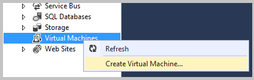
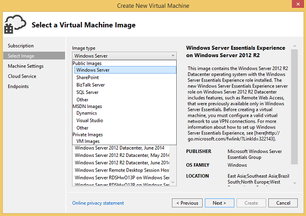
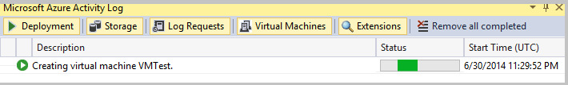
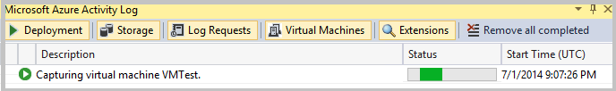

Sie können virtuellen Computern in Azure mithilfe von Server-Explorer in Visual Studio erstellen.

## Erstellen einer Azure-virtuellen Computern im Server-Explorer

Während Sie im [Verwaltungsportal Azure](http://go.microsoft.com/fwlink/?LinkID=253103)-virtuellen Computers erstellen können, können Sie mithilfe von Befehlen im Server-Explorer auch ein virtuellen Computers in Azure erstellen. Virtuellen Computern kann verwendet werden, zu einem front-End hinter einem gemeinsamen öffentlichen Lastenausgleich-Endpunkt angeben.

### Zum Erstellen eines neuen virtuellen Computers

1. Öffnen Sie im Server-Explorer den **Azure** -Knoten, und klicken Sie auf **virtuellen Computern**.

1. Klicken Sie im Kontextmenü auf **virtuellen Computern erstellen**.

    Der Assistent zum **Erstellen eines neuen virtuellen Computers** wird angezeigt.

    

1. Klicken Sie auf der Seite **Wählen Sie ein Abonnement** wählen Sie ein Abonnement beim Erstellen des virtuellen Computers zu verwendende, und klicken Sie dann auf **Weiter**.

    Wenn Sie nicht in Azure angemeldet sind, klicken Sie auf **Melden Sie sich** anmelden. Wählen Sie dann Ihr Abonnement Azure in der Dropdown-Listenfeld, wenn er noch nicht ausgewählt ist.

1. Klicken Sie auf der Seite **Wählen Sie ein Bild virtuellen Computern** wählen Sie in der Dropdown-Listenfeld **Bildtyp** einen Bildtyp aus, und wählen Sie dann einen virtuellen Computern Bilder im Listenfeld **ImageName** . Wenn Sie fertig sind, klicken Sie auf **Weiter**.

    

    Sie können die folgenden Bildtypen auswählen.

    - **Öffentliche Bilder** aufgelistet virtuellen Computern Bilder von Betriebssystemen und Serversoftware wie Windows Server und SQL Server.

    - **MSDN-Bildern** Listen virtuellen Computern Bilder von Software wie Visual Studio und Microsoft Dynamics der MSDN-Abonnenten zur Verfügung.

    - **Privat Bilder** Listen spezialisierte und GRG-virtuellen Computern Bilder, die Sie erstellt haben.

    Weitere Informationen zu spezialisierte und GRG-virtuellen Computern finden Sie unter [Virtueller Computer Bild](https://azure.microsoft.com/blog/2014/04/14/vm-image-blog-post/). Lesen Sie [zum Erfassen von einem Windows-Computer verwenden, die als Vorlage](https://azure.microsoft.com/documentation/articles/virtual-machines-capture-image-windows-server/) für Informationen dazu, wie Sie einen virtuellen Computer in eine Vorlage umwandeln, die Sie verwenden können, um schnell neu erstellen virtuellen Computern vorkonfiguriert ist.

    Sie können einen virtuellen Computern Bildnamen Anzeigen von Informationen über das Bild auf der rechten Seite der Seite klicken.

    >[AZURE.NOTE] Sie können keine **Öffentliche Bilder** virtuellen Computern Bilder hinzufügen oder **MSDN-Bilder** aufgelistet werden, da sie schreibgeschützt sind. Alle virtuellen Computern, die Sie erstellen, werden in der Liste **"Privat" Bilder** hinzugefügt.

    Wenn Sie ein Abonnement für Visual Studio Ebene MSDN-Abonnent sind, können Sie eine vorgefertigte Azure-virtuellen Computern erstellen, die Visual Studio als auch mehrere andere Bilder enthält. Weitere Informationen finden Sie unter [Erstellen eines virtuellen Computers in Visual Studio durch Verwenden von Visual Studio 2013 Bildergalerie Bild für MSDN-Abonnenten](http://visualstudio2013msdngalleryimage.azurewebsites.net) und [MSDN-Abonnements](https://www.visualstudio.com/products/msdn-subscriptions-vs). |

1. Klicken Sie auf der Seite **Einstellungen des virtuellen Computers grundlegende** Geben Sie einen anderen Computernamen, und fügen Sie dann die Angaben für die virtuellen Computern, einschließlich der Größe und einen Benutzernamen und Ihr Kennwort ein. Wenn Sie fertig sind, klicken Sie auf **Weiter**.

    Sie können den neuen Namen und das Kennwort verwenden, um melden Sie sich bei dem Computer mithilfe von Remotedesktop, daher es eine gute Idee ist, den sie für den Fall, dass Sie vergessen notieren. Nachdem Sie eine Azure-virtuellen Computern in Visual Studio erstellt haben, können Sie seine Größe und andere Einstellungen im [Verwaltungsportal Azure](http://go.microsoft.com/fwlink/?LinkID=253103)ändern.

    >[AZURE.NOTE] Wenn Sie größere des virtuellen Computers auswählen, möglicherweise zusätzliche Gebühren anfallen. Weitere Informationen finden Sie unter [Virtuellen Computern Preise Details](https://azure.microsoft.com/pricing/details/virtual-machines/) .

1. In Visual Studio erstellte Maschinen erfordern einen Clouddienst an. Wählen Sie auf der Seite **Einstellungen der Cloud-Dienst** einen Cloud-Dienst für den virtuellen Computer aus, oder klicken Sie auf **< neu erstellen... >** in der Dropdown-Liste Wenn nicht bereits einen Cloud-Dienst oder einen neuen verwenden möchten. Ein Speicherkonto ist auch erforderlich, also wählen Sie ein Speicherkonto (oder Erstellen eines neuen Kontos mit Speicher) in der Dropdown-Listenfeld **Speicher-Konto** . Weitere Informationen finden Sie unter [Einführung in Microsoft Azure-Speicher](../articles/storage/storage-introduction.md) .

1. Wenn Sie ein virtuelles Netzwerk angeben (Dies ist optional) möchten, wählen Sie ihn in der Dropdown-Listenfeldern virtuelles Netzwerk und Subnetz.

    Virtuellen Computern, die eine Sammlung Verfügbarkeit gehören werden auf verschiedenen Fehlerstrukturanalyse Domänen bereitgestellt. Weitere Informationen finden Sie unter [Azure-virtuellen Netzwerk](https://azure.microsoft.com/services/virtual-network/) .

1. Wenn Sie Ihre virtuellen Computern gehören soll eine Verfügbarkeit (auch optional) festlegen möchten, aktivieren Sie das Kontrollkästchen **angeben, einen Verfügbarkeit festlegen** , und wählen Sie dann eine Verfügbarkeit in der Dropdown-Listenfeld festlegen. Wenn Sie fertig sind, wählen Sie die Schaltfläche **Weiter** .

    Hinzufügen des virtuellen Computers zu einem Satz Verfügbarkeit hilft Ihrer Anwendung beim Netzwerkfehlern, lokalen Festplatte Hardwarefehlern und geplanten Ausfallzeit verfügbar bleiben. Sie müssen den [Azure-Verwaltungsportal](http://go.microsoft.com/fwlink/?LinkID=253103) verwenden, um virtuelle Netzwerke, Subnetze, erstellen und Verfügbarkeit legt fest. Weitere Informationen finden Sie unter [Verwalten der Verfügbarkeit von virtuellen Computern](https://azure.microsoft.com/documentation/articles/manage-availability-virtual-machines/) .

1. Legen Sie die öffentlichen Endpunkte, die für Benutzer des virtuellen Computers verfügbar sein sollen, klicken Sie auf der Seite **Endpunkte** . Beispielsweise könnten Sie entscheiden HTTP (Port 80) aktivieren zusätzlich zu den Remotedesktop und PowerShell Endpunkte, die standardmäßig aktiviert sind. Wenn Sie einen Endpunkt hinzufügen, wählen Sie eine in den **Portnamen** Dropdown-Listenfeld, und wählen Sie dann auf die Schaltfläche **Hinzufügen** . Wenn Sie einen Endpunkt entfernen möchten, wählen Sie das rote **X** neben dem Namen in der Liste Endpunkte aus.

    

    Die Endpunkte, die verfügbar sind, abhängig von Cloud-Dienst, den Sie für den virtuellen Computer ausgewählt haben. Weitere Informationen finden Sie unter [Azure-Endpunkte](https://azure.microsoft.com/documentation/articles/virtual-machines-set-up-endpoints/) .

    >[AZURE.NOTE] Aktivieren öffentlichen Endpunkte zur Verfügung Services auf dem virtuellen Computer mit dem Internet. Achten Sie darauf, zu installieren und konfigurieren Sie die Endpunkte und Dienste auf Ihrem Computer virtuellen ordnungsgemäß, z. B. Einstellung Steuerung des Benutzerzugriffs (ACLs) für die Endpunkte Listen. Weitere Informationen finden Sie unter [So Festlegen von Endpunkte eines virtuellen Computers](https://azure.microsoft.com/documentation/articles/virtual-machines-set-up-endpoints/) .

1. Wenn Sie fertig sind Konfigurieren der Einstellungen des virtuellen Computers, wählen Sie die Schaltfläche **Erstellen** des virtuellen Computers zu erstellen.

    Wie Azure des virtuellen Computers erstellt hat, zeigt der **Azure Aktivität Log** den Fortschritt den Erstellungsvorgang virtuellen Computern an.

    

    Um nur virtuellen Computerinformationen anzuzeigen, wählen Sie die Registerkarte **virtuelle Maschinen** in der **Azure Aktivität Log**aus.

    

    Wenn der Vorgang erfolgreich abgeschlossen ist, wird der neue virtuellen Computern unter dem Knoten **virtuellen Computern** im Server-Explorer angezeigt. Sie können darin protokollieren, indem Sie auf die Verknüpfung **Verbinden mithilfe von Remotedesktop** .

    

## Verwalten Sie Ihrer virtuellen Computern

Sie können auch anzeigen oder Ändern der Einstellungen für den virtuellen Computer, auf der Seite virtuellen Computern Konfiguration zusätzlich zu beenden, Herstellen einer Verbindung, aktualisieren und die ausgewählten virtuellen Computern Kontrollpunkten hinzu. Sie können:

- Ändern der Größe des virtuellen Computers.

- Wählen Sie die Verfügbarkeit zur Verwendung mit des virtuellen Computers festlegen aus.

- Fügen Sie hinzu, entfernen Sie oder ändern Sie der Einstellungen für Öffentliche Endpunkte.

- Hinzufügen, entfernen oder Konfigurieren von virtuellen Computern Erweiterungen.

- Anzeigen von Informationen über die Laufwerke des virtuellen Computers zugeordnet.

### Anzeigen oder Ändern der Einstellungen des virtuellen Computers

1. Wählen Sie im Server-Explorer Ihrer virtuellen Computern im Knoten **Azure-virtuellen Computern** aus.

1. Wählen Sie im Kontextmenü auf **Konfigurieren** der Konfigurationsseite des virtuellen Computers anzeigen aus.

    

1. Zeigen Sie die virtuellen Computerinformationen an oder ändern Sie ihn.

### Speichern oder Wiederherstellen des Status des virtuellen Computers

Konfigurieren des virtuellen Computers und Installieren von Software, ist es eine gute Idee, den Status durch Erstellen von virtuellen Computern Kontrollpunkten regelmäßig zu speichern. Ein Prüfpunkt ist eine Momentaufnahme oder eine Grafik des aktuellen Status des virtuellen Computers. Wenn Fehler des virtuellen Computers oder der virtuelle Computer konfiguriert werden soll, können Sie Zeit sparen, indem es in einer früheren Wissensstand Zustand wiederherstellen, anstatt über ganz neu beginnen.

### So erstellen einen Prüfpunkt virtuellen Computern

1. Wählen Sie im Server-Explorer Ihres virtuellen Computers im Knoten **Azure-virtuellen Computern** aus.

1. Wählen Sie im Kontextmenü auf **Konfigurieren** der Konfigurationsseite des virtuellen Computers anzeigen aus.

1. Wählen Sie auf der Konfigurationsseite die Schaltfläche **Bild erfassen** .

    

    Im Dialogfeld **erfassen virtuellen Computern** wird angezeigt.

    

1. Geben Sie eine Bezeichnung Bild und eine Beschreibung ein. Einen standardbeschriftung und eine Beschreibung bereitgestellt werden, jedoch können Sie sie bei Bedarf durch ein eigenes überschreiben.

1. Wenn Sie bereits Sysprep auf diesem virtuellen Computer ausgeführt haben, aktivieren Sie das **ich Sysprep des virtuellen Computers ausgeführt haben** .

    Sysprep ist ein Tool, die unter anderem entfernt Systeme-spezifische Daten des virtuellen Computers-Version von Windows, wodurch es Vorlage, die andere Personen verwenden können. Weitere Informationen finden Sie unter [zum Erfassen von einem Windows-Computer als Vorlage verwenden](https://azure.microsoft.com/documentation/articles/virtual-machines-capture-image-windows-server/) . Sichern Sie den virtuellen Computer aus, bevor Sie Sysprep starten.

1. Wenn Sie fertig sind Konfigurieren von Einstellungen für die erfassen, wählen Sie die Schaltfläche **erfassen** , um den Wissensstand erstellen aus.

    Wie Azure der Wissensstand, der **Azure Aktivität Log** zeigt den Fortschritt des Vorgangs erstellt.

    

    Wenn der Wissensstand Vorgang abgeschlossen ist, sehen Sie es in der **Azure Aktivitätsprotokoll**.

    

## Zum Verwalten von Kontrollpunkten virtuellen Computern

### Wiederherstellen ein virtuellen Computers in einer zuvor gespeicherten Zustand

- Befolgen Sie die Schritte in [schrittweise: Ausführen Cloud stellt von Microsoft Azure virtuellen Computern mithilfe der PowerShell - Teil 2](http://blogs.technet.com/b/keithmayer/archive/2014/02/04/step-by-step-perform-cloud-restores-of-windows-azure-virtual-machines-using-powershell-part-2.aspx).

### So löschen Sie einen Prüfpunkt

1. Wechseln Sie zu der [Azure-Verwaltungsportal](http://go.microsoft.com/fwlink/?LinkID=253103).

1. Wählen Sie auf der Seite virtuellen Computern Konfiguration der **Bilder** Registerkarte am oberen Rand der Seite aus.

1. Wählen Sie die Wissensstand, die Sie löschen möchten, und wählen Sie dann auf die Schaltfläche " **Löschen** " am unteren Rand der Seite.

## Fahren Sie Ihre virtuellen Computern

1. Wählen Sie im Server-Explorer des virtuellen Computers in der **Azure-virtuellen Computern** Knoten beendet werden soll.

1. Klicken Sie im Kontextmenü wählen Sie des Befehls **war(en) aus** , oder wählen Sie **Konfigurieren** , um die Konfigurationsseite des virtuellen Computers anzeigen aus, und wählen Sie dann auf die Schaltfläche **war(en)** .

## Nächste Schritte

Weitere Informationen zum Erstellen von virtuellen Computern, finden Sie unter [Erstellen eines virtuellen Computern ausgeführt Linux](../articles/virtual-machines/virtual-machines-linux-quick-create-cli.md) und [Erstellen eines virtuellen Computers ausgeführte Windows Azure Preview-Portal](../articles/virtual-machines/virtual-machines-windows-hero-tutorial.md).
