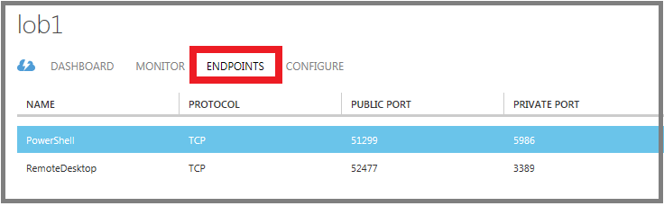
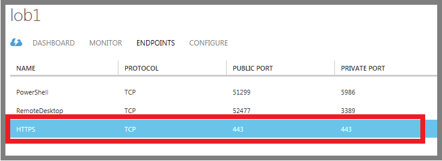
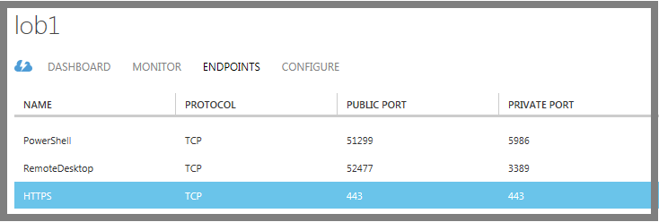
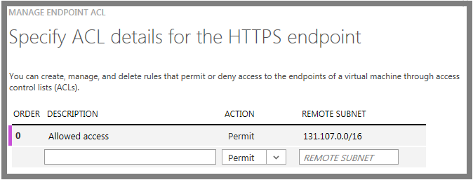

Jeder Endpunkt weist einen *öffentlichen Port* und eine *private Port*:

- Der öffentliche Port wird von Azure Lastenausgleich zum eingehenden Datenverkehr virtuellen Computer aus dem Internet zu überwachen.
- Private Anschluss wird von des virtuellen Computers zum eingehenden Datenverkehr, in der Regel an eine Anwendung oder Dienst der virtuellen Computers zu überwachen.

Standardwerte für die IP-Protokoll und TCP- oder UDP-Ports für bekannten Netzwerk Protokolle bereitgestellt werden, wenn Sie mit dem Azure klassischen Portal Endpunkte erstellen. Für benutzerdefinierte Endpunkte müssen Sie das richtige IP-Protokoll (TCP oder UDP) und die öffentlichen und privaten Ports angeben. Um eingehenden Netzwerkverkehr zufällig auf mehrere virtuelle Computer verteilt, müssen Sie einen Lastenausgleich Satz aus mehreren Endpunkten zu erstellen.

Nachdem Sie einen Endpunkt erstellt haben, können Sie eine Access Control List (ACL) definieren Sie Regeln, die zulassen oder verhindern den eingehenden Datenverkehr an den öffentlichen Port des Endpunkts basierend auf deren Quelle IP-Adresse. Ist der virtuelle Computer in ein Azure-virtuellen Netzwerk, sollten Sie Sicherheitsgruppen Netzwerk jedoch stattdessen verwenden. Weitere Informationen finden Sie unter [Netzwerk Sicherheitsgruppen](../articles/virtual-network/virtual-networks-nsg.md).

> [AZURE.NOTE]Firewallkonfiguration für Azure-virtuellen Computern erfolgt automatisch für Ports remote Connectivity Endpunkte, die automatisch Azure richtet zugeordnet. Für Ports für alle anderen Endpunkte angegeben wird keine Konfiguration automatisch an die Firewall des virtuellen Computers durchgeführt. Wenn Sie einen Endpunkt des virtuellen Computers erstellen, müssen Sie sicherstellen, dass die Firewall des virtuellen Computers auch den Datenverkehr für das Protokoll und private Port, der die Endpunktkonfiguration zulässt. Zum Konfigurieren der Firewalls finden Sie in der Dokumentation oder der Onlinehilfe für das Betriebssystem auf dem virtuellen Computer ausgeführt.

## Erstellen von außen liegenden Tabellenblättern

1.  Wenn Sie bereits anmelden [Azure klassischen Portal](http://manage.windowsazure.com)nicht getan.
2.  Klicken Sie auf **virtuellen Computern**, und klicken Sie dann auf den Namen des virtuellen Computers, die Sie konfigurieren möchten.
3.  Klicken Sie auf die **Endpunkte**. Auf der Seite **Endpunkte** Listet die aktuellen Endpunkte des virtuellen Computers. (In diesem Beispiel ist ein Windows virtueller Computer an. Eine Linux virtueller Computer wird standardmäßig einen Endpunkt für SSH angezeigt.)

    

4.  Klicken Sie in der Taskleiste auf **Hinzufügen**.
5.  Wählen Sie auf der Seite **hinzufügen einen Endpunkt eines virtuellen Computers** den Endpunkt aus.

    - Wenn Sie einen neuen Endpunkt erstellen, der in einer Reihe mit Lastenausgleich nicht zur Verfügung, oder der erste Endpunkt in einer neuen Lastenausgleich, **Hinzufügen eines eigenständigen Endpunkt**, wählen Sie dann klicken Sie auf den Pfeil nach links.
    - Andernfalls **hinzufügen einen Endpunkt zu einem bestehenden Satz von Lastenausgleich**, wählen Sie den Namen der Gruppe mit Lastenausgleich, wählen Sie dann klicken Sie auf den Pfeil nach links. Klicken Sie auf der Seite **Geben Sie die Details des Endpunkts** Geben Sie einen Namen für den Endpunkt und dann auf das Häkchen, um den Endpunkt zu erstellen.

6.  Klicken Sie auf der Seite **Details der den Endpunkt angeben** Geben Sie einen Namen für den Endpunkt im Feld **Name**ein. Sie können auch einen Protokoll Netzwerknamen aus der Liste auswählen, die Anfangswerte für das **Protokoll**, **Öffentlichen Anschluss**und **Private Anschluss**ausgefüllt werden.
7.  Wählen Sie für eine angepasste-Endpunkt im Feld **Protokoll** **TCP** oder **UDP**aus.
8.  Geben Sie für angepasste Ports, **Öffentlicher Port**, die Port-Nummer für den eingehenden Datenverkehr aus dem Internet. Geben Sie unter **"Privat" Port**die Port-Nummer, die auf der des virtuellen Computers wartet. Diese Portnummern können abweichen. Stellen Sie sicher, dass die Firewall auf dem virtuellen Computer zum Zulassen des Datenverkehrs, das Protokoll (in Schritt 7) und die private Port entspricht konfiguriert wurde.
9.  Wenn dieser Endpunkt der ersten Zeile in eine Reihe mit Lastenausgleich sein soll, klicken Sie auf **eine Gruppe mit Lastenausgleich erstellen**, und klicken Sie dann auf den Pfeil nach rechts. Geben Sie auf der Seite **konfigurieren die Menge Lastenausgleich** ein Lastenausgleich SetName, ein Protokoll Prüfpunkt und Port, und der Prüfpunkt Intervall und Anzahl der Prüfpunkte gesendet. Azure Lastenausgleich sendet Prüfpunkte mit den virtuellen Computern in einer Gruppe mit Lastenausgleich zu ihrer Verfügbarkeit zu überwachen. Den Datenverkehr in virtuellen Computern weiter, die nicht auf der Prüfpunkt reagieren Azure Lastenausgleich nicht. Klicken Sie auf den Pfeil nach rechts.
10. Klicken Sie auf das Häkchen, um den Endpunkt zu erstellen.

Klicken Sie auf der Seite **Endpunkte** wird der neue Endpunkt aufgeführt sein.

 

## Verwalten der ACL für einen Endpunkt

Zum Definieren von Computern, die Datenverkehr senden können, kann die ACL für einen Endpunkt Datenverkehr anhand der IP-Quelladresse einschränken. Führen Sie diese Schritte zum Hinzufügen, ändern oder Entfernen einer ACL für einen Endpunkt aus.

> [AZURE.NOTE] Ist der Endpunkt in einer Reihe mit Lastenausgleich, werden alle Änderungen, die Sie an die ACL für einen Endpunkt auf alle Endpunkte festlegen angewendet.

Ist der virtuelle Computer in ein Azure-virtuellen Netzwerk, empfehlen wir Netzwerk Sicherheitsgruppen statt ACLs. Weitere Informationen finden Sie unter [Netzwerk Sicherheitsgruppen](../articles/virtual-network/virtual-networks-nsg.md).

1.  Wenn Sie bereits, melden Sie sich zum klassischen Azure-Portal nicht getan.
2.  Klicken Sie auf **virtuellen Computern**, und klicken Sie dann auf den Namen des virtuellen Computers, die Sie konfigurieren möchten.
3.  Klicken Sie auf die **Endpunkte**. Wählen Sie den entsprechenden Endpunkt aus der Liste aus.

    

5.  Klicken Sie in der Taskleiste auf **ACL verwalten** , um das Dialogfeld **ACL angeben Details** zu öffnen.

    

6.  Verwenden von Zeilen in der Liste hinzufügen, löschen oder Bearbeiten von Regeln für eine ACL und deren Reihenfolge ändern. Der **Remote-Subnetz** -Wert ist, einen IP-Adressenbereich für eingehende Datenverkehr aus dem Internet, die der Azure Lastenausgleich zum Zulassen oder verhindern des Datenverkehrs basierend auf deren Quelle IP-Adresse verwendet wird. Achten Sie darauf, dass Sie den Bereich der IP-Adresse im CIDR-Format, auch bekannt als Präfix Adressformat angeben. Ein Beispiel ist 131.107.0.0/16.

Sie können Regeln verwenden, dürfen nur Datenverkehr von bestimmten Computern, die auf Ihrem Computer über das Internet entspricht oder aus bestimmten, bekannten Adressbereiche Datenverkehr verwehren möchten.

Die Regeln werden in der Reihenfolge mit die erste Regel beginnen und enden mit der letzten Regel ausgewertet. Dies bedeutet, dass Regeln zum höchsten Einschränkung aus mindestens nach sortiert werden soll. Beispiele und Weitere Informationen finden Sie unter [Neuigkeiten eine Network Access Control List?](../articles/virtual-network/virtual-networks-acl.md).

