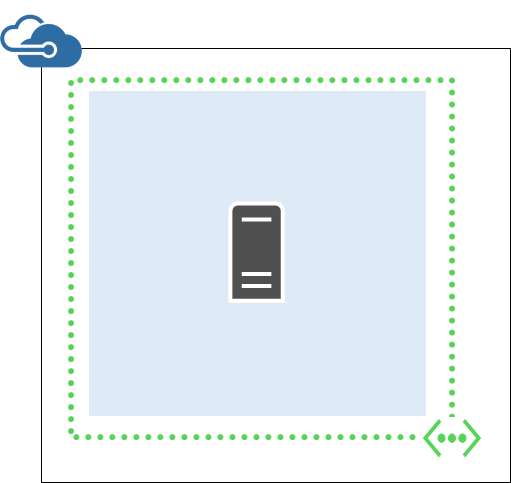
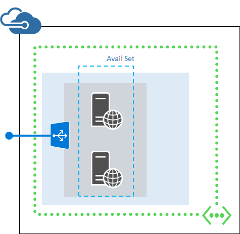

- [Quick-Erstellen eines virtuellen Computers in Azure](#quick-create-a-vm-in-azure)
- [Bereitstellen einer virtuellen Computern in Azure aus einer Vorlage](#deploy-a-vm-in-azure-from-a-template)
- [Erstellen Sie einen virtuellen Computer aus ein benutzerdefiniertes Bild](#create-a-custom-vm-image)
- [Bereitstellen einer virtuellen Computern, die einem virtuellen Netzwerk befinden und ein Lastenausgleich verwendet.](#deploy-a-multi-vm-application-that-uses-a-virtual-network-and-an-external-load-balancer)
- [Entfernen einer Ressourcengruppe](#remove-a-resource-group)
- [Anzeigen der Log für eine Gruppe Bereitstellung von Ressourcen](#show-the-log-for-a-resource-group-deployment)
- [Anzeigen von Informationen zu einem virtuellen Computern](#display-information-about-a-virtual-machine)
- [Verbinden Sie mit einem virtuellen Linux-Computer](#log-on-to-a-linux-based-virtual-machine)
- [Beenden eines virtuellen Computers](#stop-a-virtual-machine)
- [Starten eines virtuellen Computers](#start-a-virtual-machine)
- [Fügen Sie einen Datenträger](#attach-a-data-disk)

## Vorbereitung

Bevor Sie die Azure CLI mit Azure Ressourcengruppen verwenden können, müssen Sie rechts Azure CLI Version und ein Azure-Konto verfügen. Wenn Sie die Azure CLI, [Installieren sie](../articles/xplat-cli-install.md)besitzen.

### Aktualisieren Sie Ihre Azure CLI Version 0.9.0 oder höher

Typ `azure --version` zu sehen, ob Sie Version 0.9.0 bereits installiert haben oder höher. 

    azure --version
    0.9.0 (node: 0.10.25)

Wenn Ihre Version nicht 0.9.0 oder höher, Sie es aktualisieren, indem Sie eine der systemeigenen Installer oder über eine **Npm** durch Eingeben der müssen `npm update -g azure-cli`.

Sie können auch als Container Docker Azure CLI ausführen, mithilfe des folgenden [Docker Bild](https://registry.hub.docker.com/u/microsoft/azure-cli/). Führen Sie von einem Host Docker den folgenden Befehl aus:

    docker run -it microsoft/azure-cli

### Festlegen der Azure-Konto und Ihr Abonnement

Wenn Sie nicht bereits über ein Azure-Abonnement verfügen, aber Sie ein MSDN-Abonnement verfügen, können Sie Ihre [MSDN-Vorteile für Abonnenten](https://azure.microsoft.com/pricing/member-offers/msdn-benefits-details/)aktivieren. Oder Sie können für eine [kostenlose Testversion](https://azure.microsoft.com/pricing/free-trial/)registrieren.

Jetzt [Melden Sie sich bei Ihrem Konto Azure interaktiv](../articles/xplat-cli-connect.md#use-the-log-in-method) eingeben `azure login` und folgen die Anweisungen für eine interaktive Anmeldung Erfahrung mit Ihrem Konto Azure. 

> [AZURE.NOTE] Wenn Sie verfügen über eine Arbeit oder Schule ID, und Sie verfügen nicht über die zweifache Authentifizierung aktiviert kennen, können Sie **auch** verwenden `azure login -u` zusammen mit den geschäftlichen oder schulnotizbücher-ID, *ohne* einen interaktiven Sitzung sich anzumelden. Wenn keine Arbeit oder Schule ID, können Sie [Erstellen einer Arbeit oder Schule Id aus Ihrem persönlichen Microsoft-Konto](../articles/virtual-machines/virtual-machines-windows-create-aad-work-id.md) auf die gleiche Weise zu protokollieren.

Ihr Konto möglicherweise mehrere Abonnements. Sie können Ihre Abonnements auflisten, indem Sie mit der Eingabe `azure account list`, die möglicherweise ungefähr wie folgt aussehen:

    azure account list
    info:    Executing command account list
    data:    Name                              Id                                    Tenant Id                            Current
    data:    --------------------------------  ------------------------------------  ------------------------------------  -------
    data:    Contoso Admin                     xxxxxxxx-xxxx-xxxx-xxxx-xxxxxxxxxxxx  xxxxxxxx-xxxx-xxxx-xxxx-xxxxxxxxxxxx  true
    data:    Fabrikam dev                      xxxxxxxx-xxxx-xxxx-xxxx-xxxxxxxxxxxx  xxxxxxxx-xxxx-xxxx-xxxx-xxxxxxxxxxxx  false  
    data:    Fabrikam test                     xxxxxxxx-xxxx-xxxx-xxxx-xxxxxxxxxxxx  xxxxxxxx-xxxx-xxxx-xxxx-xxxxxxxxxxxx  false  
    data:    Contoso production                xxxxxxxx-xxxx-xxxx-xxxx-xxxxxxxxxxxx  xxxxxxxx-xxxx-xxxx-xxxx-xxxxxxxxxxxx  false  

Sie können das aktuelle Azure-Abonnement durch folgende Eingabe festlegen. Verwenden Sie den Namen des Abonnements oder die ID, die die Ressourcen enthält, die Sie verwalten möchten.

    azure account set <subscription name or ID> true

### Wechseln Sie zu der Azure CLI Ressource Gruppenmodus

Standardmäßig wird der CLI Azure im Modus Management Service (**Asm** Modus) beginnt. Geben Sie die folgenden Ressourcen Gruppe Modus wechseln.

    azure config mode arm

## Grundlegendes zu Azure Ressourcenvorlagen und Ressourcengruppen

Die meisten Applikationen werden anhand einer Kombination von verschiedenen Ressourcentypen (beispielsweise eine oder mehrere virtuellen Computern und Speicherkonten, einer SQL-Datenbank, eine virtuelle, oder Bereitstellung von Inhalten Netzwerk) erstellt. Das standardmäßige Azure Servicemanagement-API und Azure klassischen Portal dargestellt diese Elemente mithilfe eines Dienst-Ansatzes. Bei dieser Vorgehensweise müssen Sie bereitstellen und der einzelnen Dienste einzeln verwalten (oder suchen Sie nach anderen Tools, die berechtigt sind), und nicht als einzelne logische Einheit der Bereitstellung.

*Ressourcenmanager Azure Vorlagen*, jedoch, machen Sie es zum Bereitstellen und verwalten diese anderen Ressourcen als eine logische Bereitstellungseinheit auf deklarative Weise möglich. Statt imperativ besagt Azure was einen Befehl nach der anderen bereitstellen, die gesamte Bereitstellung in einer JSON-Datei – alle Ressourcen und zugehörige Konfiguration und Bereitstellungsparameter – beschreiben und feststellen, Azure diese Ressourcen als eine Gruppe bereitstellen.

Sie können den gesamten Lebenszyklus von Ressourcen der Gruppe dann mithilfe von Azure CLI Ressource Management Befehle zum Verwalten:

- Beenden, starten oder alle Ressourcen in der Gruppe auf einmal löschen.
- Wenden Sie rollenbasierte Access Steuerelement (RBAC) Regeln auf Sicherheitsberechtigungen für diese Sperren.
- Überwachen Sie Vorgänge an.
- Kategorisieren von Ressourcen mit zusätzlichen Metadaten für eine bessere Verlauf.

Weitere Informationen zum Azure Ressourcengruppen und diese für Sie in der [Übersicht Azure Ressourcenmanager](../articles/resource-group-overview.md)Möglichkeiten viele weitere. Wenn Sie beim Verfassen von Vorlagen interessiert sind, finden Sie unter [Azure Ressourcenmanager Authoring-Vorlagen](../articles/resource-group-authoring-templates.md).

## Aufgabe: Quick-Erstellen eines virtuellen Computers in Azure

Manchmal wissen Sie deren Bilder, die Sie benötigen, und Sie benötigen einen virtuellen Computer aus, die diesem Bild sofort und Sie nicht wichtig ist zu viel der Infrastruktur – vielleicht müssen Sie etwas eine übersichtliche virtuellen Computers zu testen. Dies ist, wann Sie verwenden möchten die `azure vm quick-create` Befehl und die Argumente übergeben, die zum Erstellen eines virtuellen Computers und seine Infrastruktur erforderlich sind.

Erstellen Sie zuerst die Ressourcengruppe ein.

    azure group create coreos-quick westus
    info:    Executing command group create
    + Getting resource group coreos-quick
    + Creating resource group coreos-quick
    info:    Created resource group coreos-quick
    data:    Id:                  /subscriptions/xxxxxxxx-xxxx-xxxx-xxxx-xxxxxxxxxxxx/resourceGroups/coreos-quick
    data:    Name:                coreos-quick
    data:    Location:            westus
    data:    Provisioning State:  Succeeded
    data:    Tags:
    data:
    info:    group create command OK

Zweites, benötigen Sie ein Bild. Um ein Bild mit der CLI Azure finden zu können, finden Sie unter [Navigieren und Azure-virtuellen Computern Bilder mit PowerShell und Azure CLI auswählen](../articles/virtual-machines/virtual-machines-linux-cli-ps-findimage.md). Aber in diesem Artikel hier eine kurze Liste mit beliebten Bilder. Wir verwenden CoreOSs unveränderliche Bild für diese Quick-create.

> [AZURE.NOTE] Für ComputeImageVersion können Sie auch einfach spätesten' als Parameter in der Azure CLI und sowohl die Vorlagensprache angeben. Damit können Sie die neueste und korrigierte Version des Bilds immer verwendet werden soll, ohne Ihre Skripts oder Vorlagen ändern zu müssen. Dies ist unten dargestellt.

| PublisherName                        | Angebot                                 | SKU                         | Version |
|:---------------------------------|:-------------------------------------------|:---------------------------------|:--------------------|
| OpenLogic                        | CentOS                                     | 7                                | 7.0.201503          |
| OpenLogic                        | CentOS                                     | 7.1                              | 7.1.201504          |
| CoreOS                           | CoreOS                                     | Beta                             | 647.0.0             |
| CoreOS                           | CoreOS                                     | Stabilität                           | 633.1.0             |
| MicrosoftDynamicsNAV             | DynamicsNAV                                | 2015                             | 8.0.40459           |
| MicrosoftSharePoint              | MicrosoftSharePointServer                  | 2013                             | 1.0.0               |
| msopentech                       | Oracle-Database-12c-Weblogic-Server-12c    | Standard                         | 1.0.0               |
| msopentech                       | Oracle-Database-12c-Weblogic-Server-12c    | Enterprise                       | 1.0.0               |
| MicrosoftSQLServer               | SQL2014-WS2012R2                           | Enterprise-optimiert-für-DW      | 12.0.2430           |
| MicrosoftSQLServer               | SQL2014-WS2012R2                           | Enterprise-optimiert-für-OLTP    | 12.0.2430           |
| Kanonische                        | UbuntuServer                               | 12.04.5-LTS                      | 12.04.201504230     |
| Kanonische                        | UbuntuServer                               | 14.04.2-LTS                      | 14.04.201503090     |
| MicrosoftWindowsServer           | WindowsServer                              | 2012-Datacenter                  | 3.0.201503          |
| MicrosoftWindowsServer           | WindowsServer                              | 2012-R2-Datacenter               | 4.0.201503          |
| MicrosoftWindowsServer           | WindowsServer                              | Windows-Server-technischen-Vorschau | 5.0.201504          |
| MicrosoftWindowsServerEssentials | WindowsServerEssentials                    | WindowsServerEssentials          | 1.0.141204          |
| MicrosoftWindowsServerHPCPack    | WindowsServerHPCPack                       | 2012R2                           | 4.3.4665            |

Erstellen Sie einfach Ihre virtuellen Computer durch Eingabe der `azure vm quick-create` Befehl und bereit für den Anweisungen. Es sollte nun wie folgt aussehen:

    azure vm quick-create
    info:    Executing command vm quick-create
    Resource group name: coreos-quick
    Virtual machine name: coreos
    Location name: westus
    Operating system Type [Windows, Linux]: linux
    ImageURN (format: "publisherName:offer:skus:version"): coreos:coreos:stable:latest
    User name: ops
    Password: *********
    Confirm password: *********
    + Looking up the VM "coreos"
    info:    Using the VM Size "Standard_A1"
    info:    The [OS, Data] Disk or image configuration requires storage account
    + Retrieving storage accounts
    info:    Could not find any storage accounts in the region "westus", trying to create new one
    + Creating storage account "cli9fd3fce49e9a9b3d14302" in "westus"
    + Looking up the storage account cli9fd3fce49e9a9b3d14302
    + Looking up the NIC "coreo-westu-1430261891570-nic"
    info:    An nic with given name "coreo-westu-1430261891570-nic" not found, creating a new one
    + Looking up the virtual network "coreo-westu-1430261891570-vnet"
    info:    Preparing to create new virtual network and subnet
    / Creating a new virtual network "coreo-westu-1430261891570-vnet" [address prefix: "10.0.0.0/16"] with subnet "coreo-westu-1430261891570-sne+" [address prefix: "10.0.1.0/24"]
    + Looking up the virtual network "coreo-westu-1430261891570-vnet"
    + Looking up the subnet "coreo-westu-1430261891570-snet" under the virtual network "coreo-westu-1430261891570-vnet"
    info:    Found public ip parameters, trying to setup PublicIP profile
    + Looking up the public ip "coreo-westu-1430261891570-pip"
    info:    PublicIP with given name "coreo-westu-1430261891570-pip" not found, creating a new one
    + Creating public ip "coreo-westu-1430261891570-pip"
    + Looking up the public ip "coreo-westu-1430261891570-pip"
    + Creating NIC "coreo-westu-1430261891570-nic"
    + Looking up the NIC "coreo-westu-1430261891570-nic"
    + Creating VM "coreos"
    + Looking up the VM "coreos"
    + Looking up the NIC "coreo-westu-1430261891570-nic"
    + Looking up the public ip "coreo-westu-1430261891570-pip"
    data:    Id                              :/subscriptions/xxxxxxxx-xxxx-xxxx-xxxx-xxxxxxxxxxxx/resourceGroups/coreos-quick/providers/Microsoft.Compute/virtualMachines/coreos
    data:    ProvisioningState               :Succeeded
    data:    Name                            :coreos
    data:    Location                        :westus
    data:    FQDN                            :coreo-westu-1430261891570-pip.westus.cloudapp.azure.com
    data:    Type                            :Microsoft.Compute/virtualMachines
    data:
    data:    Hardware Profile:
    data:      Size                          :Standard_A1
    data:
    data:    Storage Profile:
    data:      Image reference:
    data:        Publisher                   :coreos
    data:        Offer                       :coreos
    data:        Sku                         :stable
    data:        Version                     :633.1.0
    data:
    data:      OS Disk:
    data:        OSType                      :Linux
    data:        Name                        :cli9fd3fce49e9a9b3d-os-1430261892283
    data:        Caching                     :ReadWrite
    data:        CreateOption                :FromImage
    data:        Vhd:
    data:          Uri                       :https://cli9fd3fce49e9a9b3d14302.blob.core.windows.net/vhds/cli9fd3fce49e9a9b3d-os-1430261892283.vhd
    data:
    data:    OS Profile:
    data:      Computer Name                 :coreos
    data:      User Name                     :ops
    data:      Linux Configuration:
    data:        Disable Password Auth       :false
    data:
    data:    Network Profile:
    data:      Network Interfaces:
    data:        Network Interface #1:
    data:          Id                        :/subscriptions/xxxxxxxx-xxxx-xxxx-xxxx-xxxxxxxxxxxx/resourceGroups/coreos-quick/providers/Microsoft.Network/networkInterfaces/coreo-westu-1430261891570-nic
    data:          Primary                   :true
    data:          MAC Address               :00-0D-3A-30-72-E3
    data:          Provisioning State        :Succeeded
    data:          Name                      :coreo-westu-1430261891570-nic
    data:          Location                  :westus
    data:            Private IP alloc-method :Dynamic
    data:            Private IP address      :10.0.1.4
    data:            Public IP address       :104.40.24.124
    data:            FQDN                    :coreo-westu-1430261891570-pip.westus.cloudapp.azure.com
    info:    vm quick-create command OK

Und los geht's mit Ihrem neuen virtuellen Computer.

## Aufgabe: Bereitstellen eines virtuellen Computers in Azure aus einer Vorlage

Verwenden Sie die Anweisungen in den folgenden Abschnitten, um einen neuen Azure-virtuellen Computer mithilfe einer Vorlage mit der CLI Azure bereitstellen. Diese Vorlage erstellt einen einzelnen virtuellen Computer in ein neues virtuelles Netzwerk mit einem einzelnen Subnetz und im Gegensatz zu `azure vm quick-create`, ermöglicht es Ihnen, beschreiben Sie genau möchten, und wiederholen Sie die ohne Fehler. Hier ist, was mit dieser Vorlage erstellt:

### Schritt 1: Überprüfen Sie die JSON-Datei für die Vorlagenparameter

Folgen Sie den Inhalt der JSON-Datei für die Vorlage ein. (Die Vorlage wird auch in der [GitHub](https://raw.githubusercontent.com/Azure/azure-quickstart-templates/master/101-vm-simple-linux/azuredeploy.json)ansässig.)

Vorlagen sind flexibler, sodass der Designer möglicherweise möchten, geben Sie zahlreiche Parameter oder nur ein Paar durch Erstellen einer Vorlage, die mehr behoben wird anbieten möchten. Akzeptieren, um die Informationen zu erfassen, die Sie benötigen, um die Vorlage als Parameter zu übergeben, öffnen Sie die Vorlagendatei (in diesem Thema enthält eine Vorlage Inline unterhalb), und überprüfen Sie die Werte für die **Parameter** .

In diesem Fall wird die Vorlage ein für Fragen:

- Eine eindeutige speicherkontonamen für ein.
- Ein Administrator-Benutzername für den virtuellen Computer.
- Ein Kennwort.
- Einen Domänennamen für außen verwenden.
- Die Versionsnummer einer Ubuntu Server –, aber es akzeptiert nur eine einer Liste.

Finden Sie weitere Informationen zu [Benutzername und Kennwort Anforderungen](virtual-machines-linux-faq.md#what-are-the-username-requirements-when-creating-a-vm).

Nachdem Sie entscheiden, auf diese Werte Sie bereit sind für eine Gruppe erstellen und Bereitstellen dieser Vorlage in Ihrem Azure-Abonnement.

    {
    "$schema": "https://schema.management.azure.com/schemas/2015-01-01/deploymentTemplate.json#",
    "contentVersion": "1.0.0.0",
    "parameters": {
        "newStorageAccountName": {
        "type": "string",
        "metadata": {
            "description": "Unique DNS name for the storage account where the virtual machine's disks will be placed."
        }
        },
        "adminUsername": {
        "type": "string",
        "metadata": {
            "description": "User name for the virtual machine."
        }
        },
        "adminPassword": {
        "type": "securestring",
        "metadata": {
            "description": "Password for the virtual machine."
        }
        },
        "dnsNameForPublicIP": {
        "type": "string",
        "metadata": {
            "description": "Unique DNS name for the public IP used to access the virtual machine."
        }
        },
        "ubuntuOSVersion": {
        "type": "string",
        "defaultValue": "14.04.2-LTS",
        "allowedValues": [
            "12.04.5-LTS",
            "14.04.2-LTS",
            "15.04"
        ],
        "metadata": {
            "description": "The Ubuntu version for the VM. This will pick a fully patched image of this given Ubuntu version. Allowed values: 12.04.5-LTS, 14.04.2-LTS, 15.04."
        }
        }
    },
    "variables": {
        "location": "West US",
        "imagePublisher": "Canonical",
        "imageOffer": "UbuntuServer",
        "OSDiskName": "osdiskforlinuxsimple",
        "nicName": "myVMNic",
        "addressPrefix": "10.0.0.0/16",
        "subnetName": "Subnet",
        "subnetPrefix": "10.0.0.0/24",
        "storageAccountType": "Standard_LRS",
        "publicIPAddressName": "myPublicIP",
        "publicIPAddressType": "Dynamic",
        "vmStorageAccountContainerName": "vhds",
        "vmName": "MyUbuntuVM",
        "vmSize": "Standard_D1",
        "virtualNetworkName": "MyVNET",
        "vnetID": "[resourceId('Microsoft.Network/virtualNetworks',variables('virtualNetworkName'))]",
        "subnetRef": "[concat(variables('vnetID'),'/subnets/',variables('subnetName'))]"
    },
    "resources": [
        {
        "type": "Microsoft.Storage/storageAccounts",
        "name": "[parameters('newStorageAccountName')]",
        "apiVersion": "2015-05-01-preview",
        "location": "[variables('location')]",
        "properties": {
            "accountType": "[variables('storageAccountType')]"
        }
        },
        {
        "apiVersion": "2015-05-01-preview",
        "type": "Microsoft.Network/publicIPAddresses",
        "name": "[variables('publicIPAddressName')]",
        "location": "[variables('location')]",
        "properties": {
            "publicIPAllocationMethod": "[variables('publicIPAddressType')]",
            "dnsSettings": {
            "domainNameLabel": "[parameters('dnsNameForPublicIP')]"
            }
        }
        },
        {
        "apiVersion": "2015-05-01-preview",
        "type": "Microsoft.Network/virtualNetworks",
        "name": "[variables('virtualNetworkName')]",
        "location": "[variables('location')]",
        "properties": {
            "addressSpace": {
            "addressPrefixes": [
                "[variables('addressPrefix')]"
            ]
            },
            "subnets": [
            {
                "name": "[variables('subnetName')]",
                "properties": {
                "addressPrefix": "[variables('subnetPrefix')]"
                }
            }
            ]
        }
        },
        {
        "apiVersion": "2015-05-01-preview",
        "type": "Microsoft.Network/networkInterfaces",
        "name": "[variables('nicName')]",
        "location": "[variables('location')]",
        "dependsOn": [
            "[concat('Microsoft.Network/publicIPAddresses/', variables('publicIPAddressName'))]",
            "[concat('Microsoft.Network/virtualNetworks/', variables('virtualNetworkName'))]"
        ],
        "properties": {
            "ipConfigurations": [
            {
                "name": "ipconfig1",
                "properties": {
                "privateIPAllocationMethod": "Dynamic",
                "publicIPAddress": {
                    "id": "[resourceId('Microsoft.Network/publicIPAddresses',variables('publicIPAddressName'))]"
                },
                "subnet": {
                    "id": "[variables('subnetRef')]"
                }
                }
            }
            ]
        }
        },
        {
        "apiVersion": "2015-05-01-preview",
        "type": "Microsoft.Compute/virtualMachines",
        "name": "[variables('vmName')]",
        "location": "[variables('location')]",
        "dependsOn": [
            "[concat('Microsoft.Storage/storageAccounts/', parameters('newStorageAccountName'))]",
            "[concat('Microsoft.Network/networkInterfaces/', variables('nicName'))]"
        ],
        "properties": {
            "hardwareProfile": {
            "vmSize": "[variables('vmSize')]"
            },
            "osProfile": {
            "computername": "[variables('vmName')]",
            "adminUsername": "[parameters('adminUsername')]",
            "adminPassword": "[parameters('adminPassword')]"
            },
            "storageProfile": {
            "imageReference": {
                "publisher": "[variables('imagePublisher')]",
                "offer": "[variables('imageOffer')]",
                "sku": "[parameters('ubuntuOSVersion')]",
                "version": "latest"
            },
            "osDisk": {
                "name": "osdisk",
                "vhd": {
                "uri": "[concat('http://',parameters('newStorageAccountName'),'.blob.core.windows.net/',variables('vmStorageAccountContainerName'),'/',variables('OSDiskName'),'.vhd')]"
                },
                "caching": "ReadWrite",
                "createOption": "FromImage"
            }
            },
            "networkProfile": {
            "networkInterfaces": [
                {
                "id": "[resourceId('Microsoft.Network/networkInterfaces',variables('nicName'))]"
                }
            ]
            }
        }
        }
    ]
    }

### Schritt 2: Erstellen des virtuellen Computers mithilfe der Vorlage

Nachdem Sie Ihre Parameterwerte bereit haben, müssen Sie eine Ressourcengruppe für die Bereitstellung Ihrer Vorlage erstellen und dann die Vorlage bereitstellen.

Geben Sie zum Erstellen der Ressourcengruppe `azure group create <group name> <location>` mit dem Namen der gewünschten Gruppe und Datacenter Position in die Sie bereitstellen möchten. In diesem Fall schnell:

    azure group create myResourceGroup westus
    info:    Executing command group create
    + Getting resource group myResourceGroup
    + Creating resource group myResourceGroup
    info:    Created resource group myResourceGroup
    data:    Id:                  /subscriptions/xxxxxxxx-xxxx-xxxx-xxxx-xxxxxxxxxxxx/resourceGroups/myResourceGroup
    data:    Name:                myResourceGroup
    data:    Location:            westus
    data:    Provisioning State:  Succeeded
    data:    Tags:
    data:
    info:    group create command OK

Rufen Sie zum Erstellen der bereitstellungs jetzt `azure group deployment create` und übergeben:

- Die Vorlagendatei (Wenn Sie die oben angegebenen JSON-Vorlage mit einer lokalen Datei gespeichert haben).
- Eine Vorlage URI (Wenn Sie auf die Datei im GitHub oder einige andere Webadresse zeigen möchten).
- Die Ressourcengruppe, in die Sie bereitstellen möchten.
- Der Name einer optional Bereitstellung.

Sie werden aufgefordert, um die Werte von Parametern im Abschnitt "Parameter" den JSON-Datei anzugeben. Wenn Sie alle Parameterwerte angegeben haben, wird die Bereitstellung ausgeführt.

Hier ist ein Beispiel:

    azure group deployment create --template-uri https://raw.githubusercontent.com/Azure/azure-quickstart-templates/master/101-vm-simple-linux/azuredeploy.json myResourceGroup firstDeployment
    info:    Executing command group deployment create
    info:    Supply values for the following parameters
    newStorageAccountName: storageaccount
    adminUsername: ops
    adminPassword: password
    dnsNameForPublicIP: newdomainname

Sie erhalten die folgende Art der Informationen:

    + Initialisierung Vorlage Konfigurationen und Parameter
    + Erstellen einer Bereitstellungsinformationen: erstellte Vorlage Bereitstellung "FirstDeployment"
    + Anbieter Informationen registrieren: Anbieter microsoft.storage Informationen zu registrieren: Anbieter microsoft.network Informationen zu registrieren: Anbieter microsoft.compute registrieren
    + Warten auf Abschluss der Bereitstellung: DeploymentName: FirstDeployment Daten: ResourceGroupName: MyResourceGroup Daten: ProvisioningState: Daten erfolgreich: Zeitstempel: 2015-04-28T07:53:55.1828878Z Daten: Modus: inkrementell Daten: TemplateLink: https://raw.githubusercontent.com/Azure/azure-quickstart-templates/master/101-simple-linux-vm/azuredeploy.json Daten: ContentVersion: 1.0.0.0 Daten: Daten Typwert Namen:------(...) Daten: NewStorageAccountName Storageaccount Zeichenfolgendaten: AdminUsername Ops Zeichenfolgendaten: AdminPassword SecureString undefiniert Daten: DnsNameForPublicIP fehl Zeichenfolgendaten: UbuntuOSVersion Zeichenfolge 14.10 Informationen: Bereitstellung Gruppe erstellen Befehl auf OK

## Aufgabe: Erstellen eines benutzerdefinierten virtuellen Computer Bilds

Sie haben die grundlegende Verwendung von Vorlagen oben, gesehen jetzt wir ähnliche Anweisungen zum Erstellen eines benutzerdefinierten virtuellen Computers aus einer bestimmten VHD-Datei in Azure, mithilfe einer Vorlage über die CLI Azure verwenden können. Hier die Differenz ist, dass diese Vorlage aus einer angegebenen virtuellen Festplatte (virtuelle Festplatte) ein einzelnes virtuellen Computers erstellt.

### Schritt 1: Überprüfen Sie die JSON-Datei für die Vorlage

Folgen Sie den Inhalt der JSON-Datei für die Vorlage, die in diesem Abschnitt als Beispiel verwendet. (Die Vorlage wird auch in der [GitHub](https://raw.githubusercontent.com/Azure/azure-quickstart-templates/master/101-vm-from-user-image/azuredeploy.json)ansässig.)

In diesem Fall müssen Sie zum Auffinden der Werte, die Sie für die Parameter eingeben, die keine Standardwerte haben möchten. Beim Ausführen der `azure group deployment create` Befehl Azure CLI fordert Sie diese Werte eingeben.

    {
        "$schema": "http://schema.management.azure.com/schemas/2014-04-01-preview/deploymentTemplate.json",
        "contentVersion": "1.0.0.0",
        "parameters" : {
            "userImageStorageAccountName": {
                "type": "string",
                "defaultValue" : "userImageStorageAccountName"
            },
            "userImageStorageContainerName" : {
                "type" : "string",
                "defaultValue" : "userImageStorageContainerName"
            },
            "userImageVhdName" : {
                "type" : "string",
                "defaultValue" : "userImageVhdName"
            },
            "dnsNameForPublicIP" : {
                "type" : "string",
                "defaultValue": "uniqueDnsNameForPublicIP"
            },
            "adminUserName": {
                "type": "string"
            },
            "adminPassword": {
                "type": "securestring"
            },
            "osType" : {
                "type" : "string",
                "allowedValues" : [
                    "windows",
                    "linux"
                ]
            },
            "subscriptionId":{
                "type" : "string"
            },
            "location": {
                "type": "String",
                "defaultValue" : "West US"
            },
            "vmSize": {
                "type": "string",
                "defaultValue": "Standard_A2"
            },
            "publicIPAddressName": {
                "type": "string",
                "defaultValue" : "myPublicIP"
            },
            "vmName": {
                "type": "string",
                "defaultValue" : "myVM"
            },
            "virtualNetworkName":{
                "type" : "string",
                "defaultValue" : "myVNET"
            },
            "nicName":{
                "type" : "string",
                "defaultValue":"myNIC"
            }
        },
        "variables": {
            "addressPrefix":"10.0.0.0/16",
            "subnet1Name": "Subnet-1",
            "subnet2Name": "Subnet-2",
            "subnet1Prefix" : "10.0.0.0/24",
            "subnet2Prefix" : "10.0.1.0/24",
            "publicIPAddressType" : "Dynamic",
            "vnetID":"[resourceId('Microsoft.Network/virtualNetworks',parameters('virtualNetworkName'))]",
            "subnet1Ref" : "[concat(variables('vnetID'),'/subnets/',variables('subnet1Name'))]",
            "userImageName" : "[concat('http://',parameters('userImageStorageAccountName'),'.blob.core.windows.net/',parameters('userImageStorageContainerName'),'/',parameters('userImageVhdName'))]",
            "osDiskVhdName" : "[concat('http://',parameters('userImageStorageAccountName'),'.blob.core.windows.net/',parameters('userImageStorageContainerName'),'/',parameters('vmName'),'osDisk.vhd')]"
        },
        "resources": [
        {
            "apiVersion": "2014-12-01-preview",
            "type": "Microsoft.Network/publicIPAddresses",
            "name": "[parameters('publicIPAddressName')]",
            "location": "[parameters('location')]",
            "properties": {
                "publicIPAllocationMethod": "[variables('publicIPAddressType')]",
                "dnsSettings": {
                    "domainNameLabel": "[parameters('dnsNameForPublicIP')]"
                }
            }
        },
        {
          "apiVersion": "2014-12-01-preview",
          "type": "Microsoft.Network/virtualNetworks",
          "name": "[parameters('virtualNetworkName')]",
          "location": "[parameters('location')]",
          "properties": {
            "addressSpace": {
              "addressPrefixes": [
                "[variables('addressPrefix')]"
              ]
            },
            "subnets": [
              {
                "name": "[variables('subnet1Name')]",
                "properties" : {
                    "addressPrefix": "[variables('subnet1Prefix')]"
                }
              },
              {
                "name": "[variables('subnet2Name')]",
                "properties" : {
                    "addressPrefix": "[variables('subnet2Prefix')]"
                }
              }
            ]
          }
        },
        {
            "apiVersion": "2014-12-01-preview",
            "type": "Microsoft.Network/networkInterfaces",
            "name": "[parameters('nicName')]",
            "location": "[parameters('location')]",
            "dependsOn": [
                "[concat('Microsoft.Network/publicIPAddresses/', parameters('publicIPAddressName'))]",
                "[concat('Microsoft.Network/virtualNetworks/', parameters('virtualNetworkName'))]"
            ],
            "properties": {
                "ipConfigurations": [
                {
                    "name": "ipconfig1",
                    "properties": {
                        "privateIPAllocationMethod": "Dynamic",
                        "publicIPAddress": {
                            "id": "[resourceId('Microsoft.Network/publicIPAddresses',parameters('publicIPAddressName'))]"
                        },
                        "subnet": {
                            "id": "[variables('subnet1Ref')]"
                        }
                    }
                }
                ]
            }
        },
        {
            "apiVersion": "2014-12-01-preview",
            "type": "Microsoft.Compute/virtualMachines",
            "name": "[parameters('vmName')]",
            "location": "[parameters('location')]",
            "dependsOn": [
                "[concat('Microsoft.Network/networkInterfaces/', parameters('nicName'))]"
            ],
            "properties": {
                "hardwareProfile": {
                    "vmSize": "[parameters('vmSize')]"
                },
                "osProfile": {
                    "computername": "[parameters('vmName')]",
                    "adminUsername": "[parameters('adminUsername')]",
                    "adminPassword": "[parameters('adminPassword')]"
                },
                "storageProfile": {
                    "osDisk" : {
                        "name" : "[concat(parameters('vmName'),'-osDisk')]",
                        "osType" : "[parameters('osType')]",
                        "caching" : "ReadWrite",
                        "image" : {
                            "uri" : "[variables('userImageName')]"
                        },
                        "vhd" : {
                            "uri" : "[variables('osDiskVhdName')]"
                        }
                    }
                },
                "networkProfile": {
                    "networkInterfaces" : [
                    {
                        "id": "[resourceId('Microsoft.Network/networkInterfaces',parameters('nicName'))]"
                    }
                    ]
                }
            }
        }
        ]
    }

### Schritt 2: Abrufen der virtuellen Festplatte

Offensichtlich, benötigen Sie eine VHD dafür ein. Sie können eine in Azure bereits verwenden, oder Sie können eine hochladen.

Ein Windows-basiertem virtuellen Computern finden Sie unter [Erstellen und Hochladen einer Windows Server virtuellen in Azure](../articles/virtual-machines/virtual-machines-windows-classic-createupload-vhd.md).

Eine Linux-basierten virtuellen Computern finden Sie unter [Erstellen und Hochladen einer virtuellen Festplatte, die das Betriebssystem Linux enthält](../articles/virtual-machines/virtual-machines-linux-classic-create-upload-vhd.md).

### Schritt 3: Erstellen des virtuellen Computers mithilfe der Vorlage

Jetzt sind Sie bereit zum Erstellen eines neuen virtuellen Computers basierend auf VHD-Datei. Erstellen einer Gruppe in, mithilfe von bereitstellen `azure group create <location>`:

    azure group create myResourceGroupUser eastus
    info:    Executing command group create
    + Getting resource group myResourceGroupUser
    + Creating resource group myResourceGroupUser
    info:    Created resource group myResourceGroupUser
    data:    Id:                  /subscriptions/xxxxxxxx-xxxx-xxxx-xxxx-xxxxxxxxxxxx/resourceGroups/myResourceGroupUser
    data:    Name:                myResourceGroupUser
    data:    Location:            eastus
    data:    Provisioning State:  Succeeded
    data:    Tags:
    data:
    info:    group create command OK

Erstellen Sie mithilfe die Bereitstellung der `--template-uri` Option in der Vorlage direkt aufrufen (oder Sie können die `--template-file` Option, um eine Datei, die Sie gespeichert haben lokal verwenden). Beachten Sie, dass, da die Vorlage angegebene Standardeinstellungen enthält, für die nur ein paar Punkte aufgefordert werden. Wenn Sie die Vorlage an anderen Speicherorten bereitstellen, kann es passieren, dass einige naming Konflikte mit den Standardwerten (insbesondere der DNS-Name, den Sie erstellen) auftreten.

    azure group deployment create \
    > --template-uri https://raw.githubusercontent.com/Azure/azure-quickstart-templates/master/101-vm-from-user-image/azuredeploy.json \
    > myResourceGroup \
    > customVhdDeployment
    info:    Executing command group deployment create
    info:    Supply values for the following parameters
    adminUserName: ops
    adminPassword: password
    osType: linux
    subscriptionId: xxxxxxxx-xxxx-xxxx-xxxx-xxxxxxxxxxxx

Die Ausgabe sieht ungefähr wie folgt aus:

    + Initialisierung Vorlage Konfigurationen und Parameter
    + Erstellen einer Bereitstellungsinformationen: erstellte Vorlage Bereitstellung "CustomVhdDeployment"
    + Anbieter Informationen registrieren: Anbieter microsoft.network Informationen zu registrieren: Anbieter microsoft.compute registrieren
    + Warten auf Bereitstellung Fehler abgeschlossen: Bereitstellung Zustand bereitgestellt wurden nicht erfolgreich Daten: DeploymentName: CustomVhdDeployment Daten: ResourceGroupName: MyResourceGroupUser Daten: ProvisioningState: Daten erfolgreich: Zeitstempel: 2015-04-28T14:55:48.0963829Z Daten: Modus: inkrementell Daten: TemplateLink: https://raw.githubusercontent.com/Azure/azure-quickstart-templates/master/101-vm-from-user-image/azuredeploy.json Daten: ContentVersion: 1.0.0.0 Daten: Namen Typwert Daten:---------Daten: UserImageStorageAccountName UserImageStorageAccountName Zeichenfolgendaten: UserImageStorageContainerName UserImageStorageContainerName Zeichenfolgendaten: UserImageVhdName UserImageVhdName Zeichenfolgendaten: DnsNameForPublicIP UniqueDnsNameForPublicIP Zeichenfolgendaten : AdminUserName Ops Zeichenfolgendaten: AdminPassword SecureString undefiniert Daten: OsType Linux Zeichenfolgendaten: SubscriptionId Xxxxxxxx-Xxxx-Xxxx-Xxxx-Xxxxxxxxxxxx Zeichenfolgendaten: Speicherort Zeichenfolge "Westen" uns Daten: VmSize Zeichenfolge Standard_A2 Daten: PublicIPAddressName MyPublicIP Zeichenfolgendaten: VmName "MyVM" Zeichenfolgendaten: VirtualNetworkName MyVNET Zeichenfolgendaten: NicName Zeichenfolge myNIC Informationen: Bereitstellung Gruppe erstellen Befehl auf OK

## Aufgabe: Bereitstellen einer Multi-virtueller Computer-Anwendungs, die ein virtuelles Netzwerk und ein externer Lastenausgleich verwendet

Mit dieser Vorlage können Sie zwei virtuellen Computern unter ein Lastenausgleich erstellen und konfigurieren eine Regel für den Lastenausgleich auf Port 80. Diese Vorlage bereitstellt auch ein Speicherkonto, virtuelle Netzwerk, öffentliche IP-Adresse, Verfügbarkeit festlegen und Netzwerk-Schnittstellen.

Wie folgt vor, um eine Anwendung Multi-virtuellen Computer bereitstellen, die einem virtuellen Netzwerk befinden und ein Lastenausgleich verwendet werden, mithilfe einer Vorlage Ressourcenmanager im GitHub Vorlagenrepository über Azure PowerShell-Befehlen.

### Schritt 1: Überprüfen Sie die JSON-Datei für die Vorlage

Folgen Sie den Inhalt der JSON-Datei für die Vorlage ein. Wenn Sie die neueste Version möchten, hat es [am Github Repository für Vorlagen](https://raw.githubusercontent.com/Azure/azure-quickstart-templates/master/201-2-vms-loadbalancer-lbrules/azuredeploy.json)ansässig. In diesem Thema verwendet die `--template-uri` wechseln, um in der Vorlage anzurufen, aber Sie können auch die `--template-file` wechseln, um eine lokale Version zu übergeben.

    {
        "$schema": "http://schema.management.azure.com/schemas/2014-04-01-preview/deploymentTemplate.json",
        "contentVersion": "1.0.0.0",
        "parameters": {
            "location": {
                "type": "string",
                "metadata": {
                  "description": "Location of resources"
                }
            },
            "storageAccountName": {
                "type": "string",
                "metadata": {
                  "description": "Name of storage account"
                }
            },
            "adminUsername": {
                "type": "string",
                "metadata": {
                  "description": "Admin user name"
                }
            },
            "adminPassword": {
                "type": "securestring",
                "metadata": {
                  "description": "Admin password"
                }
            },
            "dnsNameforLBIP": {
                "type": "string",
                "metadata": {
                  "description": "DNS for load balancer IP"
                }
            },
            "backendPort": {
                "type": "int",
                "defaultValue": 3389,
                "metadata": {
                  "description": "Back-end port"
                }
            },
            "vmNamePrefix": {
                "type": "string",
                "defaultValue": "myVM",
                "metadata": {
                  "description": "Prefix to use for VM names"
                }
            },
            "vmSourceImageName": {
                "type": "string",
                "defaultValue": "a699494373c04fc0bc8f2bb1389d6106__Windows-Server-2012-R2-201412.01-en.us-127GB.vhd"
            },
            "lbName": {
                "type": "string",
                "defaultValue": "myLB",
                "metadata": {
                  "description": "Load balancer name"
                }
            },
            "nicNamePrefix": {
                "type": "string",
                "defaultValue": "nic",
                "metadata": {
                  "description": "Network interface name prefix"
                }
            },
            "publicIPAddressName": {
                "type": "string",
                "defaultValue": "myPublicIP",
                "metadata": {
                  "description": "Public IP name"
                }
            },
            "vnetName": {
                "type": "string",
                "defaultValue": "myVNET",
                "metadata": {
                  "description": "Virtual network name"
                }
            },
            "vmSize": {
                "type": "string",
                "defaultValue": "Standard_A1",
                "metadata": {
                  "description": "Size of the VM"
                }
            }
        },
        "variables": {
            "storageAccountType": "Standard_LRS",
            "vmStorageAccountContainerName": "vhds",
            "availabilitySetName": "myAvSet",
            "addressPrefix": "10.0.0.0/16",
            "subnetName": "Subnet-1",
            "subnetPrefix": "10.0.0.0/24",
            "publicIPAddressType": "Dynamic",
            "vnetID": "[resourceId('Microsoft.Network/virtualNetworks',parameters('vnetName'))]",
            "subnetRef": "[concat(variables('vnetID'),'/subnets/',variables ('subnetName'))]",
            "publicIPAddressID": "[resourceId('Microsoft.Network/publicIPAddresses',parameters('publicIPAddressName'))]",
            "lbID": "[resourceId('Microsoft.Network/loadBalancers',parameters('lbName'))]",
            "numberOfInstances": 2,
            "nicId1": "[resourceId('Microsoft.Network/networkInterfaces',concat(parameters('nicNamePrefix'), 0))]",
            "nicId2": "[resourceId('Microsoft.Network/networkInterfaces',concat(parameters('nicNamePrefix'), 1))]",
            "frontEndIPConfigID": "[concat(variables('lbID'),'/frontendIPConfigurations/LBFE')]",
            "backEndIPConfigID1": "[concat(variables('nicId1'),'/ipConfigurations/ipconfig1')]",
            "backEndIPConfigID2": "[concat(variables('nicId2'),'/ipConfigurations/ipconfig1')]",
            "sourceImageName": "[concat('/', subscription().subscriptionId,'/services/images/',parameters('vmSourceImageName'))]",
            "lbPoolID": "[concat(variables('lbID'),'/backendAddressPools/LBBE')]",
            "lbProbeID": "[concat(variables('lbID'),'/probes/tcpProbe')]"
        },
        "resources": [
            {
                "type": "Microsoft.Storage/storageAccounts",
                "name": "[parameters('storageAccountName')]",
                "apiVersion": "2015-05-01-preview",
                "location": "[parameters('location')]",
                "properties": {
                    "accountType": "[variables('storageAccountType')]"
                }
            },
            {
                "type": "Microsoft.Compute/availabilitySets",
                "name": "[variables('availabilitySetName')]",
                "apiVersion": "2015-05-01-preview",
                "location": "[parameters('location')]",
                "properties": { }
            },
            {
                "apiVersion": "2015-05-01-preview",
                "type": "Microsoft.Network/publicIPAddresses",
                "name": "[parameters('publicIPAddressName')]",
                "location": "[parameters('location')]",
                "properties": {
                    "publicIPAllocationMethod": "[variables('publicIPAddressType')]",
                    "dnsSettings": {
                        "domainNameLabel": "[parameters('dnsNameforLBIP')]"
                    }
                }
            },
            {
                "apiVersion": "2015-05-01-preview",
                "type": "Microsoft.Network/virtualNetworks",
                "name": "[parameters('vnetName')]",
                "location": "[parameters('location')]",
                "properties": {
                    "addressSpace": {
                        "addressPrefixes": [
                            "[variables('addressPrefix')]"
                        ]
                    },
                    "subnets": [
                        {
                            "name": "[variables('subnetName')]",
                            "properties": {
                                "addressPrefix": "[variables('subnetPrefix')]"
                            }
                        }
                    ]
                }
            },
            {
                "apiVersion": "2015-05-01-preview",
                "type": "Microsoft.Network/networkInterfaces",
                "name": "[concat(parameters('nicNamePrefix'), copyindex())]",
                "location": "[parameters('location')]",
                "copy": {
                    "name": "nicLoop",
                    "count": "[variables('numberOfInstances')]"
                },
                "dependsOn": [
                    "[concat('Microsoft.Network/virtualNetworks/', parameters('vnetName'))]"
                ],
                "properties": {
                    "ipConfigurations": [
                        {
                            "name": "ipconfig1",
                            "properties": {
                                "privateIPAllocationMethod": "Dynamic",
                                "subnet": {
                                    "id": "[variables('subnetRef')]"
                                }
                            },
                            "loadBalancerBackendAddressPools": [
                                {
                                    "id": "[concat('Microsoft.Network/loadBalancers/',parameters('lbName'),'/backendAddressPools/LBBE')]"
                                }
                            ],
                            "loadBalancerInboundNatRules": [
                                {
                                    "id": "[concat('Microsoft.Network/loadBalancers/',parameters('lbName'),'/inboundNatRule/RDP-VM', copyindex())]"
                                }
                            ]

                        }
                    ]

                }
            },
            {
                "apiVersion": "2015-05-01-preview",
                "name": "[parameters('lbName')]",
                "type": "Microsoft.Network/loadBalancers",
                "location": "[parameters('location')]",
                "dependsOn": [
                    "nicLoop",
                    "[concat('Microsoft.Network/publicIPAddresses/', parameters('publicIPAddressName'))]"
                ],
                "properties": {
                    "frontendIPConfigurations": [
                        {
                            "name": "LBFE",
                            "properties": {
                                "publicIPAddress": {
                                    "id": "[variables('publicIPAddressID')]"
                                }
                            }
                        }
                    ],
                    "backendAddressPools": [
                        {
                            "name": "LBBE"

                        }
                    ],
                    "inboundNatRules": [
                        {
                            "name": "RDP-VM1",
                            "properties": {
                                "frontendIPConfiguration":
                                    {
                                        "id": "[variables('frontEndIPConfigID')]"
                                    },
                                "protocol": "tcp",
                                "frontendPort": 50001,
                                "backendPort": 3389,
                                "enableFloatingIP": false
                            }
                        },
                        {
                            "name": "RDP-VM2",
                            "properties": {
                                "frontendIPConfiguration":
                                    {
                                        "id": "[variables('frontEndIPConfigID')]"
                                    },
                                "protocol": "tcp",
                                "frontendPort": 50002,
                                "backendPort": 3389,
                                "enableFloatingIP": false
                            }
                        }
                    ],
                    "loadBalancingRules": [
                        {
                            "name": "LBRule",
                            "properties": {
                                "frontendIPConfiguration": {
                                    "id": "[variables('frontEndIPConfigID')]"
                                },
                                "backendAddressPool": {
                                    "id": "[variables('lbPoolID')]"
                                },
                                "protocol": "tcp",
                                "frontendPort": 80,
                                "backendPort": 80,
                                "enableFloatingIP": false,
                                "idleTimeoutInMinutes": 5,
                                "probe": {
                                    "id": "[variables('lbProbeID')]"
                                }
                            }
                        }
                    ],
                    "probes": [
                        {
                            "name": "tcpProbe",
                            "properties": {
                                "protocol": "tcp",
                                "port": 80,
                                "intervalInSeconds": "5",
                                "numberOfProbes": "2"
                            }
                        }
                    ]
                }
            },
            {
                "apiVersion": "2015-05-01-preview",
                "type": "Microsoft.Compute/virtualMachines",
                "name": "[concat(parameters('vmNamePrefix'), copyindex())]",
                "copy": {
                    "name": "virtualMachineLoop",
                    "count": "[variables('numberOfInstances')]"
                },
                "location": "[parameters('location')]",
                "dependsOn": [
                    "[concat('Microsoft.Storage/storageAccounts/', parameters('storageAccountName'))]",
                    "[concat('Microsoft.Network/networkInterfaces/', parameters('nicNamePrefix'), copyindex())]",
                    "[concat('Microsoft.Compute/availabilitySets/', variables('availabilitySetName'))]"
                ],
                "properties": {
                    "availabilitySet": {
                        "id": "[resourceId('Microsoft.Compute/availabilitySets',variables('availabilitySetName'))]"
                    },
                    "hardwareProfile": {
                        "vmSize": "[parameters('vmSize')]"
                    },
                    "osProfile": {
                        "computername": "[concat(parameters('vmNamePrefix'), copyIndex())]",
                        "adminUsername": "[parameters('adminUsername')]",
                        "adminPassword": "[parameters('adminPassword')]"
                    },
                    "storageProfile": {
                        "sourceImage": {
                            "id": "[variables('sourceImageName')]"
                        },
                        "destinationVhdsContainer": "[concat('http://',parameters('storageAccountName'),'.blob.core.windows.net/',variables('vmStorageAccountContainerName'),'/')]"
                    },
                    "networkProfile": {
                        "networkInterfaces": [
                            {
                                "id": "[resourceId('Microsoft.Network/networkInterfaces',concat(parameters('nicNamePrefix'),copyindex()))]"
                            }
                        ]
                    }
                }
            }
        ]
    }

### Schritt 2: Erstellen der bereitstellungs mithilfe der Vorlage

Erstellen Sie mithilfe eine Ressourcengruppe für die Vorlage `azure group create <location>`. Erstellen Sie dann mithilfe eine Bereitstellung in dieser Ressourcengruppe `azure group deployment create` die Ressourcengruppe übergeben, einen Namen für die Bereitstellung übergeben und die Anweisungen für Parameter in der Vorlage, die keine Standardwerte beantwortet.

    azure group create lbgroup westus
    info:    Executing command group create
    + Getting resource group lbgroup
    + Creating resource group lbgroup
    info:    Created resource group lbgroup
    data:    Id:                  /subscriptions/xxxxxxxx-xxxx-xxxx-xxxx-xxxxxxxxxxxx/resourceGroups/lbgroup
    data:    Name:                lbgroup
    data:    Location:            westus
    data:    Provisioning State:  Succeeded
    data:    Tags:
    data:
    info:    group create command OK

Verwenden Sie jetzt die `azure group deployment create` Befehl und die `--template-uri` Option, um die Vorlage bereitzustellen. Bereiten Sie sich mit Ihrem Parameterwerte, wenn sie werden aufgefordert, wie unten dargestellt.

    azure group deployment create \
    > --template-uri https://raw.githubusercontent.com/Azure/azure-quickstart-templates/master/201-2-vms-loadbalancer-lbrules/azuredeploy.json \
    > lbgroup \
    > newdeployment
    info:    Executing command group deployment create
    info:    Supply values for the following parameters
    location: westus
    newStorageAccountName: storagename
    adminUsername: ops
    adminPassword: password
    dnsNameforLBIP: lbdomainname
    + Initializing template configurations and parameters
    + Creating a deployment
    info:    Created template deployment "newdeployment"
    + Registering providers
    info:    Registering provider microsoft.storage
    info:    Registering provider microsoft.compute
    info:    Registering provider microsoft.network
    + Waiting for deployment to complete
    data:    DeploymentName     : newdeployment
    data:    ResourceGroupName  : lbgroup
    data:    ProvisioningState  : Succeeded
    data:    Timestamp          : 2015-04-28T20:58:40.1678876Z
    data:    Mode               : Incremental
    data:    TemplateLink       : https://raw.githubusercontent.com/Azure/azure-quickstart-templates/master/201-2-vms-loadbalancer-lbrules/azuredeploy.json
    data:    ContentVersion     : 1.0.0.0
    data:    Name                   Type          Value
    data:    ---------------------  ------------  ----------------------
    data:    location               String        westus
    data:    newStorageAccountName  String        storagename
    data:    adminUsername          String        ops
    data:    adminPassword          SecureString  undefined
    data:    dnsNameforLBIP         String        lbdomainname
    data:    backendPort            Int           3389
    data:    vmNamePrefix           String        myVM
    data:    imagePublisher         String        MicrosoftWindowsServer
    data:    imageOffer             String        WindowsServer
    data:    imageSKU               String        2012-R2-Datacenter
    data:    lbName                 String        myLB
    data:    nicNamePrefix          String        nic
    data:    publicIPAddressName    String        myPublicIP
    data:    vnetName               String        myVNET
    data:    vmSize                 String        Standard_A1
    info:    group deployment create command OK

Beachten Sie, dass diese Vorlage ein Bild von Windows Server bereitstellt. Es könnte jedoch ganz einfach durch alle Linux Bild ersetzt werden. Möchten Sie einen Docker Cluster mit mehreren Punktschwarms Managern erstellen? Sie [können Sie dies tun](https://azure.microsoft.com/documentation/templates/docker-swarm-cluster/).

## Aufgabe: Entfernen einer Ressourcengruppe

Beachten Sie, dass Sie können einer Ressourcengruppe erneut bereitstellen, aber wenn Sie mit einem fertig sind, Sie ihn, mithilfe von löschen können `azure group delete <group name>`.

    azure group delete myResourceGroup
    info:    Executing command group delete
    Delete resource group myResourceGroup? [y/n] y
    + Deleting resource group myResourceGroup
    info:    group delete command OK

## Aufgabe: Anzeigen der Log für eine Gruppe Bereitstellung von Ressourcen

Diesen Termin ist üblich, während Sie erstellen oder Verwenden von Vorlagen. Anruflisten zum Anzeigen der bereitstellungs für eine Gruppe ist `azure group log show <groupname>`, dem etwas Informationen, die zu verstehen und sinnvoll ist, warum etwas passiert ist – oder nicht, angezeigt werden. (Weitere Informationen zur Behebung von Bereitstellung Ihrer sowie weitere Informationen zu Problemen finden Sie unter [Problembehandlung Ressource Gruppe Bereitstellungen in Azure](../articles/resource-manager-troubleshoot-deployments-cli.md).)

Auf bestimmte Fehler Ziel z. B. Sie möglicherweise Tools, wie **Jq** Abfrage Dinge etwas genauer verwenden, wie die einzelnen Fehlern müssen Sie beheben. Im folgende Beispiel wird **Jq** , um ein Bereitstellungsprotokoll für **Lbgroup**, suchen Sie nach Fehlern zu analysieren.

    azure group log show lbgroup -l --json | jq '.[] | select(.status.value == "Failed") | .properties'

Sie können die Ursache des Problems sehr schnell ermitteln, beheben, und wiederholen. Im folgenden Fall hatte zwei virtuellen Computern gleichzeitig, der Erstellung der Vorlage wurde die Schloss auf VHD-Datei erstellt. (Nachdem wir die Vorlage geändert haben, wurde die Bereitstellung schnell erfolgreich.)

    {
      "statusCode": "Conflict",
      "statusMessage": "{\"status\":\"Failed\",\"error\":{\"code\":\"ResourceDeploymentFailure\",\"message\":\"The resource operation completed with terminal provisioning state 'Failed'.\",\"details\":[{\"code\":\"AcquireDiskLeaseFailed\",\"message\":\"Failed to acquire lease while creating disk 'osdisk' using blob with URI http://storage.blob.core.windows.net/vhds/osdisk.vhd.\"}]}}"
    }

## Aufgabe: Anzeigen von Informationen zu einem virtuellen Computern

Finden Sie Informationen über bestimmte virtuellen Computern in der Ressourcengruppe, mithilfe der `azure vm show <groupname> <vmname>` Befehl. Wenn Sie mehr als ein virtueller Computer in der Gruppe verfügen, müssen Sie zuerst die virtuellen Computern in einer Gruppe mithilfe von Liste `azure vm list <groupname>`.

    azure vm list zoo
    info:    Executing command vm list
    + Getting virtual machines
    data:    Name   ProvisioningState  Location  Size
    data:    -----  -----------------  --------  -----------
    data:    myVM0  Succeeded          westus    Standard_A1
    data:    myVM1  Failed             westus    Standard_A1

Und dann, myVM1 nachschlagen:

    azure vm show zoo myVM1
    info:    Executing command vm show
    + Looking up the VM "myVM1"
    + Looking up the NIC "nic1"
    data:    Id                              :/subscriptions/xxxxxxxx-xxxx-xxxx-xxxx-xxxxxxxxxxxx/resourceGroups/zoo/providers/Microsoft.Compute/virtualMachines/myVM1
    data:    ProvisioningState               :Failed
    data:    Name                            :myVM1
    data:    Location                        :westus
    data:    Type                            :Microsoft.Compute/virtualMachines
    data:
    data:    Hardware Profile:
    data:      Size                          :Standard_A1
    data:
    data:    Storage Profile:
    data:      Image reference:
    data:        Publisher                   :MicrosoftWindowsServer
    data:        Offer                       :WindowsServer
    data:        Sku                         :2012-R2-Datacenter
    data:        Version                     :latest
    data:
    data:      OS Disk:
    data:        OSType                      :Windows
    data:        Name                        :osdisk
    data:        Caching                     :ReadWrite
    data:        CreateOption                :FromImage
    data:        Vhd:
    data:          Uri                       :http://zoostorageralph.blob.core.windows.net/vhds/osdisk.vhd
    data:
    data:    OS Profile:
    data:      Computer Name                 :myVM1
    data:      User Name                     :ops
    data:      Windows Configuration:
    data:        Provision VM Agent          :true
    data:        Enable automatic updates    :true
    data:
    data:    Network Profile:
    data:      Network Interfaces:
    data:        Network Interface #1:
    data:          Id                        :/subscriptions/xxxxxxxx-xxxx-xxxx-xxxx-xxxxxxxxxxxx/resourceGroups/zoo/providers/Microsoft.Network/networkInterfaces/nic1
    data:          Primary                   :false
    data:          Provisioning State        :Succeeded
    data:          Name                      :nic1
    data:          Location                  :westus
    data:            Private IP alloc-method :Dynamic
    data:            Private IP address      :10.0.0.5
    data:
    data:    AvailabilitySet:
    data:      Id                            :/subscriptions/xxxxxxxx-xxxx-xxxx-xxxx-xxxxxxxxxxxx/resourceGroups/zoo/providers/Microsoft.Compute/availabilitySets/MYAVSET
    info:    vm show command OK

> [AZURE.NOTE] Wenn Sie programmgesteuert speichern und die Ausgabe Ihrer Console-Befehle bearbeiten möchten, möchten Sie möglicherweise eine JSON-Analysetool wie z. B. **[Jq](https://github.com/stedolan/jq)** oder **[Jsawk](https://github.com/micha/jsawk)**oder Sprache Bibliotheken verwenden, die gut für den Vorgang sind.

## Aufgabe: Anmelden bei einer virtuellen Linux-Computer

In der Regel Linux-Computern über SSH besteht. Weitere Informationen finden Sie unter [SSH mit Linux auf Azure verwenden](../articles/virtual-machines/virtual-machines-linux-mac-create-ssh-keys.md).

## Aufgabe: Beenden eines virtuellen Computers

Führen Sie diesen Befehl ein:

    azure vm stop <group name> <virtual machine name>

>[AZURE.IMPORTANT]Verwenden Sie für diesen Parameter, um die virtuelle IP-Adresse des die Vnet beibehalten, falls es sich um den letzten virtuellen Computer in dieser Vnet ist.    Wenn Sie verwenden die `StayProvisioned` Parameter, Sie können weiterhin in Rechnung gestellt werden für den virtuellen Computer.

## Aufgabe: Starten eines virtuellen Computers

Führen Sie diesen Befehl ein:

    azure vm start <group name> <virtual machine name>

## Aufgabe: Fügen Sie einen Datenträger

Sie müssen entscheiden, ob fügen Sie einen neuen Datenträger oder die Daten enthält. Für einen neuen Datenträger wird der Befehl VHD-Datei erstellt und fügt es in einem Befehl.

Wenn Sie einen neuen Datenträger installieren zu können, führen Sie diesen Befehl aus:

     azure vm disk attach-new <resource-group> <vm-name> <size-in-gb>

Um einen vorhandenen Daten Datenträger angefügt wird, führen Sie diesen Befehl aus:

    azure vm disk attach <resource-group> <vm-name> [vhd-url]

Klicken Sie dann müssen Sie den Datenträger, bereitstellen wie gewohnt in Linux verwenden.

## Nächste Schritte

Weit Weitere Beispiele für Azure CLI Verwendung mit der **Cloud** -Modus finden Sie unter [Verwenden der Azure CLI für Mac, Linux, und Windows Azure-Ressourcenmanager](../articles/xplat-cli-azure-resource-manager.md). Um weitere Informationen zur Azure-Ressourcen sowie deren Konzepte finden Sie unter [Übersicht Azure Ressourcenmanager](../articles/resource-group-overview.md).

Weitere Vorlagen, die Sie verwenden können, finden Sie unter [Schnellstart Azure Vorlagen](https://azure.microsoft.com/documentation/templates/) und [Verwenden von Vorlagen Anwendungsframeworks](../articles/virtual-machines/virtual-machines-linux-app-frameworks.md).

