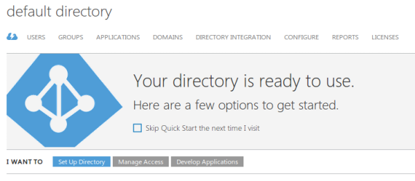
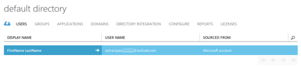
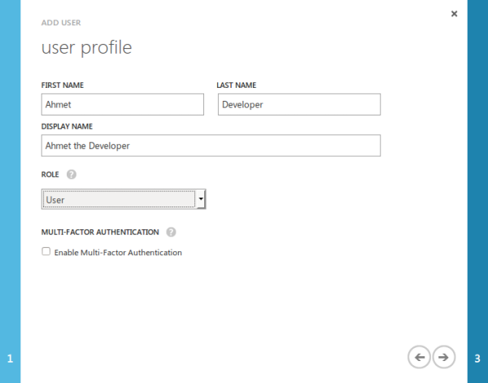
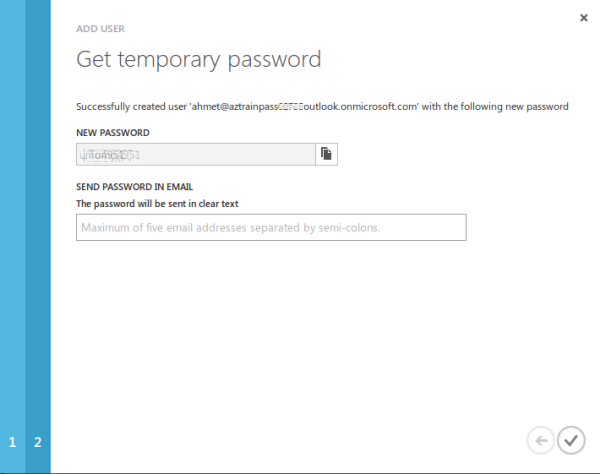
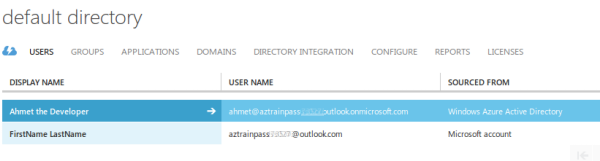
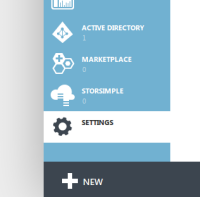
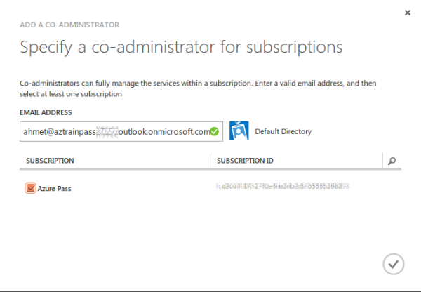
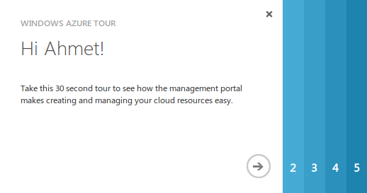

 

> [AZURE.NOTE] Wenn Sie einen Benutzernamen und ein Kennwort von einem Administrator erteilt wurden, besteht eine hohe Wahrscheinlichkeit, dass Sie bereits eine Arbeit oder Schule ID (manchmal auch als eine *Organisations-ID*bezeichnet). Ist dies der Fall ist, können Sie sofort Ihr Konto Azure Azure Zugriff auf Ressourcen verwenden, die eine erfordern. Wenn Sie feststellen, dass Sie diese Ressourcen verwendet werden kann, müssen Sie in diesem Artikel erhalten Sie Hilfe zurückzukehren. Weitere Informationen finden Sie unter [Konten, mit denen Sie für, anmelden](https://msdn.microsoft.com/library/azure/dn629581.aspx#BKMK_SignInAccounts) und [Azure AD wie ein Azure-Abonnement verknüpft ist](https://msdn.microsoft.com/library/azure/dn629581.aspx#BKMK_SubRelationToDir).

Die Schritte sind einfache. Sie müssen Ihre signierte auf Identität im Portal Azure klassischen suchen ermitteln Ihrer Azure Active Directory-Standarddomäne und einen neuen Benutzer als Administrator Azure gemeinsame hinzufügen.

## Suchen Sie Ihr Standardverzeichnis im klassischen Azure-Portal

Sie zunächst [Azure klassischen Portal](https://manage.windowsazure.com) für die persönliche Identität des Microsoft-Konto anmelden. Nachdem Sie angemeldet sind, dem blauen Bereich auf der linken Seite einen Bildlauf aus, und klicken Sie auf **ACTIVE DIRECTORY**.

Zunächst einige Informationen über Ihre Identität in Azure zu suchen. Sie sollten sehen ähnlich der folgenden klicken Sie im Hauptfenster angezeigt wird, dass Sie über ein Standard-Verzeichnis verfügen.

Lassen Sie uns einige weitere Informationen zu finden. Klicken Sie auf die Standardzeile Verzeichnis, die an den standardmäßigen Verzeichniseigenschaften bringt.  

Um den Standarddomänennamen anzuzeigen, klicken Sie auf **Domänen**.

Sehen Sie, dass bei Azure-Konto erstellt wurde, mit Azure Active Directory eine persönliche Standarddomäne erstellt wird, die einen Hashwert (eine Zahl, die aus einer Textzeichenfolge generiert) wird hier sollten Ihrer persönlichen ID als Unterdomäne des onmicrosoft.com verwendet. Dies ist die Domäne, die Sie jetzt einen neuen Benutzer hinzufügen möchten.

## Erstellen eines neuen Benutzers in der Standarddomäne

Klicken Sie auf **Benutzer** , und suchen Sie nach der einzelnen persönlichen Konto. In der Spalte **Die Quelle ist von** sollte angezeigt werden, dass es sich um ein **Microsoft-Konto**ist. Erstellen eines Benutzers in Ihrem standardmäßigen sollen. Azure Active Directory-Domäne "onmicrosoft.com".

Wir werden befolgen Sie [diese Anweisungen](https://technet.microsoft.com/library/hh967632.aspx#BKMK_1) in den nächsten Schritten, aber ein bestimmtes Beispiel verwenden.

Klicken Sie am unteren Rand der Seite auf **+ Benutzer hinzufügen**. Geben Sie auf der Seite, die angezeigt wird den neuen Benutzernamen ein, und stellen Sie den **Typ der Benutzer** einen **neuen Benutzer in Ihrer Organisation**. In diesem Beispiel wird der neue Benutzername `ahmet`. Wählen Sie die Standarddomäne, die Sie festgestellt zuvor als Domäne für die e-Mail-Adresse des Ahmet. Klicken Sie auf den Pfeil nach rechts klicken Sie abschließend.

Fügen Sie weitere Details für Ahmet, aber Vergewissern Sie sich, um den entsprechenden Wert für die **Rolle** auszuwählen. Es einfach verwenden **Globaler Administrator** stellen Sie sicher, dass Dinge funktionieren, aber wenn Sie eine geringere Rolle verwenden können, dies ist eine gute Idee. In diesem Beispiel wird **die Benutzerrolle** . (Erfahren Sie mehr unter [Administratorberechtigungen nach Rolle](https://msdn.microsoft.com/library/azure/dn468213.aspx#BKMK_1)). Aktivieren Sie mehrstufige Authentifizierung nicht, es sei denn, Sie kombinierte Authentifizierung für jedes Protokoll in Vorgang verwenden möchten. Wenn Sie fertig sind, klicken Sie auf den Pfeil nach rechts.

Klicken Sie auf die Schaltfläche **Erstellen** , um generieren und ein temporäres Kennwort für Ahmet anzuzeigen.

Kopieren Sie die Benutzer ein e-Mail-Adresse ein, oder verwenden Sie **Ein Kennwort IN E-Mail senden**. Sie benötigen die Informationen in Kürze anmelden.

Den neuen Benutzer **Ahmet der Entwickler**, Azure Active Directory bezogen sollte jetzt angezeigt werden. Sie haben die neue Arbeit oder Schule Identität mit Azure Active Directory erstellt. Diese Identität jedoch keine noch auf Berechtigungen Azure Ressourcen verwendet haben.

Wenn Sie **Ein Kennwort IN E-Mail senden**verwenden, wird die folgenden Arten von e-Mails gesendet.

## Hinzufügen von Azure gemeinsame Administratorrechte für Abonnements

Jetzt müssen Sie den neuen Benutzer als Administrator gemeinsame Ihres Abonnements hinzufügen, damit der neue Benutzer im Verwaltungsportal anmelden kann. Klicken Sie hierzu in der unteren linken Bereich auf **Einstellungen**.

Klicken Sie im Hauptfenster Einstellungen Bereich oben auf **Administratoren** und nur Ihre persönlichen Microsoft-Kontoidentität sollte angezeigt werden. Klicken Sie am unteren Rand der Seite auf **+ ADD** um eine gemeinsame Administrator anzugeben. Hier geben Sie die e-Mail-Adresse des neuen Benutzers, die Sie erstellt haben, einschließlich Ihrer Standarddomäne, ein. Wie in den nächsten Screenshot dargestellt, wird ein grünes Häkchen neben dem Benutzer für das standardmäßige Verzeichnis angezeigt. Denken Sie daran, um alle Abonnements auszuwählen, die Sie diesem Benutzer verwalten können möchten.

Wenn Sie fertig sind, sollte jetzt zwei Benutzer, einschließlich der neuen gemeinsame Administrator Identität angezeigt werden. Melden Sie sich im Portal.

## Protokollierung und das Kennwort des neuen Benutzers ändern

Melden Sie sich als neuer Benutzer, die, den Sie erstellt haben.

Sofort werden Sie aufgefordert, ein neues Kennwort erstellen.

Sie sollten mit Erfolg belohnt werden, die wie folgt aussieht.

## Nächste Schritte

Ihre neue Azure Active Directory-Identität können jetzt [Azure Ressource Gruppenvorlagen](../articles/xplat-cli-azure-resource-manager.md)verwenden.

    azure login
    info:    Executing command login
    warn:    Please note that currently you can login only via Microsoft organizational account or service principal. For instructions on how to set them up, please read http://aka.ms/Dhf67j.
    Username: ahmet@aztrainpassxxxxxoutlook.onmicrosoft.com
    Password: *********
    /info:    Added subscription Azure Pass
    info:    Setting subscription Azure Pass as default
    +
    info:    login command OK
    ralph@local:~$ azure config mode arm
    info:    New mode is arm
    ralph@local:~$ azure group list
    info:    Executing command group list
    + Listing resource groups
    info:    No matched resource groups were found
    info:    group list command OK
    ralph@local:~$ azure group create newgroup westus
    info:    Executing command group create
    + Getting resource group newgroup
    + Creating resource group newgroup
    info:    Created resource group newgroup
    data:    Id:                  /subscriptions/xxxxxxxx-xxxx-xxxx-xxxx-xxxxxxxxxxxx/resourceGroups/newgroup
    data:    Name:                newgroup
    data:    Location:            westus
    data:    Provisioning State:  Succeeded
    data:    Tags:
    data:
    info:    group create command OK
