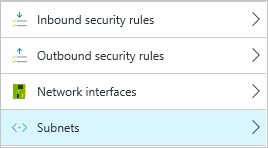
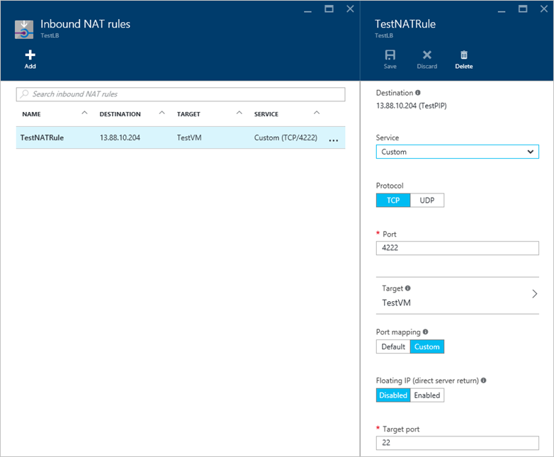

Die Vorgehensweise zum Azure Endpunkte funktioniert zwischen den klassischen und Ressourcenmanager Bereitstellungsmodellen etwas anders. Im Bereitstellungsmodell Ressourcenmanager haben Sie jetzt die Flexibilität Netzwerkfilter zu erstellen, die den Datenfluss ein-und Ihre virtuellen Computern steuern. Diese Filter können Sie komplexe Netzwerke Umgebungen hinter einer einfachen Endpunkt wie in der Bereitstellung Klassisch zu erstellen. Dieser Artikel enthält eine Übersicht über Sicherheitsgruppen Netzwerk und wie sie unterscheiden sich von mit klassischen Endpunkte, erstellen diese Regeln, Filtern und Bereitstellung Beispielszenarien.

## Ressourcenmanager Bereitstellungen im Überblick
Endpunkte im Modell Bereitstellung klassischen werden durch Sicherheitsgruppen Netzwerk und Access-Steuerelement Zugriffssteuerungsliste Regeln ersetzt. QuickSteps zum Implementieren Netzwerk Sicherheit Gruppe ACL-Regeln sind:

- Erstellen Sie eine Sicherheitsgruppe Netzwerk ein.
- Zulassen oder den Verkehr ablehnen, definieren Ihr Netzwerk Sicherheit Gruppe ACL-Regeln.
- Weisen Sie Ihre Netzwerk-Sicherheitsgruppe zu einer Netzwerk-Benutzeroberfläche oder virtuelle Netzwerk-Subnetz ein.

Wenn Sie auch Port-Weiterleitung ausführen möchten, müssen Sie ein Lastenausgleich vor Ihrer virtuellen Computer platzieren und NAT-Regeln verwenden. QuickSteps zum Implementieren eines Lastenausgleich und NAT-Regeln würde wie folgt aussehen:

- Erstellen Sie ein Lastenausgleich.
- Erstellen eines Back-End-Pools aus, und fügen Sie Ihre virtuellen Computer mit dem Pool.
- Definieren Sie Regeln für die Weiterleitung erforderliche Port NAT.
- Zuweisen der NAT-Regeln zu Ihrer virtuellen Computer an.

## Netzwerk-Sicherheitsgruppe (Übersicht)
Netzwerk-Sicherheitsgruppen sind ein neues Feature, das eine Sicherheitsebene für bestimmte Ports und Subnetze auf Ihre virtuellen Computern zugreifen dürfen Sie bereitstellt. Sie haben in der Regel immer eine Netzwerk-Sicherheitsgruppe Bereitstellen dieser Sicherheitsebene zwischen Ihrem virtuellen Computern und außen. Netzwerk-Sicherheitsgruppen können auf eine virtuelle Netzwerksubnetz oder bestimmte Netzwerk-Schnittstellen für einen virtuellen angewendet werden. Anstatt Endpunkt ACL-Regeln zu erstellen, erstellen Sie jetzt Netzwerk Sicherheit Gruppe ACL-Regeln. Diese Regeln ACL bieten eine viel bessere Kontrolle als einfach erstellen von außen liegenden Tabellenblättern, um einen bestimmten Anschluss weiterzuleiten. Weitere Informationen finden Sie unter [Neuigkeiten einer Sicherheitsgruppe Netzwerk?](../articles/virtual-network/virtual-networks-nsg.md).

> [AZURE.TIP] Sie können mehrere Subnetze oder Netzwerk-Schnittstellen Sicherheitsgruppen Netzwerk zuweisen. Es gibt keine 1:1-Zuordnung, d. h., Sie können eine Sicherheitsgruppe Netzwerk mit einem gemeinsamen Satz von ACL-Regeln erstellen und auf mehrere Subnetze oder Netzwerkschnittstellen anwenden. Darüber hinaus können Netzwerk-Sicherheitsgruppe zu Ressourcen über Ihr Abonnement (basierend auf der [Grundlage Access-Steuerelemente Rolle](../articles/active-directory/role-based-access-control-what-is.md). angewendet werden

## Laden Sie Balancers (Übersicht)
Im Modell Bereitstellung klassischen würde Azure alle (Netzwerkadressübersetzung) und Port auf einen Clouddienst Weiterleiten von für Sie ausführen. Wenn Sie einen Endpunkt zu erstellen, würden Sie den externen Anschluss zusammen mit dem internen Port, um den Datenverkehr in direkte verfügbar machen angeben. Netzwerk-Sicherheitsgruppen direkt führen nicht in derselben NAT und Port Forwarding. 

Damit Sie NAT-Regeln für solche Port weiterleiten erstellen können, erstellen Sie eine Azure Lastenausgleich in der Ressourcengruppe. Lastenausgleich ist wieder Bestandteil nur auf bestimmte virtuelle Computer angewendet, falls erforderlich. Die Azure laden Lastenausgleich NAT-Regeln funktionieren entlang Netzwerk Sicherheit Gruppe ACL Regeln zu viel mehr Flexibilität und Kontrolle als mit der Cloud-Dienst Endpunkte erzielt wurde. Weitere Informationen finden Sie unter den [Lastenausgleich Übersicht zu laden](../articles/load-balancer/load-balancer-overview.md).

## Netzwerk-Sicherheitsgruppe ACL-Regeln
ACL-Regeln können Sie festlegen, welche Datenverkehr ein-und Ihre virtuellen Computer basierend auf bestimmten Ports, Portbereiche oder Protokolle versendet werden kann. Regeln sind einzelne virtuellen Computern oder einem Subnetz zugewiesen. Das folgende Bildschirmabbild ist ein Beispiel für eine allgemeine Webserver ACL-Regeln:

ACL-Regeln werden basierend auf einer Priorität Metrik, die Sie angeben – je höher der Wert, desto geringer die Priorität angewendet. Jeder Netzwerk-Sicherheitsgruppe weist drei Standardregeln, die entwickelt wurden, um den Datenfluss Azure Netzwerke, mit einem expliziten verarbeitet `DenyAllInbound` wie in der Regel abgeschlossen. Regeln für das standardmäßige ACL erhalten eine niedrige Priorität mit Regeln nicht stören, die Sie erstellen.

## Zuweisen von Netzwerk-Sicherheitsgruppen
Sie weisen eine Sicherheitsgruppe Netzwerk ein Subnetz oder Netzwerk-Schnittstellen. Dieser Ansatz ermöglicht Ihnen, werden als präzise Bedarf beim Anwenden von Regeln ACL auf nur einen bestimmten virtuellen Computer oder ein Standardsatz von ACL-Regeln gelten für alle virtuellen Computern Teil einer Subnetz sicherzustellen:

Das Verhalten der Sicherheitsgruppe Netzwerk ändern nicht, je nach einem Subnetz oder Netzwerk-Schnittstellen zugewiesen wird. Ein gängiges Bereitstellungsszenario weist die Netzwerk-Sicherheitsgruppe zu einem Subnetz zur Einhaltung von allen virtuellen Computern, die diesem Subnetz angefügt zugewiesen. Weitere Informationen finden Sie unter [Anwenden von Netzwerk Sicherheitsgruppen auf Ressourcen](../virtual-nework/virtual-networks-nsg.md#associating-nsgs).

## Standardverhalten der Netzwerk-Sicherheitsgruppen
Je nachdem, wann und wie Sie Ihr Netzwerk-Sicherheitsgruppe erstellen möglicherweise für Windows virtuellen Computern RDP Zugriff auf TCP-Port 3389 zulassen Standardregeln erstellt werden. Standardregeln für Linux virtuellen Computern treten SSH-Zugriff auf TCP-22. Diese Regeln für automatischen ACL werden in den folgenden Situationen erstellt:

- Wenn Sie einen Windows-virtuellen über das Portal erstellen und die Standardaktion zum Erstellen einer Sicherheitsgruppe Netzwerk annehmen, wird eine Regel ACL zulassen TCP-3389 (RDP) erstellt.
- Wenn Sie eine Linux VM über das Portal erstellen und die Standardaktion zum Erstellen einer Sicherheitsgruppe Netzwerk annehmen, wird eine Regel ACL zulassen TCP-22 (SSH) erstellt.

Unter allen anderen Bedingungen werden diese Regeln der Standard-ACL nicht erstellt werden. Sie herstellen nicht der virtuellen Computer, ohne die entsprechenden ACL Regeln erstellen. Dazu zählt die folgenden allgemeinen Aktionen:

- Erstellen eine Sicherheitsgruppe Netzwerk über das Portal als eine eigene Aktion das Erstellen des virtuellen Computer an.
- Erstellen eine Sicherheitsgruppe Netzwerk programmgesteuert über PowerShell, Azure CLI, Rest-APIs.
- Erstellen eines virtuellen Computers und Zuweisen einer vorhandenen Netzwerk-Sicherheitsgruppe, die noch nicht über die entsprechenden ACL Regel definiert verfügt.

In den vorherigen Fällen müssen Sie ACL-Regeln für Ihre virtuellen Computer an, damit die entsprechende remote-Management-Verbindungen zu erstellen.

## Standardverhalten eines virtuellen Computers ohne eine Sicherheitsgruppe Netzwerk
Sie können ein virtuellen Computers erstellen, ohne eine Sicherheitsgruppe Netzwerk erstellen. In diesen Fällen können Sie mit der virtuellen Computer mit RDP oder SSH ohne alle ACL-Regeln erstellen verbinden. Auf ähnliche Weise, wenn Sie einen Webdienst auf Port 80 installiert haben, zugegriffen werden diesen Dienst automatisch per Remotezugriff. Der virtuellen Computer enthält alle Ports geöffnet sein.

> [AZURE.NOTE] Sie müssen immer noch eine öffentliche IP-Adresse eines virtuellen Computers in Reihenfolge für alle remote-Verbindungen zugewiesen haben. Ohne eine Sicherheitsgruppe Netzwerk für die Benutzeroberfläche Subnetz oder Netzwerk nicht den virtuellen Computer an alle externen Datenverkehr verfügbar machen. Die Standardaktion beim Erstellen eines virtuellen Computers über das Portal besteht darin, eine neue öffentliche IP-Adresse zu erstellen. Für alle anderen Formulare ein virtuellen Computers, wie z. B. PowerShell, Azure CLI oder Ressourcenmanager Vorlage erstellen wird eine öffentliche IP-Adresse nicht automatisch erstellt, es sei denn, explizit angefordert. Über das Portal die Standardaktion ist ebenfalls eine Netzwerk-Sicherheitsgruppe zu erstellen. Diese Standardaktion bedeutet, dass Sie in einer Situation mit einer zugänglicher virtueller Computer einhandeln dürfen nicht, die keine direkte Filtern Netzwerk verfügt.

## Grundlegendes zum Lastenausgleich und NAT-Regeln
In der Bereitstellung Klassisch motivieren Sie Endpunkte aus, die auch Port Weiterleitung durchgeführt. Bei der Erstellung eines virtuellen Computers im Modell Bereitstellung klassischen würde ACL Regeln für RDP oder SSH automatisch erstellt werden. Diese Regeln würde TCP-3389 oder TCP-22 Hilfethemas nach außen nicht verfügbar machen. Stattdessen sollte eine wertvolle TCP-verfügbar gemacht werden, die den entsprechenden internen Anschluss zugeordnet ist. Sie können auch Ihre eigenen ACL Regeln in ähnlicher Weise, wie etwa die eingeblendete einen Webserver auf TCP-4280 nach außen erstellen. Sie können diese ACL-Regeln und den Port Zuordnungen im folgenden Screenshot vom klassischen-Portal finden Sie unter:

Mit Sicherheitsgruppen Netzwerk wird dieser Funktion Port-Weiterleitung von einem Lastenausgleich behandelt. Weitere Informationen finden Sie unter [Lastenausgleich in Azure](../articles/load-balancer/load-balancer-overview.md). Im folgenden Beispiel wird ein Lastenausgleich mithilfe einer Regel NAT Port-Weiterleitung TCP-4222 mit dem internen TCP Port 22 ein virtuellen Computers ausführen:

> [AZURE.NOTE] Wenn Sie ein Lastenausgleich implementieren, zuweisen nicht Sie normalerweise dem virtuellen Computer selbst eine öffentliche IP-Adresse. In diesem Fall weist Lastenausgleich eine öffentliche IP-Adresse zugewiesen. Sie müssen immer noch Netzwerk-Sicherheitsgruppe und ACL Regeln zum Definieren des Datenfluss ein-und Ihre virtuellen Computer zu erstellen. Die Auslastung Lastenausgleich NAT-Regeln sind einfach zu definieren, welche Ports über den Lastenausgleich zulässig sind und wie sie auf die Back-End-virtuellen Computern verteilt erhalten. Daher müssen Sie zum Erstellen einer Regel NAT für den Datenverkehr über den Lastenausgleich. Damit können den Datenverkehr an den virtuellen Computer erreicht haben, können erstellen Sie eine Netzwerk Sicherheit Gruppe ACL Regel.