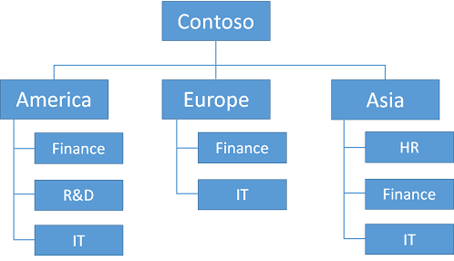

Azure ist eine hervorragende Plattform zur Prüfung des Konzepts Konfigurationen oder Test-/Implementierung, da es sich um sehr kleinen Investition einen bestimmten Ansatz zu einer Implementierung von Ihrer Lösungen Testen erfordert. Sie jedoch müssen die einfachen Methoden für eine Test-/-Umgebung aus der schwierigen, detaillierten Methoden für eine voll funktionsfähige, einsatzbereit Implementierung von einer IT Arbeitsbelastung unterscheiden können sein.

Dieser Leitfaden viele Bereiche identifiziert für die Planung für den Erfolg eines IT-Aufgaben in Azure unbedingt erforderlich ist. Darüber hinaus bietet die Planung Ordnung zur Erstellung der erforderlichen Ressourcen. Obwohl es einige Flexibilität gibt, empfehlen wir, dass Sie die Reihenfolge, in diesem Artikel der Planung und Entscheidung anwenden.

In diesem Artikel wurde aus dem Inhalt des Blogbeitrags [Azure Implementierungsrichtlinien](http://blogs.msdn.com/b/thecolorofazure/archive/2014/05/13/azure-implementation-guidelines.aspx) angepasst. Vielen Dank an Santiago Cánepa (Application Development-Manager für Microsoft) und Hugo Salcedo (Application Development-Manager für Microsoft) für ihre ursprüngliche Material.

> [AZURE.NOTE] Gruppen die sind veraltet. Ihre Verwendung wird nicht hier beschrieben. Weitere Informationen finden Sie unter [Landes-/ VNets und Gruppen](../articles/virtual-network/virtual-networks-migrate-to-regional-vnet.md).

## 1. Benennungskonventionen

Sie sollten eine gute Benennungskonvention angeordnet haben, bevor Sie etwas in Azure zu erstellen. Eine Benennungskonvention wird sichergestellt, dass alle Ressourcen, die eine vorhersehbar Name, welche geringere den Verwaltungsaufwand Management dieser Ressourcen zugeordnet.

Sie könnten Sie entscheiden folgen eine bestimmte Folge von Benennungskonvention für die gesamte Organisation oder für eine bestimmte Azure-Abonnements oder Konto definiert. Es ist, zwar für Einzelpersonen in Organisationen herstellen implizite Regeln beim Arbeiten mit Azure-Ressourcen, wenn ein Team für die Arbeit an einem Projekt auf Azure muss einfach Skalierung dieses Modell keine gute.

Sie sollten sich auf eine Reihe von Benennungskonventionen vorab einigen. Es gibt einige Überlegungen hinsichtlich Benennungskonventionen, die über den einzelnen Regeln Ausschneiden, die betreffenden Konventionen zusammensetzt.

### Affixtyp

Beim Erstellen von bestimmter Ressourcen verwendet Azure einige Standardeinstellungen Verwaltung von Ressourcen zu vereinfachen, die diese Ressourcen zugeordnet sind. Beispielsweise versucht beim Erstellen des ersten virtuellen Computers für eine neue Cloud-Dienst im klassische Azure-Portal des virtuellen Computers Namen für den Namen des virtuellen Computers einen neuen Clouddienst verwenden.

Daher ist es von Vorteil Typen von Ressourcen zu identifizieren, eine Affix, dieses Typs zu erkennen. Darüber hinaus klar Geben Sie an, ob das Affix am sein soll:

- Den Anfang des Namens (Präfix)
- Das Ende des Namens (Suffix)

Hier sind beispielsweise zwei mögliche Namen für eine Ressourcengruppe, die eine Berechnung-Engine hostet:

- RG-CalculationEngine (Präfix)
- CalculationEngine-Rg (Suffix)

Affixtyp können auf verschiedene Aspekte verweisen, die die entsprechenden Ressourcen zu beschreiben. Die folgende Tabelle zeigt einige Beispiele für in der Regel verwendet.

Seitenverhältnis | Beispiele | Notizen
--- | --- | ---
Umgebung | Entwickler, Stg, prod | Je nach den Zweck und die Namen der einzelnen Umgebung.
Speicherort | Usw (Westen USA) verwenden (ostasiatische US 2) | Abhängig von der Region des Datencenters oder die Region des Unternehmens.
Azure Komponente, Dienst- oder Produkt | RG für Ressourcengruppe, Svc für Cloud-Dienst, VNet für virtuelle Netzwerk | Je nach dem Produkt für das Ressource Unterstützung bereitstellt.
Rolle | SQL, Ora, sp iis | Abhängig von der Rolle des virtuellen Computers.
Instanz | 01, 02, 03 usw.. | Für Ressourcen, die mehr als eine Instanz ausgeführt werden. Beispielsweise mit Lastenausgleich Webservern in einen Cloud-Dienst.

Beim Einrichten Ihrer Benennungskonventionen, stellen Sie sicher, dass klar Zustand welche Affixtyp für jeden Typ von Ressourcen, und welche Positionen (Präfix im Vergleich mit einer Suffix) verwendet werden soll.

### Datumsangaben

Es ist oft wichtig, Erstellungsdatum aus den Namen einer Ressource zu bestimmen. Es empfiehlt sich das Datumsformat jjjjMMtt. Dieses Format wird sichergestellt, dass nicht nur das vollständige Datum aufgezeichnet wird, sondern auch die zwei Ressourcen, die nur auf das Datum, deren Namen unterscheiden alphabetisch und chronologisch zur gleichen Zeit sortiert.

### Benennen von Ressourcen

Definieren Sie jede Art von Ressourcen in die Benennungskonvention, sollte der haben Regeln, die definieren wie jede Ressource Namen zuweisen, die erstellt wird. Diese Regeln sollten auf alle Arten von Ressourcen, beispielsweise anwenden:

- Abonnements
- Konten
- Speicherkonten
- Virtuelle Netzwerke
- Subnetze
- Verfügbarkeit von Gruppen
- Ressourcengruppen
- Cloud-Dienste
- Virtuellen Computern
- Endpunkte
- Netzwerk-Sicherheitsgruppen
- Rollen

Um sicherzustellen, dass der Name enthält genügend Informationen, um zu bestimmen, welche Ressource es verweist, aussagekräftigen Namen verwendet werden sollen.

### Computernamen

Beim Erstellen eines virtuellen Computers Administratoren erfordert Microsoft Azure, um einen Namen mit virtuellen Computern der maximal 15 Zeichen zu erhalten. Azure verwendet Name des virtuellen Computers als den Namen der Ressource Azure-virtuellen Computern an. Azure verwendet, die denselben, den Namen des Computers für das Betriebssystem des virtuellen Computers installiert Namen werden. Jedoch möglicherweise diese Namen nicht immer die gleiche sein.

Fall ein virtuellen Computers aus einer VHD-Bilddatei, die bereits ein Betriebssystem enthält erstellt wurde, kann der Name des virtuellen Computers in Azure Netzwerknamen des virtuellen Computers Betriebssystem variieren. Diese Situation kann ein Maß an zusätzlichem virtuellen Computern Verwaltung hinzufügen, daher nicht empfohlen, gehen Sie wie folgt. Weisen Sie der Ressource Azure-virtuellen Computern denselben Namen wie dem Namen des Computers, den Sie an das Betriebssystem des virtuellen Computers zuweisen.

Es empfiehlt sich, dass der Azure-virtuellen Computername den Namen des zugrunde liegenden Betriebssystems Computer identisch sein. Aus diesem Grund führen Sie die Benennung von Regeln in [Microsoft NetBIOS-Computer Benennungskonventionen](https://support.microsoft.com/kb/188997/)beschriebenen NetBIOS aus.

### Namen von Benutzerkonten

Speicherkonten sind spezielle Regeln, die für deren Namen vorhanden. Sie können nur Kleinbuchstaben und Zahlen. Weitere Informationen finden Sie unter [Erstellen eines Speicher-Kontos](../storage/storage-create-storage-account.md#create-a-storage-account) . Darüber hinaus sollten der Kontonamen Speicher in Kombination mit von Core.Windows.NET befinden., ein Global gültigen und eindeutigen DNS-Name. Wenn das Speicherkonto Mystorageaccount aufgerufen wird, sollten die folgenden resultierenden DNS-Namen beispielsweise eindeutig sein:

- mystorageaccount.BLOB.Core.Windows.NET
- mystorageaccount.Table.Core.Windows.NET
- mystorageaccount.Queue.Core.Windows.NET

### Azure Baustein Namen

Azure Bausteine sind Anwendung Ebene Services, Azure Angebote, in der Regel, diese Applikationen PaaS Features nutzen, obwohl IaaS Ressourcen einige, nutzen Sie möglicherweise SQL-Datenbank und den Datenverkehr Manager wie.

Diese Dienste basieren auf ein Array von Elementen, die erstellt und in Azure registriert sind. Darüber hinaus müssen diese in Ihrem Benennungskonventionen berücksichtigt werden.

### Richtlinien für die Implementierung Wiederholung für Benennungskonventionen

Entscheidung:

- Was sind Ihre Benennungskonvention für Azure Ressourcen?

Aufgabe:

- Definieren der Benennungskonventionen im Hinblick auf Affixtyp, Hierarchie, Zeichenfolgenwerten und andere Richtlinien für Azure Ressourcen.

## 2. Abonnements und Konten

Mit Azure arbeiten möchten, benötigen Sie ein oder mehrere Azure-Abonnements. Ressourcen, wie Cloud Services oder virtuellen Computern, im Kontext diese Abonnements vorhanden ist.

- Enterprise-Kunden haben in der Regel ein Enterprise-Registrierung, ist die oberste Ressource in der Hierarchie und mit einem oder mehreren Konten verknüpft ist.
- Für Verbraucher und Kunden, ohne eine Enterprise-Registrierung ist die oberste Ressource das Konto an.
- Abonnements mit Konten verknüpft sind, und kann ein oder mehrere Abonnements pro Konto vorhanden sein. Azure Datensätze Abrechnungsinformationen Ebene der Abonnements.

Aufgrund der maximal zwei Hierarchieebenen der Beziehung Konto/Abonnement ist es wichtig, die Benennungskonvention Konten und Abonnements für die Abrechnung Anforderungen ausrichten. Z. B., wenn ein globaler Konzern Azure verwendet, diese könnten Sie entscheiden, dass ein Konto pro Region und Abonnements auf verwaltet die Region ein.

Beispielsweise können Sie diese Struktur verwenden.

Befolgen dasselbe Beispiel, sollte ein Bereich feststellen, dass mehrere Abonnements zu einer bestimmten Gruppe verknüpft ist, sollte die Benennungskonvention eine Möglichkeit, um die Extra auf das Konto oder dem Namen des Abonnements codieren aufnehmen, dann. Diese Organisation ermöglicht Geschäftsdatensätze Abrechnung Daten, um die neuen Ebenen der Hierarchie während des Berichte zu generieren.

Die Organisation könnte wie folgt aussehen.

Microsoft bietet detaillierte Abrechnung über eine Datei herunterladen, für ein einzelnes Konto oder für alle Konten in einem Enterprise Agreement. Sie können diese Datei, z. B. verarbeiten, mithilfe von Microsoft Excel. Dieses Verfahren würde Aufnahme die Daten, Partitionieren die Ressourcen, die mehr als eine Ebene der Hierarchie in separaten Spalten codieren und Verwenden einer PivotTable oder PowerPivot dynamische reporting-Funktionen bieten.

### Richtlinien für die Implementierung Wiederholung für Abonnements und Konten

Entscheidung:

- Welche Festlegen des Abonnements und Konten führen Sie Ihre IT-Arbeitsbelastung oder Infrastruktur hosten müssen?

Aufgabe:

- Erstellen des Abonnements und Ihren Konten mit Ihrer Benennungskonvention festlegen.

## 3. Speicher

Azure-Speicher ist Bestandteil der viele Azure Lösungen. Azure-Speicher bietet Dienste zum Speichern von Daten, unstrukturierte Daten und Nachrichten, und es ist auch Bestandteil der entsprechenden virtuellen Computern unterstützenden Infrastruktur.

Es sind zwei Arten von Speicherkonten aus Azure verfügbar. Blob-Speicher (verwendet zum Speichern von Azure-virtuellen Computern Datenträger), Tabellenspeicher, Warteschlangenspeicher und Dateispeicher Zugriff auf bietet eine standard-Speicher-Konto. Premium-Speicher ist für Applikationen leistungsfähige, wie etwa SQL Server in einem Cluster AlwaysOn vorgesehen und derzeit unterstützt nur Datenträger Azure-virtuellen Computern.

Speicherkonten werden an Skalierbarkeit Ziele gebunden. Finden Sie unter [Grenzwerte für Microsoft Azure-Abonnement und Dienst, Kontingente, und Einschränkungen](../articles/azure-subscription-service-limits.md#storage-limits) mit aktuellen Azure Speichergrenzwerte vertraut zu machen. Siehe auch [Azure-Speicher Skalierbarkeit und Leistung Ziele](../articles/storage/storage-scalability-targets.md)aus.

Azure erstellt virtuellen Computern mit einer Betriebssystem Festplatten, eine temporäre und NULL oder mehr optionale Daten Datenträger. Die Betriebssystem-Datenträger und Datenlaufwerke auf sind Azure Seitenblobs, während der temporäre Speicherplatz auf dem Knoten lokal gespeichert wird, in dem auf der Computer verfügbar ist. Dadurch wird den temporären Datenträger ungenießbar, Daten, die während eine Wiederverwendung System beibehalten müssen, da der Computer im Hintergrund von einem Knoten zu einem anderen Verlust von Daten in diesem Datenträger migriert werden möglicherweise. Speichern Sie nichts nicht auf dem temporären Laufwerk.

Betriebssystem Festplatten und Datenfestplatten besitzen eine maximale Größe von 1023 Gigabyte (GB), da die maximale Größe eines Blob 1024 GB ist und müssen, die die Metadaten (Fußzeile) der Datei virtuelle Festplatte (ein GB ist 10243 Byte) enthalten. Sie können in Windows, um diese Beschränkung überschreiten Festplattenstriping implementieren.

### Verteilten Festplatten
Neben der Bereitstellung der Möglichkeit, Laufwerke in vielen Fällen mehr als 1023 GB erstellen optimiert mit Striping für Daten Datenträger Leistung von Dokumenten, indem mehrere Blobs in den Hintergrund des Speichers für ein einzelnes Volume. Fortgesetzt wird mit Striping, die für das Schreiben und Lesen von Daten aus einem einzelnen logischen Datenträger e/a Parallel.

Azure auferlegt Grenzwerte für den Betrag der Daten- und Bandbreite verfügbar, weil die Größe des virtuellen Computers. Weitere Informationen finden Sie unter [Größen für virtuelle Computer](../articles/virtual-machines/virtual-machines-linux-sizes.md).

Wenn Sie Festplattenstriping für Datenträger Azure-Daten verwenden, sollten Sie die folgenden Richtlinien:

- Daten Datenträger sollten immer die maximale Größe (1023 GB)
- Fügen Sie die maximale Daten Datenträger für die Größe des virtuellen Computers zulässig.
- Verwenden der Speicher Leerzeichen Konfiguration
- Verwenden der Speicher Striping Konfiguration
- Vermeiden Sie Optionen zum Zwischenspeichern Azure Datenträger (Zwischenspeichern Richtlinie = keine)

Weitere Informationen finden Sie unter [Speicher Leerzeichen - Entwerfen für die Leistung](http://social.technet.microsoft.com/wiki/contents/articles/15200.storage-spaces-designing-for-performance.aspx).

### Mehrere Speicherkonten

Verwenden mehrere Speicherkonten in den Hintergrund viele virtuelle Computer zugeordneten Datenträger wird sichergestellt, dass die aggregierten ein-/Ausgabe der betreffenden Datenträger deutlich unterhalb der Skalierbarkeit Ziele für jedes dieser Konten Speicher.

Es empfiehlt sich, dass Sie mit der Bereitstellung von einem virtuellen Computern pro Speicherkonto starten.

### Entwurf

Um diese Strategien, um das Datenträgersubsystem virtuellen Computern mit gute Leistung implementieren implementieren, nutzt einer IT Arbeitsbelastung oder Infrastruktur normalerweise viele Speicherkonten. Diese hosten viele virtuelle Festplatte Blobs. In einigen Fällen ist mehr als ein Blob mit einem einzelnen Band aus einer virtuellen Computern verknüpft.

Diese Situation kann Komplexität der Verwaltungsaufgaben hinzufügen. Entwerfen eine solide Strategie für Speicher, einschließlich der entsprechenden benennen für die zugrunde liegenden Datenträger und zugehörigen virtuelle Festplatte Blobs ist.

### Richtlinien für die Implementierung Wiederholung Storage

Entscheidungen:

- Benötigen Sie Festplattenstriping Datenträger größer als 500 TB (TB) erstellen?
- Benötigen Sie Festplattenstriping optimale Leistung für Ihre Arbeitsbelastung erzielen?
- Welche Menge Storage Kontotypen müssen Sie Ihre IT-Arbeitsbelastung oder Infrastruktur hosten?

Aufgabe:

- Erstellen von Speicherkonten mit Ihrer Benennungskonvention festlegen. Sie können die Azure-Portal, im klassischen Azure-Portal oder des PowerShell-Cmdlets **New-AzureStorageAccount** verwenden.

## 4-Cloud-Diensten

Cloud Services sind ein wesentlicher Baustein in Azure Servicemanagement, beide für PaaS und IaaS-Dienste. Für PaaS darstellen Cloud Services eine Zuordnung von Rollen, deren Instanzen zwischen miteinander kommunizieren können. Cloud Services eine öffentliche virtuelle IP-Adresse (VIP) Adresse und ein Lastenausgleich, die eingehenden Datenverkehr aus dem Internet akzeptiert zugeordnet sind, und es ein Lastenausgleich, die die Rollen für den Empfang dieser Datenverkehr konfiguriert.

Bei IaaS bieten Cloud Services ähnliche Funktionalität, obwohl in den meisten Fällen die laden Lastenausgleich Funktionalität zum Weiterleiten von Datenverkehr für bestimmte TCP- oder UDP-Ports aus dem Internet zu viele virtueller Computer in die Cloud-Dienst verwendet wird.

> [AZURE.NOTE] Cloud Services sind in Azure Ressourcenmanager nicht vorhanden. Eine Einführung in die Vorteile der Ressourcenmanager finden Sie unter [Azure zu berechnen, Netzwerk- und Anbieter unter Azure Ressourcenmanager](../articles/virtual-machines/virtual-machines-windows-compare-deployment-models.md).

Cloud-Dienstnamen sind besonders wichtig in IaaS, da Azure als Teil der standardmäßigen Benennungskonvention für Datenträger verwendet. Der Name der Cloud-Dienst kann nur Buchstaben, Zahlen und Bindestriche enthalten. Das erste und letzte Zeichen in das Feld muss einen Buchstaben oder eine Zahl sein.

Azure stellt die Cloud-Service-Namen zur Verfügung, da sie mit der VIP, in der Domäne "cloudapp.net" verknüpft sind. Für die Benutzerfunktionalität der Anwendung sollte ein Namen für die Eitelkeit konfiguriert werden, je nach Bedarf auf den Namen der vollqualifizierte Cloud-Dienst ersetzen. Dies geschieht normalerweise mit einen CNAME-Eintrag in der öffentlichen DNS-Einträge, die den öffentlichen DNS-Namen für die Ressource (beispielsweise www.contoso.com) maps auf den Namen DNS-Hostinganbieter die Ressource (z. B. Cloud-Dienst, die den Webserver für www.contoso.com) Cloud-Dienst.

Darüber hinaus müssen die Benennungskonvention für Cloud-Diensten verwendet Ausnahmen tolerieren, da die Namen der Cloud-Dienst müssen unter allen anderen Microsoft Azure Cloud-Diensten unabhängig von den Microsoft Azure-Mandanten eindeutig sein.

Eine wichtige Einschränkung der Cloud-Dienste zu berücksichtigen ist, dass nur eine virtuellen Computern Verwaltungsvorgang jeweils für alle virtuellen Computer in der Cloud-Dienst ausgeführt werden kann. Wenn Sie eine Verwaltungsvorgang virtuellen Computern auf einem virtuellen Computern in der Cloud-Dienst durchführen, müssen Sie warten, bis er abgeschlossen ist, bevor Sie eine neue Verwaltungsvorgang auf einem anderen virtuellen Computern ausführen können. Daher sollten Sie die Anzahl der virtuellen Computern in einen Cloud-Dienst gering halten.

Azure-Abonnements können maximal 200 Cloud Services unterstützt.

### Richtlinien für die Implementierung Wiederholung für Clouddienste

Entscheidung:

- Welche Festlegen der Cloud Services müssen Sie Ihre IT-Arbeitsbelastung oder Infrastruktur hosten?

Aufgabe:

- Erstellen von Cloud-Diensten mit Ihrer Benennungskonvention festlegen. Sie können die klassischen Azure-Portal oder des PowerShell-Cmdlets **New-AzureService** verwenden.

## 5 virtuelle Netzwerke

Der nächste logische Schritt besteht im Erstellen virtuelle Netzwerke zur Unterstützung der Kommunikation über den virtuellen Computern in der Lösung erforderlich sind. Obwohl es möglich, mehrere virtuelle Computer eine IT-Aufgaben in nur einem Cloud-Dienst zu hosten ist, werden virtuelle Netzwerke empfohlen.

Virtuelle Netzwerke sind Container für virtuellen Computern, die für die auch Subnetze, benutzerdefinierte Adressieren und DNS-Konfigurationsoptionen festlegen können. Virtuellen Computern innerhalb der gleichen virtuellen Netzwerk können direkt mit anderen Computern innerhalb der gleichen virtuellen Netzwerk kommunizieren, unabhängig davon, welche Cloud-Dienst sie Mitglied sind. Innerhalb des virtuellen Netzwerks bleibt diese Kommunikation privat, ohne dass für die Kommunikation, über den öffentlichen Endpunkte zu gelangen. Über die IP-Adresse oder den Namen mit einem DNS-Server virtuelle Netzwerk oder lokal installiert wird, wenn der virtuelle Computer mit dem Firmennetzwerk verbunden ist, kann diese Kommunikation auftreten.

### Website-Konnektivität
Wenn lokale Benutzer und Computern laufenden Konnektivität mit virtuellen Computern in einer Azure virtuelle Netzwerk nicht benötigen, erstellen Sie ein virtuelles Netzwerk Cloud nur ein.

Dies ist in der Regel für Internet zugänglichen Auslastung, wie etwa einer internetbasierten Webserver. Sie können diesen virtuellen Computern mit Remote Desktop-Verbindungen, remote PowerShell-Sitzungen, Secure Shell (SSH) Verbindungen und Punkt-zu-Standort VPN-Verbindungen verwalten.

Da Sie nicht mit Ihrem lokalen Netzwerk verbunden sind, können Cloud nur virtuelle Netzwerke ein Teil des Speicherplatzes private IP-Adresse verwenden.

Wenn lokale Benutzer und Computern laufenden Konnektivität mit virtuellen Computern in ein Azure-virtuellen Netzwerk erfordern, erstellen Sie ein Kreuz lokale virtuelle Netzwerk, und verbinden Sie es mit Ihrem lokalen Netzwerk mit einer ExpressRoute oder Website-zu-Standort VPN-Verbindung.

In dieser Konfiguration ist das Azure virtuelle Netzwerk im Wesentlichen eine cloudbasierte Erweiterung von Ihrem lokalen Netzwerk.

Da sie eine Verbindung mit Ihrem lokalen Netzwerk herstellen, Cross lokale virtuelle Netzwerke müssen einen Teil des Adressbereichs verwendet, die von Ihrer Organisation, der eindeutig ist, und routing-Infrastruktur muss routing des Datenverkehrs auf diesen Abschnitt unterstützen, indem Sie es mit Ihrem lokalen VPN-Gerät weiterleiten.

Pakete mit Ihrem lokalen Netzwerk aus Ihrem Cross lokale virtuelle Netzwerk Reisen lässt, müssen Sie den Satz von relevanten lokalen Adresspräfixe als Teil der lokalen Netzwerk Definition für das virtuelle Netzwerk konfigurieren. Je nach den Abstand der Adresse des virtuellen Netzwerks und Festlegen der entsprechenden lokalen Speicherorte können viele Adresspräfixe in dem lokalen Netzwerk vorhanden sein.

Sie können ein virtuelles Netzwerk Cloud nur mit einem Cross lokale virtuelle Netzwerk konvertieren, aber es wahrscheinlich erfordert, dass Sie Ihr virtuelles Netzwerk Adresse Speicherplatz, Subnets und den virtuellen Computern, die statische Azure zugewiesene IP-Adressen, bekannt als dynamische IP-Adressen (DIPs) verwenden neu zu berechnen. Daher überlegen Sie den Typ des virtuellen Netzwerke benötigte (Cloud nur im Vergleich zu Cross lokale), bevor Sie sie erstellen.

### Subnetze
Subnetze ermöglichen es Ihnen, Ressourcen zu organisieren, die verwandt sind, entweder logisch (z. B. ein Subnetz für virtuellen Computern, die mit der gleichen Anwendung verknüpft ist) oder physisch (beispielsweise ein Subnetz pro Cloud-Dienst), oder Subnetz Isolation Verfahren zur Erhöhung der Sicherheit einsetzen.

Für Cross lokale virtuelle Netzwerke sollten Sie Subnetze mit den gleichen Konventionen entwerfen, mit denen Sie für lokale Ressourcen, planmäßigen Denken Sie daran, die **immer Azure verwendet die ersten drei IP-Adressen des Adressbereichs für jedes Subnetz**. Ermitteln Sie die Anzahl der Adressen für das Subnetz erforderlich, die Anzahl von virtuellen Computern, die Sie benötigen nun für zukünftiges Wachstum schätzen, und verwenden Sie dann in der folgenden Tabelle, um die Größe der im Subnetz zu bestimmen.

Anzahl von virtuellen Computern erforderlich | Anzahl der Hostbits erforderlich | Größe des im Subnetz
--- | --- | ---
1 bis 3 | 3 | / 29
4 – 11     | 4 | / 28
12 – 27 | 5 | / 27
28 – 59 | 6 | / 26
60 – 123 | 7 | / 25

> [AZURE.NOTE] Für lokale normalen Subnetze ist die maximale Anzahl von Hostadressen für ein Subnetz mit n Hostbits 2n – 2. Für eine Azure Subnetz ist die maximale Anzahl von Hostadressen für ein Subnetz mit n Hostbits 2n – 5 (2 und 3 für die Adressen, die in jedem Subnetz Azure verwendet).

Wenn Sie eine Größe Subnetz, die zu klein ist auswählen, müssen Sie neu zu berechnen und erneut den virtuellen Computern im Subnetz bereitstellen.

### Richtlinien für die Implementierung Wiederholung für virtuelle Netzwerke

Entscheidungen:

- Welche Art von virtuellen Netzwerk müssen Sie Ihre IT-Arbeitsbelastung oder Infrastruktur hosten (nur Cloud- oder übergreifend lokale)?
- Für Cross lokale virtuelle Netzwerke wie viel Speicherplatz Adresse müssen Sie die Subnetze und virtuellen Computern jetzt und in der Zukunft angemessenen erläuterten hosten möchte?

Aufgaben:

- Definieren Sie den Abstand Adresse für das virtuelle Netzwerk an.
- Definieren von Adresssubnetzen und den Abstand Adresse für jeden.
- Für Cross lokale virtuelle Netzwerke definieren von lokalen Netzwerk Adresse Leerzeichen für die lokale Orte, die den virtuellen Computern in das virtuelle Netzwerk erreicht haben müssen.
- Erstellen Sie das virtuelle Netzwerk Ihrer Benennungskonvention verwenden. Sie können die Azure-Portal oder im klassischen Azure-Portal verwenden.

## 6. legt die Verfügbarkeit

Cloud Services enthält Azure PaaS eine oder mehrere Rollen aus, die Code ausgeführt werden. Rollen können eine oder mehrere Instanzen von virtuellen Computern haben, die automatisch der Textur Vorschriften. Bei einem beliebigen Zeitpunkt Azure möglicherweise die Instanzen ausführenden aktualisieren, aber, da sie dieselbe Rolle gehören, Azure weiß, dass nicht alle gleichzeitig zu verhindern, dass einen Dienstausfall für die Rolle aktualisieren.

In Azure IaaS ist des Konzepts der Rolle nicht signifikante, da jede IaaS virtuellen Computern eine Rolle mit einer einzelnen Instanz darstellt. Um den Hinweis in Azure nicht zu bringen zwei oder mehr zugeordneten Computer zur gleichen Zeit (zum Beispiel für das Betriebssystem von Updates des Knotens, wo sie sich befinden), wurde des Konzepts der Verfügbarkeit Sätze eingeführt werden. Eine Sammlung Verfügbarkeit teilt Azure nicht zu bringen unten alle Computer in der gleichen Verfügbarkeit gleichzeitig festlegen, um einen Dienstausfall zu verhindern. Die Mitglieder virtuellen Computern eine Sammlung von Verfügbarkeit haben eine 99,95 % Verfügbarkeit Vereinbarung zum Servicelevel.

Verfügbarkeit Sätze muss ein Teil der Planen für hohe Verfügbarkeit der Lösung. Eine Sammlung Verfügbarkeit wird als Satz von virtuellen Computern in einer einzelnen Cloud-Dienst definiert, die die gleichen Verfügbarkeit SetName aufweisen. Nachdem Sie die Cloud-Dienste erstellt haben, können Sie Verfügbarkeit Gruppen erstellen.

### Richtlinien für die Implementierung Wiederholung für Verfügbarkeit Mengen

Entscheidung:

- Wie viele Verfügbarkeit Sätze müssen Sie für die verschiedenen Rollen und Ebenen in Ihre IT-Arbeitsbelastung oder Infrastruktur?

Aufgabe:

- Definieren der Verfügbarkeit Sätze Verwendung Ihrer Benennungskonvention. Sie können zuordnen ein virtuellen Computers zu einer Verfügbarkeit festgelegt, wenn Sie den virtuellen Computern erstellen, oder Sie können Zuordnen eines virtuellen Computers zu einer Verfügbarkeit nach dem Erstellen des virtuellen Computers festgelegt.

## 7. virtuellen Computern

In Azure PaaS verwaltet Azure-virtuellen Computern und deren zugeordneten Datenträger. Müssen Sie erstellen und benennen Sie Cloud Services und Rollen und Azure erstellt dann Instanzen, die diesen Rollen zugeordnet sind. Bei Azure IaaS ist es auf der Sie die Namen für die Cloud Services, virtuellen Computern und zugehörigen Datenträger angeben.

Klicken Sie zum Verringern Verwaltungsaufwand verwendet das Azure klassische Portal den Namen des Computers als einen Vorschlag für den Standardnamen für den zugeordneten Clouddienst (in der Groß-/Kleinschreibung, die der Kunden zum Erstellen eines neuen Cloud-Diensts als Teil der Assistent zum Erstellen von virtuellen Computern wählt).

Darüber hinaus blobs Azure Namen Datenträger und deren unterstützenden virtuelle Festplatte mit einer Kombination aus den Namen der Cloud-Dienst, den Namen des Computers und dem Erstellungsdatum.

Die Anzahl der Datenträger ist im Allgemeinen wesentlich größer als die Anzahl der virtuellen Computern. Beim Bearbeiten von virtuellen Computern Verwaisung Datenträger nicht verloren geht von vorsichtig vor. Darüber hinaus können Datenträger gelöscht werden, ohne das unterstützende Blob löschen. Wenn dies der Fall ist, bleibt das Blob im Speicherkonto bis manuell gelöscht.

### Richtlinien für die Implementierung Wiederholung für virtuellen Computern

Entscheidung:

- Wie viele virtuelle Computer müssen Sie für die IT-Arbeitsbelastung oder Infrastruktur bereit?

Aufgaben:

- Definieren Sie jeder Name des virtuellen Computers verwenden Ihrer Benennungskonvention.
- Erstellen Sie Ihre virtuellen Computer mit Azure-Portal, das Azure klassischen Portal, das **Neu AzureVM** PowerShell-Cmdlet die CLI Azure oder Ressourcenmanager Vorlagen.

## Beispiel für eine IT-Arbeitsbelastung: der Contoso finanzielle Analyse-Engine

Das Unternehmen Contoso hat eine finanzielle Analyse der nächsten Generation-Engine mit führenden eigene Algorithmen zur Unterstützung der Verfügbarkeit Markt trading entwickelt. Benutzer möchten diese-Engine zur Verfügung stellen seiner Kunden als eine Reihe von Servern in Azure, die enthalten:

- Zwei (und schließlich Weitere) IIS-basierten Webservern mit benutzerdefinierte Web Services in einer Webebene
- Zwei (und schließlich Weitere) IIS-basierte Anwendungsserver, die die Berechnungen in einer Schicht Anwendung ausführen
- Ein SQL Server 2014 Cluster mit AlwaysOn Verfügbarkeit Gruppen (zwei SQL Server und ein Mehrzahl Knoten Zeuge), der zurückliegenden und laufenden Berechnungsdaten in einer Datenbankebene gespeichert sind
- Zwei Active Directory-Domäne-Controller für eine unabhängige Gesamtstruktur und die Domäne in der Ebene Authentifizierung, die für SQL Server Cluster erforderlich ist
- Alle Server sind in zwei Subnetzen ansässig; ein front-End-Subnetz für die Webserver und einem Back-End-Subnetz für die Anwendungsserver, einem SQL Server 2014 Cluster und Domänencontroller

Eingehende secure web Datenverkehr von den Contoso-Clients auf das Internet muss Lastenausgleich zwischen den Webservern werden. Berechnung Anforderung Datenverkehr in Form von HTTP-Anfragen von den Webservern muss zwischen die Anwendungsserver verteilt werden. Darüber hinaus muss die-Engine für hohe Verfügbarkeit entworfen werden.

Das sich daraus ergebende Design zu integrieren.

- Eine Contoso Azure-Abonnement und Konto
- Speicherkonten
- Ein virtuelles Netzwerk mit unterschiedlichen zwei
- Verfügbarkeit legt für die Gruppen von Servern mit einer ähnlichen Rolle
- Virtuellen Computern
- Eine einzelne Ressourcengruppe

Alle vorstehend genannten führen Sie diese Contoso-Benennungskonventionen:

- Contoso verwendet [IT Arbeitsbelastung]-[Ort]-[Azure Ressource] als Präfix. In diesem Beispiel "Azfae" (Azure finanzielle Analyse-Engine) ist der Name der IT Arbeitsbelastung und "verwenden" (ostasiatische US 2) den Speicherort, da die meisten Contoso initial Kunden auf die Nord der Vereinigten Staaten sind.
- Speicherkonten verwenden Contosoazfaeusesa [Beschreibung] Beachten Sie, dass Contoso das Präfix für die Eindeutigkeit hinzugefügt wurde, und die Verwendung von Bindestriche Speicher Kontonamen nicht unterstützt.
- Virtuelle Netzwerke verwenden AZFAE verwenden VN [Anzahl].
- Verfügbarkeit legt verwenden Azfae-- als-[Rolle] verwenden.
- Namen von virtuellen Computern verwenden Azfae-- virtueller Computer-[Vmname] verwenden.

### Konten und Azure-Abonnements

Contoso ist ihre Konzern-Abonnement, mit dem Namen "Contoso" Enterprise-Abonnement verwenden, Rechnung für diese IT Arbeitsbelastung bereitstellen.

### Speicherkonten

Contoso bestimmt, dass sie zwei Speicherkonten benötigt:

- **Contosoazfaeusesawebapp** für die standardmäßige Speicherung Webserver, Anwendungsserver, und Domäne Controlles und ihre zusätzliche Datenlaufwerke
- **Contosoazfaeusesasqlclust** für die Speicherung Premium den SQL Server-Cluster-Servern und deren zusätzliche Daten Datenträger

### Ein virtuelles Netzwerk mit unterschiedlichen

Da das virtuelle Netzwerk nicht laufenden Verbindung zu lokalen Netzwerk von Contoso benötigt, entschieden Contoso in einem Cloud nur virtuelle Netzwerk.

Er erstellt ein virtuelles Netzwerk Cloud nur mit den folgenden Einstellungen mit Azure-Portal an:

- Name: AZFAE-verwenden – VN01
- Standort: Ostasiatischen USA 2
- Virtuelle Netzwerk Adressbereichs: 10.0.0.0/8
- Erste Subnetz:
    - Name: Front-End
    - Leerzeichen zu beheben: 10.0.1.0/24
- Zweite Subnetz:
    - Name: Back-End-
    - Leerzeichen zu beheben: 10.0.2.0/24

### Verfügbarkeit von Gruppen

Um alle vier Ebenen von deren finanzielle Analyse-Engine hoher Verfügbarkeit entschieden Contoso auf vier Verfügbarkeit Sätzen aus:

- **Azfae verwenden als dc** für die Domänencontroller
- **Azfae verwenden als Web** für die Webserver
- **Azfae verwenden als app** für die Anwendungsserver
- **Azfae verwenden als Sql** für die Server in der SQL Server-cluster

Diese Sätze Verfügbarkeit werden zusammen mit den virtuellen Computern erstellt.

### Virtuellen Computern

Contoso entschieden auf die folgenden Namen für ihre Azure-virtuellen Computern:

- **Azfae-verwenden – virtueller Computer-dc01** für den ersten Domänencontroller
- **Azfae-verwenden – virtueller Computer-dc02** für den zweiten Domänencontroller
- **Azfae-verwenden – virtueller Computer-web01** für den ersten Webserver
- **Azfae-verwenden – virtueller Computer-web02** für den zweiten Webserver
- **Azfae-verwenden – virtueller Computer-app01** für den ersten Anwendungsserver
- **Azfae-verwenden – virtueller Computer-app02** für den zweiten Anwendungsserver
- **Azfae-verwenden – virtueller Computer-sql01** für den ersten SQL Server in der SQL Server-cluster
- **Azfae-verwenden – virtueller Computer-sql02** für den zweiten SQL Server in der SQL Server-cluster
- **Azfae-verwenden – virtueller Computer-sqlmn01** für die meisten Knoten Zeuge in der SQL Server-cluster

So sieht die sich daraus ergebende Konfiguration aus.

Dieser Konfiguration übernimmt:

- Ein Cloud nur virtuelles Netzwerk mit unterschiedlichen zwei (Front-End- und Back-End)
- Zwei Speicherkonten
- Vier Verfügbarkeit Sätze für jede Ebene der finanzielle Analyse-engine
- Die virtuellen Computer für die vier Ebenen
- Eine Sammlung externen Lastenausgleich für HTTPS-basierten Webdatenverkehr aus dem Internet an den Webserver
- Eine interne Lastenausgleich für unverschlüsselter Web-Verkehr von den Webservern die Anwendungsserver festlegen
- Eine einzelne Ressourcengruppe

## Zusätzliche Ressourcen

[Microsoft Azure-Abonnement und Beschränkungen Service, Kontingente und Einschränkungen](../articles/azure-subscription-service-limits.md#storage-limits)

[Größen für virtuellen Computern](../articles/virtual-machines/virtual-machines-linux-sizes.md)

[Azure-Speicher Skalierbarkeit und Leistung Ziele](../articles/storage/storage-scalability-targets.md)

[Erweiterung Bezug Architektur Datencenter](https://gallery.technet.microsoft.com/Datacenter-extension-687b1d84)

[Azure Datenverarbeitung, Netzwerk und Speicher Anbieter unter Azure Ressourcenmanager](../articles/virtual-machines/virtual-machines-windows-compare-deployment-models.md)

