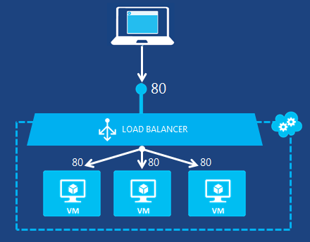

Es gibt zwei Ebenen Lastenausgleich für Azure-Infrastrukturdiensten verfügbar:

- **DNS-Ebene**: Lastenausgleich für den Datenverkehr in anderen Cloud-Diensten in verschiedenen Daten Centers, mit anderen Azure Websites ansässig befindet sich in verschiedenen Data Center oder externe Endpunkte. Dies geschieht mit Azure Datenverkehr-Manager und die Funktion RUNDEN Robert Lastenausgleich Methode laden.
- **Netzwerkebene**: Lastenausgleich von eingehendem Internet, die anderen virtuellen Computern der Cloud-Dienst oder den Lastenausgleich des Verkehrs zwischen virtuellen Computern in einer Cloud-Dienst oder virtuelles Netzwerk. Dies geschieht mit dem Azure Lastenausgleich.

## Datenverkehr Manager Lastenausgleich für Cloud-Diensten und websites##

Datenverkehr-Manager können Sie die Verteilung der den Benutzerdatenverkehr in Endpunkte, steuern, welche die Cloud Services, Websites, externen Websites und anderen Datenverkehr Manager Profile enthalten sein können. Datenverkehr Manager funktioniert durch Anwenden einen intelligenten Policy-Engine zu Domain Name System (DNS) Abfragen für die Domänennamen Internet Ressourcen auf. Der Cloud Services oder Websites können in verschiedenen Rechenzentren auf der ganzen Welt ausgeführt werden.

Sie müssen entweder REST oder Windows PowerShell verwenden, um externe Endpunkte oder Profilen Datenverkehr-Managers als Endpunkte zu konfigurieren.

Datenverkehr-Manager verwendet drei Methoden, mit den Lastenausgleich, um den Datenverkehr verteilen:

- **Failover**: Verwenden Sie diese Methode, wenn Sie möchten, verwenden einen primären Endpunkt für den gesamten Verkehr, aber Sicherungskopien bereitgestellt wird, falls die primäre nicht mehr verfügbar ist.
- **Leistung**: Verwenden Sie diese Methode, wenn Sie verfügen über Endpunkte an unterschiedlichen geografischen Standorten und Anfordern des Clients den "nächstliegende" Endpunkt im Hinblick auf den niedrigsten Wartezeit verwendet werden soll.
- **Runden Robert:**  Verwenden Sie diese Methode, wenn eine Reihe von Clouddiensten im gleichen Datencenter oder übergreifend Cloud Services oder Websites in verschiedenen Rechenzentren laden verteilt werden soll.

Weitere Informationen finden Sie unter [Informationen zu den Datenverkehr Manager laden Lastenausgleich Methoden](../articles/traffic-manager/traffic-manager-routing-methods.md).

Die folgende Abbildung zeigt ein Beispiel für die Funktion RUNDEN Robert Lastenausgleich Methode zum Verteilen von Datenverkehr zwischen verschiedenen Cloud Services.

Der grundlegende Vorgang lautet wie folgt:

1.  Internet-Client fragt einen Domänennamen, einem Webdienst entspricht.
2.  DNS leitet die Anforderung Abfrage in den Datenverkehr-Manager.
3.  Datenverkehr Manager wählt den nächsten Clouddienst in der Liste der Funktion RUNDEN Robert und sendet der DNS-Name. Der Internet-Client-DNS-Server löst den Namen in eine IP-Adresse und sendet es an die Internet-Client.
4.  Der Internet-Client eine Verbindung herstellt, mit der Cloud-Dienst von Datenverkehr Manager ausgewählt.

Weitere Informationen finden Sie unter [Den Datenverkehr-Manager](../articles/traffic-manager/traffic-manager-overview.md).

## Azure Lastenausgleich für virtuellen Computern ##

Virtuellen Computern in der cloud-Dienst oder virtuelles Netzwerk kann miteinander kommunizieren, die direkt mit ihrer privaten IP-Adressen. Computer und Dienste außerhalb der Cloud-Dienst oder virtuelles Netzwerk können nur mit virtuellen Computern in einen Cloud-Dienst oder virtuelles Netzwerk mit einem konfigurierten Endpunkt kommunizieren. Ein Endpunkt ist eine Zuordnung von einer öffentlichen IP-Adresse und den Port zu diesen privaten IP-Adresse und den Port eines virtuellen Computern oder einer Webrolle innerhalb einer Azure-Cloud-Dienst.

Die Azure Lastenausgleich verteilt zufällig einen bestimmten Typ von eingehendem auf mehreren virtuellen Computern oder Diensten in einer Konfiguration, die als eine Reihe mit Lastenausgleich bezeichnet. Beispielsweise können Sie die Laden der Web-Anforderung Verkehr über mehrere Webservern oder Webrollen zuweisen.

Das folgende Diagramm veranschaulicht einen Endpunkt Lastenausgleich für standard (nicht verschlüsselten) Web-Verkehr, die von drei virtuellen Computern öffentlichen und privaten-Standardanschluss 80 gemeinsam genutzt wird. Diese drei virtuellen Computern sind in einem Satz mit Lastenausgleich.

Weitere Informationen finden Sie unter [Azure Lastenausgleich](../articles/load-balancer/load-balancer-overview.md). Die Schritte zum Erstellen einer Menge mit Lastenausgleich finden Sie unter [Konfigurieren eines Lastenausgleich festlegen](../articles/load-balancer/load-balancer-get-started-internet-arm-ps.md).

Azure kann auch in einen Cloud-Dienst oder virtuelles Netzwerk Lastenausgleich. Dies wird als interne Lastenausgleich bezeichnet und kann auf folgende Weise verwendet werden:

- Für den Lastenausgleich zwischen Servern in verschiedenen Ebenen einer Anwendung mit mehreren Ebenen (z. B. zwischen Web- und Ebenen).
- Saldo Line-of-Business (LOB) Applications in Azure gehostet werden, ohne zusätzliche Last Lastenausgleich Hardware oder Software zu laden.
- Lokale Server in der Gruppe von Computern aufnehmen möchten, dessen Datenverkehr Laden ist, ausgelastet.

Lastenausgleich, internen Lastenausgleich wird ähnlich wie Azure Laden durch eine interne Lastenausgleich Menge konfigurieren erleichtert.

Die folgende Abbildung zeigt ein Beispiel für einen internen Lastenausgleich Endpunkt für eine Textzeile branchenspezifische Anwendung, die in einem Cross lokale virtuelle Netzwerk zwischen drei virtuellen Computern freigegeben ist.

## Laden Sie Lastenausgleich Aspekte

Ein Lastenausgleich ist standardmäßig auf Timeout ein Sitzung in 4 Minuten im Leerlauf konfiguriert. Wenn eine Anwendung hinter einem Lastenausgleich bewirkt, eine Verbindung im Leerlauf für mehr als 4 Minuten dass und sie nicht über eine Keepalive-Konfiguration verfügen, wird die Verbindung getrennt. Sie können das Ladeverhalten Lastenausgleich, um eine [längere Timeouteinstellung für Azure Lastenausgleich](../articles/load-balancer/load-balancer-tcp-idle-timeout.md)zulassen ändern.

Andere Aspekte ist den Typ der Verteilung Modus von Azure Lastenausgleich unterstützt. Sie können die Quelle IP-Zugehörigkeit (Source IP, IP-Zieladresse) oder Quelle IP-Protokoll (Source IP, IP-Zieladresse und Protocol) konfigurieren. Schauen Sie sich [Azure Lastenausgleich Verteilung Modus (Quelle IP-Zugehörigkeit)](../articles/load-balancer/load-balancer-distribution-mode.md) , für Weitere Informationen.

## Nächste Schritte

Die Schritte zum Erstellen einer Menge mit Lastenausgleich finden Sie unter [Konfigurieren eines internen Lastenausgleich festlegen](../articles/load-balancer/load-balancer-get-started-ilb-arm-ps.md).

Weitere Informationen zu den Lastenausgleich finden Sie unter [Internal Lastenausgleich](../articles/load-balancer/load-balancer-internal-overview.md).
