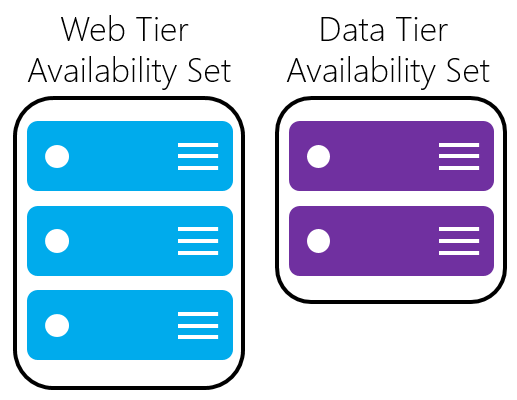

## Grundlegendes zu geplanten im Vergleich zu nicht geplante Wartung
Es gibt zwei Arten von Microsoft Azure-Plattform Ereignissen, die die Verfügbarkeit von Ihren virtuellen Computern beeinflussen können: geplante Wartung und nicht geplante Wartung.

- **Geplante Wartung Ereignisse** sind periodisch Aktualisierungen von Microsoft zur zugrunde liegenden Azure-Plattform zur Verbesserung der allgemeinen Zuverlässigkeit, Leistung und Sicherheit der Plattforminfrastruktur, die Ihren virtuellen Computern ausgeführt werden, klicken Sie auf. Die meisten dieser Updates werden ohne Auswirkung auf Ihre virtuellen Computern oder Cloud Services ausgeführt. Es gibt jedoch Instanzen, in denen diese Updates einen Neustart des virtuellen Computers die erforderlichen Updates auf die Plattforminfrastruktur anzuwendende benötigen.

- **Nicht geplante Wartung Ereignisse** auftreten, wenn die Hardware oder physische Infrastruktur zugrunde liegenden Ihres virtuellen Computers in irgendeiner Weise fehlerhaft ist. Dies kann lokales Netzwerkfehlern, bei der lokalen Festplatte oder andere den Shapes für Gestelle Ebene Fehler enthalten. Wenn solche ein Fehler erkannt wird, wird die Azure-Plattform des virtuellen Computers automatisch von den fehlerhaften physischen Computer Hosten Ihrer virtuellen Computers zu einem fehlerfrei physischen Computer migrieren. Solche Ereignisse sind selten, aber möglicherweise auch dazu führen, dass Ihre virtuellen Computern, neu zu starten.

## Führen Sie bewährte Methoden beim Entwerfen Ihrer Anwendungs für hohe Verfügbarkeit
Um den Einfluss Ausfall aufgrund eine oder mehrere der folgenden Ereignisse zu verringern, empfehlen wir die folgenden hohe Verfügbarkeit bewährte Methoden für die virtuellen Computer:

* [Konfigurieren von mehreren virtuellen Computern in einer Verfügbarkeit Redundanzgründen festlegen]
* [Konfigurieren Sie jede Anwendungsebene in separaten Verfügbarkeit Sätze]
* [Kombinieren von Lastenausgleich mit Verfügbarkeit]

### Konfigurieren von mehreren virtuellen Computern in einer Verfügbarkeit Redundanzgründen festlegen
Damit redundante an Ihrer Anwendung verwendet werden kann, wird empfohlen, dass Sie zwei oder mehr virtuelle Computer in einem Satz Verfügbarkeit gruppieren. Diese Konfiguration ist sichergestellt, dass während entweder ein Ereignis geplanten oder nicht geplanten Wartung, mindestens eine virtuellen Computern zur Verfügung, und die 99,95 entsprechen % Azure Vereinbarung zum SERVICELEVEL. Weitere Informationen finden Sie unter der [Vereinbarung zum SERVICELEVEL für virtuelle Computer](https://azure.microsoft.com/support/legal/sla/virtual-machines/).

> [AZURE.IMPORTANT] Vermeiden Sie verlassen einer einzelnen Instanz virtuellen Computern in einer Verfügbarkeit von selbst festlegen. Virtuellen Computern in dieser Konfiguration berechtigen nicht für eine Vereinbarung zum SERVICELEVEL Garantie und werden Ausfallzeiten während Azure geplanten Wartung Ereignisse konfrontiert.

Jeder virtuelle Computer in einer Gruppe Verfügbarkeit ist eine **Domäne aktualisieren** und eine **Fehlerstrukturanalyse-Domäne** der zugrunde liegenden Azure-Plattform zugewiesen. Für einen angegebenen Einheiten festgelegt ist, werden fünf Benutzer nicht konfigurierbare Update Domänen standardmäßig (Ressourcenmanager Bereitstellungen dann zum Bereitstellen von bis zu zwanzig Update Domänen erhöht werden können) zugewiesen an, dass die Gruppen von virtuellen Computern und die zugrunde liegende physische Hardware, die zur gleichen Zeit neu gestartet werden kann. Wenn mehr als fünf virtuellen Computern innerhalb eines einzelnen Verfügbarkeit Satzes konfiguriert werden, der sechsten virtuellen Computern wird in der Domäne aktualisieren des ersten virtuellen Computers, der siebten in der gleichen Update-Domäne wie der zweiten virtuellen Computern platziert werden usw. Die Reihenfolge der Domänen aktualisieren, die gerade neu gestartet dürfen nicht sequenziell während der geplanten Wartung fortfahren, aber nur ein Update Domain wird jeweils neu gestartet.

Fehlerstrukturanalyse-Domänen definieren die Gruppe von virtuellen Computern, die eine allgemeine Power Quell- und Netzwerk wechseln gemeinsam nutzen. Standardmäßig werden den virtuellen Computern, die so konfiguriert, dass innerhalb einer Gruppe Verfügbarkeit über bis zu drei Fehlerstrukturanalyse-Domänen für die Ressource-Manager Bereitstellungen getrennt (zwei Fehler Domänen für Classic). Während der platzieren Ihren virtuellen Computern in einer Menge Verfügbarkeit nicht Ihrer Anwendung Betriebssystem oder anwendungsspezifische Fehlern gewarnt werden, wird es den Einfluss der potenzielle physischen Hardwarefehler, Netzwerkausfälle oder Power Interruptions eingeschränkt.

<!--Image reference-->
   

### Konfigurieren Sie jede Anwendungsebene in separaten Verfügbarkeit Sätze

Wenn Ihre virtuellen Computern alle fast identisch sind und denselben für eine Anwendung Zweck, empfehlen wir, dass Sie eine für jede Ebene der Anwendung festlegen Verfügbarkeit konfigurieren.  Wenn Sie zwei verschiedene Ebenen auf demselben Satz Verfügbarkeit angeordnet werden, können alle virtuellen Computer in der gleichen Anwendungsebene gleichzeitig neu gestartet werden. Konfigurieren Sie mindestens zwei virtuellen Computern in einer Verfügbarkeit, legen Sie für jede Ebene an, Sie mindestens eine virtuellen Computers in jeder sichergestellt ist Stufe stehen zur Verfügung.

Beispielsweise könnten Sie alle virtuellen Computer in der Front-End-Ihrer Anwendung IIS, Apache, Nginx usw., in einer einzelnen Verfügbarkeit ausgeführt setzen. Stellen Sie sicher, dass nur die Front-End-virtuellen Computern in demselben Satz Verfügbarkeit platziert werden. Auf ähnliche Weise stellen Sie sicher, dass nur Datenebenen-virtuellen Computern eigene Verfügbarkeit festlegen, wie Ihre repliziert SQL Server-virtuellen Computern oder Ihre MySQL-virtuellen Computern bereitgestellt werden.

<!--Image reference-->
   

### Kombinieren Sie ein Lastenausgleich mit Verfügbarkeit
Kombinieren der [Lastenausgleich Azure](../articles/load-balancer/load-balancer-overview.md) mit einer Verfügbarkeit festlegen, können Sie die meisten Anwendung Stabilität zu gelangen. Azure Lastenausgleich verteilt Verkehr mehrere virtuelle Computer an. Für unsere Standard in virtuelle Maschinen ist Azure Lastenausgleich in enthalten. Beachten Sie, dass nicht alle virtuellen Computern Ebenen Lastenausgleich Azure enthalten. Weitere Informationen zu Ihren virtuellen Computern für den Lastenausgleich finden Sie unter [Lastenausgleich virtuellen Computern](../articles/virtual-machines/virtual-machines-linux-load-balance.md).

Wenn der Lastenausgleich nicht so konfiguriert ist, um den Datenverkehr auf mehrere virtuelle Computer zu verteilen, wirkt ein beliebiges Ereignis geplanten Wartung der nur Datenverkehr-Bereitstellung von virtuellen Computern, einen Ausfall an Ihrer Anwendungsebene verursacht. Platzieren mehrere virtuelle Computer auf der gleichen Ebene unter den Lastenausgleich und die Verfügbarkeit festlegen ermöglicht den Datenverkehr auf mindestens eine Instanz kontinuierlich realisiert werden.

 

<!-- Link references -->
[Konfigurieren von mehreren virtuellen Computern in einer Verfügbarkeit Redundanzgründen festlegen]: #configure-multiple-virtual-machines-in-an-availability-set-for-redundancy
[Jede Anwendungsebene in separaten Verfügbarkeit Sätze konfigurieren]: #configure-each-application-tier-into-separate-availability-sets
[Kombinieren von Lastenausgleich mit Verfügbarkeit]: #combine-the-load-balancer-with-availability-sets
[Avoid single instance virtual machines in availability sets]: #avoid-single-instance-virtual-machines-in-availability-sets

