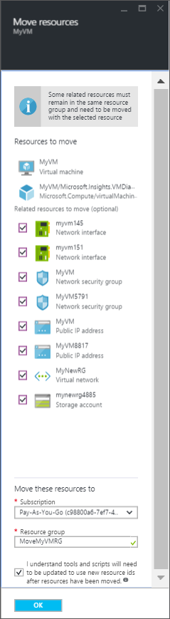
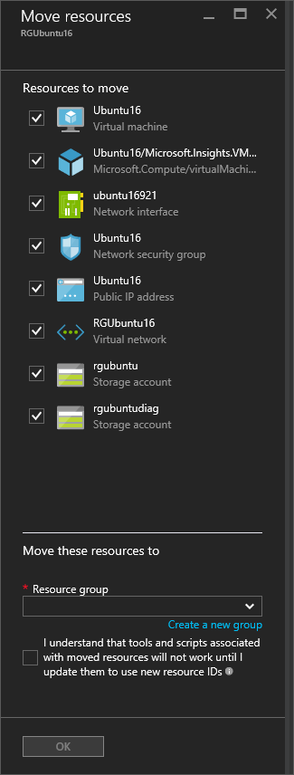

## Verwenden Sie zum Verschieben eines virtuellen Computers zu einem anderen Abonnement im portal

Sie können einen virtuellen Computer verschieben und der zugehörige Ressourcen auf ein anderes Abonnement verwenden des Portals.

1. Öffnen der [Azure-Portal](https://portal.azure.com)an.
2. Klicken Sie auf **Durchsuchen** > **virtuellen Computern** und wählen Sie den virtuellen Computer aus der Liste verschieben möchten.
    
    
    
3. Klicken Sie im Abschnitt **Essentials** auf das **Abonnement ändern** Bleistiftsymbol neben dem Namen des Abonnements. Das **Verschieben von Ressourcen** Blade wird geöffnet.
    
    
    
4. Wählen Sie die Ressourcen zu verschieben. In den meisten Fällen sollten Sie alle aufgelisteten optionalen Ressourcen verschieben.
5. Wählen Sie das **Abonnement** den virtuellen Computer, die verschoben werden soll.
6. Wählen Sie eine vorhandene **Ressourcengruppe** aus, oder geben Sie einen Namen zu eine neuen Ressourcengruppe erstellt haben.
7. Wenn Sie fertig sind, wählen Sie die neue Ressource kennen, die IDs erstellt werden soll, und die müssen mit dem virtuellen Computer verwendet werden, nachdem er verschoben wird und dann auf **OK**.

## Verwenden Sie zum Verschieben eines virtuellen Computers zu einem anderen Ressourcengruppe im portal

Sie können einen virtuellen Computer verschieben und der zugehörige Ressourcen in eine andere Ressourcengruppe im Portal verwenden.

1. Öffnen der [Azure-Portal](https://portal.azure.com)an.
2. Klicken Sie auf **Durchsuchen** > **Ressourcengruppen** , und wählen Sie die Ressourcengruppe aus, die den virtuellen Computer enthält.
3. Wählen Sie in das Blade **Ressourcengruppe** **Verschieben** aus dem Menü aus.
    
    
    
3. Wählen Sie in das Blade **Verschieben von Ressourcen** die Ressourcen verschoben werden, und klicken Sie dann entweder Geben Sie einen vorhandenen Gruppe Ressourcennamen oder wählen Sie zum Erstellen einer neuen Ressourcengruppe ein. Wenn Sie fertig sind, wählen Sie die neue Ressource kennen, die IDs erstellt werden und die müssen mit dem virtuellen Computer verwendet werden, nachdem es verschoben wird, und klicken Sie auf **OK**
    
    

