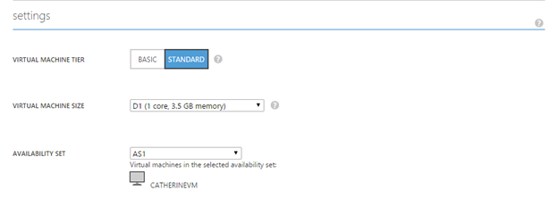
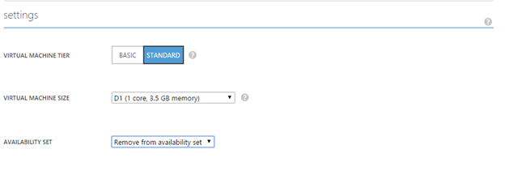

## <a name="multi-and-single-instance-vms"></a>Senden und einzelnen Instanz virtuellen Computern
Für viele Kunden auf Windows Azure ausgeführte ist es wichtig, dass sie planen, wenn ihre virtuellen Computer geplanten Wartung unterliegen, da dies ~ 15 Minuten Ausfall ergibt sind. Sie können die Verfügbarkeit Datensätze zu kontrollieren, wenn bereitgestellte virtuellen Computern geplanten Wartung erhalten nutzen.

Es gibt zwei mögliche Konfigurationen für virtuelle Computer auf Windows Azure ausgeführte aus. Virtuellen Computern sind entweder als mit mehreren Instanzen oder eine Instanz konfiguriert. Wenn in einem Satz Verfügbarkeit virtuellen Computern sind, werden diese als mit mehreren Instanzen konfiguriert. Notiz auch einzelnen virtuellen Computern können in einem Satz Verfügbarkeit bereitgestellt werden und werden als mit mehreren Instanzen behandelt werden. Wenn virtuellen Computern nicht in einem Satz Verfügbarkeit sind, werden diese als einzelne Instanz konfiguriert.  Details auf Verfügbarkeit Gruppen finden Sie unter entweder [die Verfügbarkeit von Ihrem Windows-virtuellen Computern](../articles/virtual-machines/virtual-machines-windows-manage-availability.md) oder [die Verfügbarkeit von Ihrem Linux virtuellen Computern verwalten](../articles/virtual-machines/virtual-machines-linux-manage-availability.md).

Einzelner Instanz und mit mehreren Instanzen virtuellen Computern geplanten Wartung Aktualisierungen erfolgen getrennt. Durch neu konfigurieren Ihrer virtuellen Computer werden einer Instanz (Wenn sie mit mehreren Instanzen sind) oder mit mehreren Instanzen (Wenn sie eine Instanz befinden) werden, können Sie steuern, wann ihre virtuellen Computer die geplante Wartung erhalten. Finden Sie entweder [geplante Wartung für Linux Azure-virtuellen Computern](../articles/virtual-machines/virtual-machines-linux-planned-maintenance.md) oder [geplante Wartung für Windows Azure-virtuellen Computern](../articles/virtual-machines/virtual-machines-windows-planned-maintenance.md) Details auf der geplanten Wartung Azure-virtuellen Computern.

## <a name="for-multi-instance-configuration"></a>Für mehrere Instanzkonfiguration
Sie können auswählen, die Uhrzeit geplanten Wartung Ihrer virtuellen Computern wirkt sich auf, die in einer Konfiguration festlegen Verfügbarkeit bereitgestellt werden, durch Verfügbarkeit legt diesen virtuellen Computern entfernen.

1.  Eine e-Mail-Nachricht werden 7 Kalendertage vor der geplanten Wartung auf Ihre virtuellen Computern in einer Konfiguration mit mehreren Instanzen an Sie gesendet. Das Abonnement-IDs und die Namen der betroffenen mit mehreren Instanzen virtueller Computer werden im Textkörper der e-Mail enthalten sein.

2.  Während die sieben Tage können Sie die Uhrzeit auswählen, wenn, die Ihre Instanzen aktualisiert werden durch ihre Verfügbarkeit festlegen Ihrer mit mehreren Instanzen virtuellen Computern in diesem Bereich entfernen. Diese Änderung in Konfiguration führt zu einem Neustart, während des virtuellen Computers von einem physischen Host, für die Wartung, auf andere physische Host, der für die Wartung ausgelegt ist nicht als Ziel verschoben werden. 

3.  Sie können den virtuellen Computer aus seine Verfügbarkeit festlegen in der klassischen Portal entfernen. 
   
    1.  Klicken Sie im Portal klassischen des virtuellen Computers klicken Sie auf, und wählen Sie dann auf "konfigurieren". 

    2.  Klicken Sie unter "Einstellungen" sehen welche Verfügbarkeit festlegen Sie der virtuellen Computer befindet.

        

    3.  Legen Sie im Feld Verfügbarkeit Dropdownmenü, wählen Sie "aus dem Verfügbarkeit Satz entfernen".

        

    4.  Wählen Sie aus der unten auf "Speichern". Wählen Sie "Ja", um zu bestätigen, dass diese Aktion den virtuellen Computer neu gestartet wird.

4.  Diese virtuelle Computer werden in einer Instanz Hosts verschoben werden und werden nicht aktualisiert werden, während der geplanten Wartung auf Verfügbarkeit festlegen möchten.

5.  Sobald die Verfügbarkeit festlegen virtuellen Computern aktualisieren (gemäß dem Termine in der ursprünglichen e-Mail umrandet) abgeschlossen ist, sollten Sie die virtuellen Computern wieder in ihre Verfügbarkeit Datensätze hinzufügen und als mit mehreren Instanzen virtuellen Computern erneut konfiguriert werden. Die virtuellen Computern aus einer Instanz wieder zurück an mehrere Instanzen verschieben führt zu einem Neustart. In der Regel, nachdem alle Updates für mehrere Instanzen über die gesamte Azure-Umgebung abgeschlossen sind, folgt einer Instanz Wartung.

Dies kann auch mithilfe der PowerShell Azure erreicht werden:

```
Get-AzureVM -ServiceName "<VmCloudServiceName>" -Name "<VmName>" | Remove-AzureAvailabilitySet | Update-AzureVM
```

## <a name="for-single-instance-configuration"></a>Für die Konfiguration einzelner Instanz
Sie können auswählen, die Uhrzeit geplanten Wartung Sie virtuellen Computern in einer Konfiguration einzelner Instanz wirkt sich auf die durch diese virtuellen Computern in Verfügbarkeit Datensätze hinzufügen.

Schrittweise

1.  Eine e-Mail wird Ihnen 7 Kalendertage vor der geplanten Wartung auf virtuellen Computern in einer Konfiguration einzelner Instanz gesendet werden. Die Abonnement-IDs und die Namen der betroffenen einzelner Instanz virtueller Computer werden im Textkörper der e-Mail enthalten sein. 

2.  Während diese sieben Tage können Sie die Zeit auswählen Ihrer Instanz Neustart durch Verschieben der einzelner Instanz virtuellen Computern in einer Verfügbarkeit in die gleiche Region festlegen. Diese Änderung in der Konfiguration führt zu einem Neustart, während des virtuellen Computers von einem physischen Host, für die Wartung, auf andere physische Host, der für die Wartung ausgelegt ist nicht als Ziel verschoben werden.

3.  Führen Sie die folgenden Anweisungen zum Hinzufügen von vorhandener virtuellen Computern in Verfügbarkeit Sätze aus dem klassischen Portal und Azure PowerShell (Siehe Azure PowerShell Stichprobe im Hinweis unten).

4.  Sobald diese virtuellen Computern erneut als mit mehreren Instanzen konfiguriert sind, werden sie zu einer Instanz virtuellen Computern aus der geplanten Wartung ausgeschlossen.

5.  Sobald die Aktualisierung einer Instanz virtuellen Computern (gemäß dem Termine in der ursprünglichen e-Mail umrandet) abgeschlossen ist, können Sie deren Datensätze Verfügbarkeit die virtuellen Computern entfernen und erneut als einzelner Instanz virtuellen Computern konfiguriert werden.

Dies kann auch mithilfe der PowerShell Azure erreicht werden:

    Get-AzureVM -ServiceName "<VmCloudServiceName>" -Name "<VmName>" | Set-AzureAvailabilitySet -AvailabilitySetName "<AvSetName>" | Update-AzureVM

<!--Anchors-->


<!--Link references-->
[Virtual Machines Manage Availability]: virtual-machines-windows-tutorial.md
[Understand planned versus unplanned maintenance]: virtual-machines-manage-availability.md#Understand-planned-versus-unplanned-maintenance/
