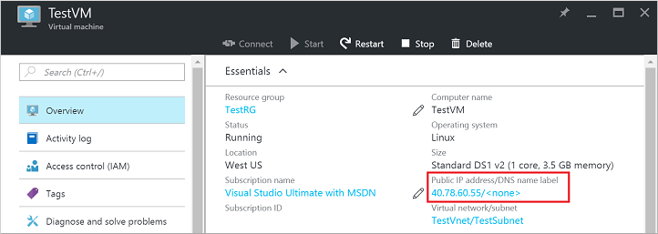
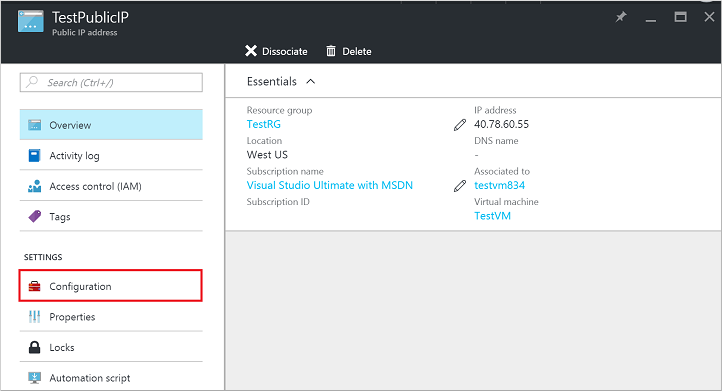
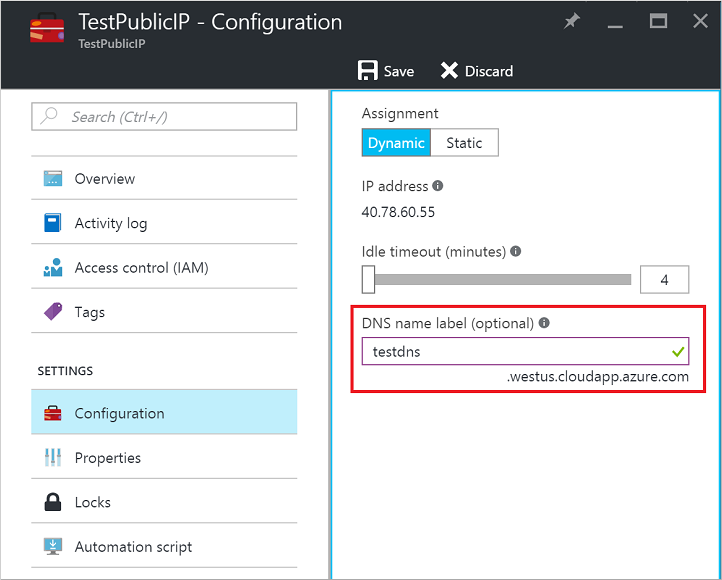
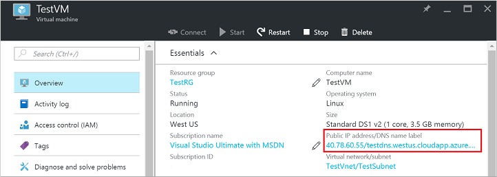

## QuickSteps 

Im Artikel wird vorausgesetzt, dass Sie Ihr Abonnement im Portal angemeldet haben, und ein virtuellen Computers mit verfügbaren Bilder mit dem Ressourcenmanager Bereitstellungsmodell erstellt. Gehen Sie folgendermaßen vor, nach dem Start des virtuellen Computers ausgeführt.

1.  Zeigen Sie die Einstellungen des virtuellen Computers auf dem Portal an, und klicken Sie auf die öffentliche IP-Adresse.

    

2.  Beachten Sie, dass der DNS-Namen für die öffentliche IP-Adresse leer ist. Klicken Sie auf **Konfiguration** für die öffentliche IP-Karte.

    

3.  Geben Sie die gewünschte Bezeichnung für DNS und Konfiguration **Speichern** .

    

    Öffentliche IP-Ressource zeigt jetzt diese neuen DNS-Beschriftung auf deren Blade aus.

4.  Schließen Sie die Blades öffentliche IP-Adresse, und kehren Sie zum virtuellen Computern vorher in das Portal. Stellen Sie sicher, dass der DNS-Name/FQDN neben die IP-Adresse für die öffentliche IP-Ressource angezeigt wird.

    