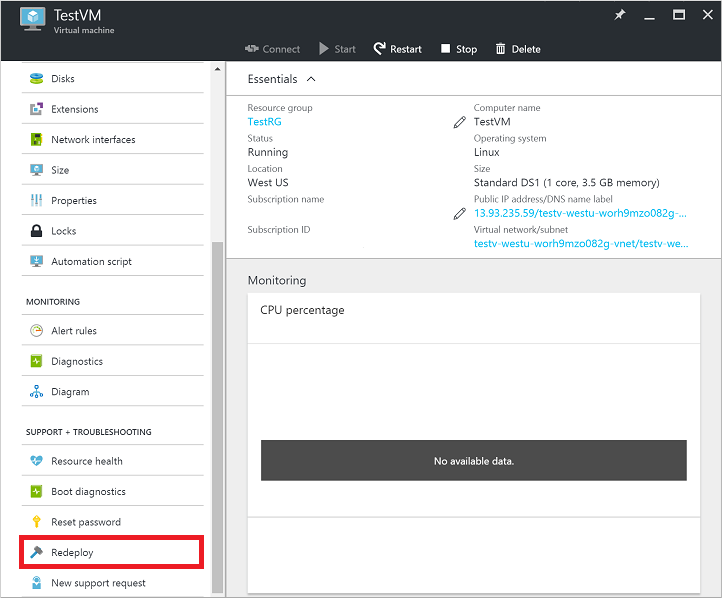
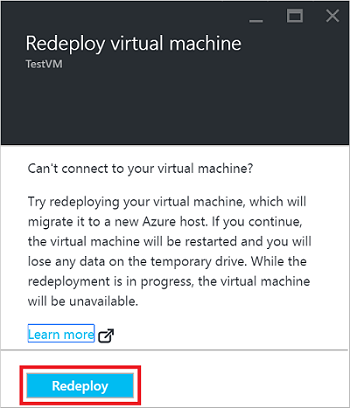
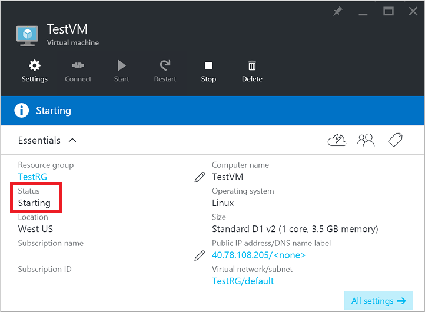
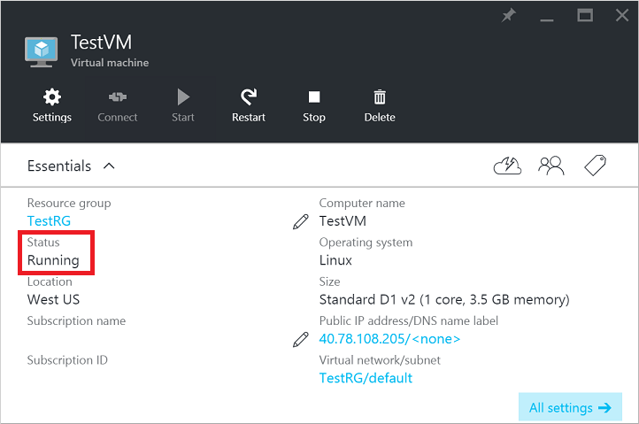

## Verwenden von Azure-portal

1. Wählen Sie den virtuellen Computer erneut bereitgestellt werden sollen, und klicken Sie auf die Schaltfläche 'Bereitstellen' in 'Einstellungen' Blades. Führen Sie einen Bildlauf nach unten zum Abschnitt **Support und Problembehandlung** finden Sie unter, der die Schaltfläche 'Bereitstellen' wie im folgenden Beispiel enthält:

    

2. Klicken Sie auf die Schaltfläche 'Erneut bereitstellen', um den Vorgang zu bestätigen:

    

3. Der **Status** des virtuellen Computer ändert sich zum *Aktualisieren* als den virtuellen Computer vorbereitet erneut, wie im folgenden Beispiel bereitgestellt:

    

4. Der **Status** nimmt dann *Starten* , wenn der virtuellen Computer auf einem neuen Azure Host, wie im folgenden Beispiel gezeigt startet:

    

5. Nach der virtuellen Computer die, nach Abschluss des Bootvorgangs den **Status** gibt klicken Sie dann auf *Ausführen*, hat, der angibt, des virtuellen Computer erfolgreich erneut bereitgestellt wurde:

    