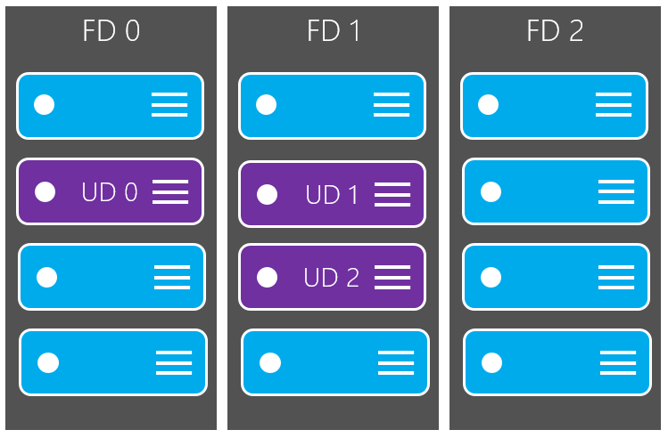

# Regionen und Verfügbarkeit für virtuelle Computer in Azure
Es ist wichtig zu verstehen, wie und, wo Ihre virtuellen Computern (virtuellen Computern) in Azure, zusammen mit der Optionen aus, um die Leistung, Verfügbarkeit und Redundanz maximieren ausgeführt werden. Azure arbeitet in mehreren Rechenzentren auf der ganzen Welt. Diese Rechenzentren sind in zu geographischen Regionen, was Ihnen Flexibilität beim Auswählen des Speicherorts der Applications erstellen gruppiert. Dieser Artikel bietet einen Überblick über die Verfügbarkeit und Redundanz Features von Azure.

## Was sind Azure Regionen?
Azure ermöglicht Ihnen, Ressourcen, wie z. B. virtuellen Computern, in festgelegten geographischen Regionen wie 'Westen US', 'North Europe' oder 'Oder Asien' zu erstellen. Es gibt derzeit 30 Azure Regionen auf der ganzen Welt. Sie können die [Liste der Regionen und deren Speicherorte](https://azure.microsoft.com/regions/)überprüfen. In den einzelnen Bereichen vorhanden und mehrere Rechenzentren für Redundanz und Verfügbarkeit bereitzustellen. Dieser Ansatz bietet Ihnen Flexibilität beim Erstellen Ihrer Clientanwendungen zum virtuellen Computern, die Benutzer am nächsten ist erstellen sowie zum Zwecke der Mehrwertsteuer oder eine juristische Person, die Einhaltung von Vorschriften entsprechen.

## Spezielle Azure Regionen
Es gibt einige speziellen Azure Regionen Compliance-oder rechtliche Zwecke, die Sie beim Erstellen von Ihrer Anwendung verwenden möchten. Diese spezielle Bereiche umfassen:

- **US Gov Virginia** und **uns Gov Iowa**
    - Eine physische und logische Netzwerk isoliert Instanz von Azure für uns Behörden und Partner, von Betrieben ausgefiltert US Personen. Enthält weitere Compliance-Zertifizierung wie [FedRAMP](https://www.microsoft.com/en-us/TrustCenter/Compliance/FedRAMP) und [DISA](https://www.microsoft.com/en-us/TrustCenter/Compliance/DISA). Weitere Informationen zum [Azure Government](https://azure.microsoft.com/features/gov/).
- **Zentrale Indien**, **Süd Indien**und **Westen Indien**
    - Diese Bereiche sind derzeit für Volume licensing-Kunden und Partner mit einer lokalen Registrierung in Indien zur Verfügung. Access öffnet direkte online-Abonnements in der gesamten 2016.
- **China Osten** und **China Nord**
    - Diese Bereiche sind verfügbar über eine eigene Zusammenarbeit zwischen Microsoft und 21Vianet, bei dem Microsoft keine direkt die Datencentern unterhält. Finden Sie weitere Informationen zu [Microsoft Azure in China](http://www.windowsazure.cn/)aus.
- **Deutschland Mittel-** und **Deutschland Nordost**
    - Diese Bereiche sind derzeit verfügbar über ein Datenmodell-Vertrauensnehmer vererbungseinstellungen Kundendaten in Deutschland unter Verwaltung von T-Systems, einem deutschen Telekom Unternehmen, gilt als Deutsch Daten Vertrauensnehmers bleibt.

## Region-Paare
Jede Azure Region ist mit einer anderen Region innerhalb der gleichen Geography (z. B. US, Europa oder Asien) kombiniert. Dieser Ansatz ermöglicht die Replikation von Ressourcen wie Speicher virtueller Computer, über ein "geography", die die Wahrscheinlichkeit von Naturkatastrophen, der Aufstand, Stromausfällen oder beide Regionen gleichzeitig Auswirkungen physische Netzwerkausfälle reduziert werden soll. Weitere Vorteile von Region Paare umfassen:

- Bei einer breiter Azure Ausfall erhält eine Region aus jeder Paar mit beitragen, die Zeit für Applikationen wiederherstellen. 
- Geplanten Azure-Updates werden, die für Regionen eine nacheinander zu minimieren Ausfallzeiten und Risiken der Anwendung einem Dienstausfall Variationswebsites.
- Daten befindet sich innerhalb der gleichen Geography als dessen Paar (mit Ausnahme von Brasilien Süd) befinden für Steuer und Recht Zuständigkeit der Durchsetzung von.

Beispiele für Region Paare sind:

| Primärschlüssel        | Sekundären   |
|:---------------|:------------|
| Westen US        | Ostasiatische US     |
| North Europa   | Westen Europa |
| Oder Asien | Ostasien   |

Sie können die vollständige [Liste der regionalen Paare hier](../articles/best-practices-availability-paired-regions.md#what-are-paired-regions)sehen.

## Verfügbarkeit von Funktionen
Einige Dienste oder virtueller Computer Features sind nur in bestimmten Regionen, wie bestimmte virtueller Computer Größen oder Speichertypen verfügbar. Es gibt auch einige globale Azure Dienste, die Ihnen die Auswahl einen bestimmten Bereich, wie z. B. [Azure Active Directory](../articles/active-directory/active-directory-whatis.md), [Den Datenverkehr Manager](../articles/traffic-manager/traffic-manager-overview.md)oder [Azure DNS](../articles/dns/dns-overview.md)nicht benötigen. Um Sie beim Entwerfen Ihrer Anwendung Umgebung unterstützen, können Sie die [Verfügbarkeit von Azure-Diensten über die einzelnen Regionen](https://azure.microsoft.com/regions/#services)überprüfen. 

## Verfügbarkeit von Speicher
Grundlegendes zu Azure Regionen und Regionen ist wichtig, wenn Sie die verfügbaren Azure-Speicher Replikationsoptionen berücksichtigen. Wenn Sie ein Speicherkonto erstellen, müssen Sie eine der folgenden Optionen für die Replikation auswählen:

- Lokal redundante Speicher (LRS)
    - Repliziert Ihre Daten dreimal in der Region, in der Sie Ihr Speicherkonto erstellt haben.
- Speichern von redundanten Zonen (ZRS)
    - Repliziert Ihre Daten dreimal über zwei oder drei Fertigungsanlagen, in einem einzigen Bereich oder über zwei Bereiche an.
- Geo redundante Speicher (GRS)
    - Repliziert Ihre Daten sekundäre Region ein, die hundert Meilen von der primären Region ist.
- Lesezugriff Geo redundante Speicher (RAS-GRS)
    - Ihre Daten sekundäre Region, wie bei GRS repliziert, sondern auch dann bietet schreibgeschützten Zugriff auf die Daten in der zweiten Standort.

Die folgende Tabelle enthält einen schnellen Überblick über die Unterschiede zwischen den Typen der Speicher Replikation an:

| Strategie für die Replikation                                                        | LRS | ZRS | GRS | RAS-GRS |
|:----------------------------------------------------------------------------|:----|:----|:----|:-------|
| Daten werden über mehrere Fertigungsanlagen repliziert.                              | Nein  | Ja | Ja | Ja    |
| Daten können gelesen werden, von der sekundären Standorten und mit der gewohnten Standort befinden. | Nein  | Nein  | Nein  | Ja    |
| Die Anzahl der Kopien der Daten auf separate Knoten verwaltet.                      | 3   | 3   | 6   | 6      |

Sie können weitere Informationen zu [Replikationsoptionen hier Azure-Speicher](../articles/storage/storage-redundancy.md).

### Kosten für Speicher
Preise variieren je nach Speichertyp und Verfügbarkeit, die Sie auswählen. 

- Premium-Speicher wird in eine Volltonfarbe Zustand Laufwerken (SSDs) gesichert und basierend auf der Kapazität des Laufwerks belastet wird.
- Standard-Speicher wird in normalen dreht Datenträger gesichert und werden in Rechnung gestellt basierend auf der Kapazität in verwenden und des gewünschten Speicher Verfügbarkeit.
    - Für RAS-GRS gibt es eine zusätzliche Geo-Replikation Datenübertragung Gebühr für die Bandbreite der Replikation der Daten in eine andere Azure Region.

Finden Sie unter [Azure Speicher Preise](https://azure.microsoft.com/pricing/details/storage/) Preisinformationen auf die verschiedenen Speichertypen und die von Verfügbarkeitsoptionen.

## Azure Bilder
Virtuellen Computern sind in Azure von einem Bild erstellt. Üblicherweise sind Bilder aus dem [Azure Marketplace](https://azure.microsoft.com/marketplace/) , wo Partner vorkonfiguriertes abgeschlossen OS oder Anwendung Bildern erhalten.

Beim Erstellen eines virtuellen Computers von einem Bild in der Azure Marketplace, arbeiten Sie tatsächlich mit Vorlagen. Azure Ressourcenmanager Vorlagen sind deklarative JavaScript Object Notation (JSON)-Dateien, die verwendet werden können, um komplexe Anwendung Umgebungen, umfasst virtuellen Computern, Speicher, virtuelle Netzwerke usw. zu erstellen. Weitere Informationen zum Verwenden von [Vorlagen Azure Ressourcenmanager](../articles/resource-group-overview.md), einschließlich so [Erstellen Sie eine eigene Vorlagen](../articles/resource-group-authoring-templates.md).

Können auch eigene benutzerdefinierte Bilder erstellen und diese mit [Azure CLI](../articles/virtual-machines/virtual-machines-linux-upload-vhd.md) hochladen oder [Azure PowerShell](../articles/virtual-machines/virtual-machines-windows-upload-image.md) Schnelles Erstellen von benutzerdefinierten virtuelle Computer Ihre spezifische erstellen Anforderungen.

## Verfügbarkeit von Gruppen
Eine Sammlung Verfügbarkeit ist eine logische Gruppierung von virtuellen Computern, die zu verstehen, wie eine Anwendung erstellt wird, um für Redundanz und Verfügbarkeit bereitzustellen Azure ermöglicht. Es wird empfohlen, dass die Erstellung von zwei oder mehr virtuellen Computern innerhalb einer Verfügbarkeit legen Sie dafür, dass eine Anwendung hochgradig verfügbar und entsprechen den [99,95 % Azure Vereinbarung zum SERVICELEVEL](https://azure.microsoft.com/support/legal/sla/virtual-machines/). Die Menge der Verfügbarkeit von zwei zusätzliche Gruppierungen gefährdet, die Schutz vor Hardware-Fehlern und Updates sicheres angewendet werden – einen Fehler (FDs) und Update-Domänen (UDs) zulassen.

Weitere Informationen zum Verwalten der Verfügbarkeit von [Linux virtuellen Computern](../articles/virtual-machines/virtual-machines-linux-manage-availability.md) oder [Windows-virtuellen Computern](../articles/virtual-machines/virtual-machines-linux-manage-availability.md).

### Fehlerstrukturanalyse-Domänen
Eine Fehlerstrukturanalyse-Domäne ist eine logische Gruppe von zugrunde liegenden Hardware, die eine allgemeine Power Quell- und Netzwerk wechseln, ähnlich wie eine den Shapes für Gestelle innerhalb einer lokalen Datencenters gemeinsam nutzen. Beim Erstellen von virtuellen Computern innerhalb eines Satzes Verfügbarkeit verteilt die Azure-Plattform automatisch Ihrer virtuellen Computer auf diese Fehlerstrukturanalyse-Domänen. Dieser Ansatz beschränkt den Einfluss der potenzielle physischen Hardwarefehler, Netzwerkausfälle oder Power Interruptions.

### Aktualisieren von Domänen
Eine Update-Domäne ist eine logische Gruppe von zugrunde liegenden Hardware, die Wartung kann unterliegen oder neu zur gleichen Zeit gestartet werden. Beim Erstellen von virtuellen Computern innerhalb eines Satzes Verfügbarkeit verteilt die Azure-Plattform automatisch Ihrer virtuellen Computer auf diese Domänen aktualisieren. Dieser Ansatz stellt sicher, dass mindestens eine Instanz der Anwendung immer bleibt während der regelmäßigen Wartung die Azure-Plattform Deklaration ausgeführt. Die Reihenfolge der Domänen aktualisieren, die gerade neu gestartet dürfen nicht sequenziell während der geplanten Wartung fortfahren, aber jeweils nur ein Update Domain neu gestartet wird.

## Nächste Schritte
Sie können jetzt beginnen, diese Verfügbarkeit und Redundanzfunktionen verwenden, um Ihre Azure-Umgebung zu erstellen. Bewährte Methoden für die Informationen finden Sie unter [bewährte Methoden Azure Verfügbarkeit](../articles/best-practices-availability-checklist.md).