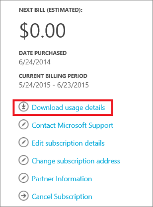
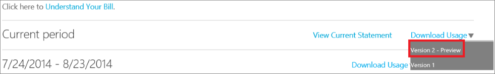
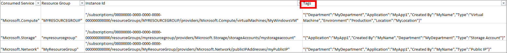

## Ihre Kategorien anzeigen in die Verwendungsdetails

Kategorien auf Datenverarbeitung, Netzwerk und Speicher Ressourcen im Bereitstellungsmodell Ressourcenmanager platziert werden in Ihrer Verwendungsdetails im [Portal Abrechnung](https://account.windowsazure.com/)aufgefüllt.

Klicken Sie auf **Verwendungsdetails herunterladen** , die Verwendungsdetails in Ihrem Abonnement anzuzeigen.

Wählen Sie Ihre Rechnung und die **Version 2** Verwendungsdetails:

Aus der Verwendungsdetails können Sie alle Tags in der Spalte **Kategorien** finden Sie unter:

Durch die Analyse die folgenden Tags zusammen mit der Verwendung, können Organisationen zu neue Einblicken in deren Verbrauchsdaten gewinnen werden.

