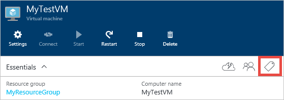

## Kategorisieren eines virtuellen Computers Vorlagen durch

Zunächst sehen wir uns Kategorisieren von Vorlagen durch. [Diese Vorlage](https://github.com/Azure/azure-quickstart-templates/tree/master/101-vm-tags) platziert Tags in den folgenden Ressourcen: berechnen (virtuellen Computern), Speicher (Speicherkonto) und Netzwerk (öffentliche IP-Adresse, virtuelle Netzwerk- und Network Interface). Diese Vorlage für einen Windows-virtuellen ist jedoch für Linux virtuelle Computer angepasst werden kann.

Klicken Sie auf die Schaltfläche **bereitstellen zu Azure** , über den [Link Vorlage](https://github.com/Azure/azure-quickstart-templates/tree/master/101-vm-tags). Dies erfolgt die Navigation [Azure-Portal](https://portal.azure.com/) , in dem Sie diese Vorlage bereitstellen können.

Diese Vorlage enthält die folgenden Tags: *Abteilung*, *Anwendung*und *Erstellt von*. Sie können hinzufügen/bearbeiten diese Tags direkt in der Vorlage, wenn Sie mit anderen Tagnamen möchten.

Wie Sie sehen können, werden die Kategorien als Schlüssel/Wert-Paare, getrennt durch einen Doppelpunkt (:)) definiert. In diesem Format müssen die Tags definiert werden:

        “tags”: {
            “Key1” : ”Value1”,
            “Key2” : “Value2”
        }

Speichern Sie die Vorlagendatei nach Abschluss der Bearbeitung mit der Kategorien Ihrer Wahl.

Als Nächstes können Sie im Abschnitt **Parameter bearbeiten** die Werte für Ihre Kategorien ausfüllen.

Klicken Sie auf **Erstellen** , um diese Vorlage mit Ihren Werten für Kategorie bereitgestellt werden.

## Über das Portal Tagging

Nach Ressourcen mit Kategorien erstellt haben, können Sie anzeigen, hinzufügen und Löschen von Kategorien im Portal.

Wählen Sie das Symbol Kategorien, um Ihre Kategorien anzuzeigen:

Hinzufügen einer neuen Kategorie über das Portal durch eigene Schlüssel/Wert-Paar definieren, und speichern Sie es.

Ihre neue Kategorie sollte jetzt in der Liste der Kategorien für die Ressource angezeigt werden.

