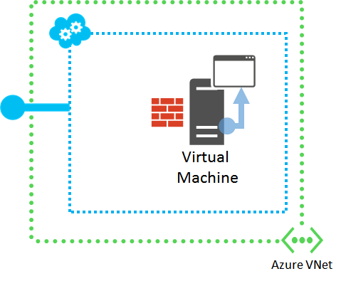

Es gibt verschiedene Gründe beginnen oder eine Verbindung mit einer Anwendung einer Azure-virtuellen Computern (virtueller Computer) ausgeführt werden kann. Gründe für die Anwendung nicht ausgeführt oder hört die erwarteten Ports, der überwachenden Port blockiert oder Netzwerke Regeln nicht ordnungsgemäß Übergabe Verkehr zur Anwendung. Dieser Artikel beschreibt einen systematische Ansatz zum Suchen und das Problem zu beheben.

Wenn beim Herstellen einer Verbindung mit Ihrem virtuellen Computer mit RDP oder SSH Probleme auftreten, lesen Sie den folgenden Artikeln zuerst:

 - [Behandeln von Problemen mit Remote Desktop-Verbindungen zu einem Windows-basierten Azure virtuellen Computern](../articles/virtual-machines/virtual-machines-windows-troubleshoot-rdp-connection.md)
 - [Behandeln von Problemen mit Secure Shell (SSH) Verbindungen mit einer Linux-basierten Azure-virtuellen Computern](../articles/virtual-machines/virtual-machines-linux-troubleshoot-ssh-connection.md).

> [AZURE.NOTE] Azure weist zwei verschiedenen Bereitstellungsmodelle für das Erstellen und Arbeiten mit Ressourcen: [Ressourcenmanager und Classic](../articles/resource-manager-deployment-model.md). Dieser Artikel behandelt das beide Modelle verwenden, jedoch wird empfohlen, die meisten neue Bereitstellungen Ressourcenmanager Modell verwenden.

Wenn Sie an einer beliebigen Stelle in diesem Artikel weitere Hilfe benötigen, können Sie die Azure-Experten auf [der MSDN-Azure und den Stapelüberlauf Foren](https://azure.microsoft.com/support/forums/)kontaktieren. Alternativ können Sie auch einen Supportvorfall Azure ablegen. Wechseln Sie zu der [Azure support-Website](https://azure.microsoft.com/support/options/) , und wählen Sie die **Erste unterstützen**.

## Schnellstart-Endpunkt-Behandeln von Verbindungsproblemen

Wenn Probleme beim Herstellen einer Verbindung mit einer Anwendung auftreten, versuchen Sie die folgenden allgemeinen Schritte zur Problembehandlung. Versuchen Sie nach jedem Schritt Herstellen einer Verbindung mit Ihrer Anwendung erneut aus:

- Starten des virtuellen Computers
- Erstellen Sie den Endpunkt neu / firewall-Regeln / Netzwerk-Sicherheit Gruppe (NSG) Regeln
    - [Klassisch - Endpunkte Cloud Services verwalten](../articles/cloud-services/cloud-services-enable-communication-role-instances.md)
    - [Ressourcenmanager Modell - Netzwerk Sicherheitsgruppen verwalten](../articles/virtual-network/virtual-networks-create-nsg-arm-pportal.md)
- Verbinden von anderen Speicherort, beispielsweise ein anderes Azure-virtuellen-Netzwerk
- Erneutes Bereitstellen des virtuellen Computers
    - [Stellen Sie Windows virtueller Computer erneut bereit.](../articles/virtual-machines/virtual-machines-windows-redeploy-to-new-node.md)
    - [Stellen Sie erneut bereit Linux virtueller Computer](../articles/virtual-machines/virtual-machines-linux-redeploy-to-new-node.md)
- Erstellen des virtuellen Computers

Weitere Informationen finden Sie unter [Problembehandlung Endpunkt Connectivity (RDP/SSH/HTTP, Fehler usw.)](https://social.msdn.microsoft.com/Forums/azure/en-US/538a8f18-7c1f-4d6e-b81c-70c00e25c93d/troubleshooting-endpoint-connectivity-rdpsshhttp-etc-failures?forum=WAVirtualMachinesforWindows).

## Übersicht über die ausführliche zur Problembehandlung

Es gibt vier Hauptbereichen Sie den Zugriff auf eine Anwendung zu beheben, die auf einer Azure-virtuellen Computern ausgeführt wird.

1.  Die Anwendung der Azure-virtuellen Computern ausgeführt wird.
    - Wird die Anwendung selbst ordnungsgemäß ausgeführt?
2.  Der Azure-virtuellen Computern.
    - Ist der virtuellen Computer selbst, ordnungsgemäß funktioniert und Beantworten von Besprechungsanfragen?
3.  Azure Netzwerkendpunkte.
    - Cloud-Dienstendpunkte für virtuellen Computern in der Bereitstellung klassisch.
    - Netzwerk-Sicherheitsgruppen und eingehende NAT Regeln für virtuellen Computern im Modell zur Bereitstellung von Ressourcenmanager.
    - Werden Fluss von Benutzern zur virtuellen Computer/Anwendung auf die erwarteten Ports können Datenverkehr?
4.  Das Internet Kante Gerät.
    - Verhindern Firewall-Regeln an Ort Datenverkehr das parallelen richtig?

Für Clientcomputer, die die Anwendung über eine Website-zu-Standort VPN oder ExpressRoute Verbindung zugreifen, sind die wichtigsten Bereiche, die Probleme verursachen können die Anwendung und Azure-virtuellen Computern.
Gehen Sie folgendermaßen vor, um die Ursache des Problems und dessen Korrektur zu ermitteln.

## Schritt 1: Access-Anwendung vom Ziel virtueller Computer

Versuchen Sie, die Anwendung mit das entsprechende Clientprogramm den virtuellen Computer zugreifen, auf dem er ausgeführt wird. Verwenden Sie den lokalen Hostnamen, die lokale IP-Adresse oder die Loopbackadresse (127.0.0.1).

Angenommen, wenn die Anwendung auf einem Webserver befindet, öffnen Sie einen Browser des virtuellen Computers, und versuchen Sie, auf einer Webseite gehostet des virtuellen Computers zuzugreifen.

Wenn Sie die Anwendung zugreifen können, wechseln Sie zu [Schritt2](#step2).

Wenn Sie die Anwendung zugreifen können, überprüfen Sie die folgenden Einstellungen:

- Die Anwendung wird auf dem Ziel virtuellen Computer ausgeführt werden.
- Die Anwendung wird die erwarteten TCP- und UDP-Ports überwacht.

Verwenden Sie unter Windows und Linux-basierten virtuellen Maschinen den **Netstat - ein** Befehl zum Anzeigen der aktiven Ports zum empfangen. Überprüfen Sie die Ausgabe für die erwarteten Ports auf Grundlage Ihrer Anwendung aktiv sein muss. Starten Sie die Anwendung oder konfigurieren Sie ihn so verwenden Sie bei Bedarf die erwarteten Ports und versuchen Sie erneut, auf die Anwendung lokal zuzugreifen.

## Schritt 2: Access-Anwendung von einem anderen virtuellen Computer im gleichen virtuellen Netzwerk

Versuchen Sie, die Anwendung eines anderen virtuellen Computers aber in demselben virtuellen Netzwerk, mithilfe des virtuellen Computers Hostname oder seine Azure zugewiesen Public, Private oder Anbieter IP-Adresse zugreifen. Verwenden Sie für die Verwendung des Modells klassischen Bereitstellung erstellte Maschinen nicht die öffentliche IP-Adresse des Cloud-Dienst.

Angenommen, ist die Anwendung auf einem Webserver, versuchen Sie, eine Webseite in einem Browser auf einen anderen virtuellen Computer im gleichen virtuellen Netzwerk zugreifen.

Wenn Sie die Anwendung zugreifen können, wechseln Sie zu [Schritt 3](#step3).

Wenn Sie die Anwendung zugreifen können, überprüfen Sie die folgenden Einstellungen:

- Die Hostfirewall auf dem Ziel virtueller Computer ist die eingehenden Anfragen und Antwort ausgehenden Datenverkehr zulassen.
- Einen unbefugten oder Netzwerk Überwachung Software für das Ziel virtueller Computer ausgeführt wird den Datenverkehr zu ermöglichen.
- Cloud Services-Endpunkte oder Netzwerk Sicherheitsgruppen sind die Datenfluss zulässt.
    - [Klassisch - Endpunkte Cloud Services verwalten](../articles/cloud-services/cloud-services-enable-communication-role-instances.md)
    - [Ressourcenmanager Modell - Netzwerk Sicherheitsgruppen verwalten](../articles/virtual-network/virtual-networks-create-nsg-arm-pportal.md)
- Eine separate Komponente virtueller Computer und Ihre virtuellen Computer, wie etwa einen Lastenausgleich oder eine Firewall, Ihre virtuellen Computer in den Pfad zwischen des Tests ausgeführt wird der Datenfluss zulässt.

Verwenden Sie auf einem Windows-basierten virtuellen Computer Windows-Firewall mit erweiterter Sicherheit um zu bestimmen, ob die Firewallregeln Ihrer Anwendung eingehenden und ausgehenden Datenverkehr ausschließen.

## Schritt 3: Access-Anwendung von außerhalb des virtuellen Netzwerks

Versuchen Sie, die Anwendung von einem Computer außerhalb des virtuellen Netzwerks als den virtuellen Computer zugreifen, auf dem die Anwendung ausgeführt wird. Verwenden Sie ein anderes Netzwerk als dem ursprünglichen Clientcomputer.

Beispielsweise ist die Anwendung auf einem Webserver, versuchen Sie, die Webseite aus einem Browser auf einen Computer, der nicht in das virtuelle Netzwerk zugreifen.

Wenn Sie die Anwendung zugreifen können, überprüfen Sie die folgenden Einstellungen:

- Für virtuelle Computer mithilfe des Modells klassischen Bereitstellung erstellt:
    - Dass die Endpunktkonfiguration für den virtuellen Computer die eingehenden Datenfluss, insbesondere das Protokoll (TCP oder UDP) und die öffentlichen und privaten Portnummern zulässt.
    - Dass Access Control Lists (ACLs) für den Endpunkt nicht eingehenden Datenverkehr aus dem Internet verhindern.
    - Weitere Informationen finden Sie unter [So Festlegen von Endpunkte eines virtuellen Computers](../articles/virtual-machines/virtual-machines-windows-classic-setup-endpoints.md).

- Für virtuelle Computer mit dem Modell zur Bereitstellung von Ressourcenmanager erstellt:
    - Dass die eingehende NAT-Konfiguration für die Regel für den virtuellen Computer die eingehenden Datenfluss, insbesondere das Protokoll (TCP oder UDP) und die öffentlichen und privaten Portnummern zulässt.
    - Das Netzwerk Sicherheitsgruppen die eingehenden Anfragen und ausgehenden Antworten Datenverkehr erteilen sind.
    - Weitere Informationen finden Sie unter [was eine Netzwerk Sicherheit Gruppe (NSG) ist?](../articles/virtual-network/virtual-networks-nsg.md)

Wenn virtuellen Computers oder der Endpunkt ein Mitglied einer Gruppe mit Lastenausgleich ist:

- Stellen Sie sicher, dass der Prüfpunkt-Protokoll (TCP oder UDP) und den Port-Nummer richtig sind.
- Wenn die Prüfpunkt-Protokoll und den Port unterscheidet sich von der vorgegebenen Lastenausgleich Protokoll und den Port:
    - Stellen Sie sicher, dass die Anwendung auf der Prüfpunkt-Protokoll (TCP oder UDP) und den Port-Nummer überwacht wird ( **Netstat – einer** für das Ziel verwenden virtueller Computer).
    - Die Hostfirewall auf dem Ziel virtueller Computer ist die eingehenden Prüfpunkt Anforderung und die ausgehende durchsuchten Antwort Datenverkehr zulassen.

Wenn Sie die Anwendung zugreifen können, stellen Sie sicher, dass Ihr Internet Kante Gerät zugelassen wird:

- Der Anwendung ausgehende Anforderung Datenverkehr aus dem Clientcomputer zu Azure-virtuellen Computern.
- Die Anwendung eingehende Antwort Datenverkehr aus der Azure-virtuellen Computern.

## Zusätzliche Ressourcen

[Behandeln von Problemen mit Remote Desktop-Verbindungen zu einem Windows-basierten Azure virtuellen Computern](../articles/virtual-machines/virtual-machines-windows-troubleshoot-rdp-connection.md)

[Behandeln von Problemen mit Secure Shell (SSH) Verbindungen mit einer Linux-basierten Azure-virtuellen Computern](../articles/virtual-machines/virtual-machines-linux-troubleshoot-ssh-connection.md)
