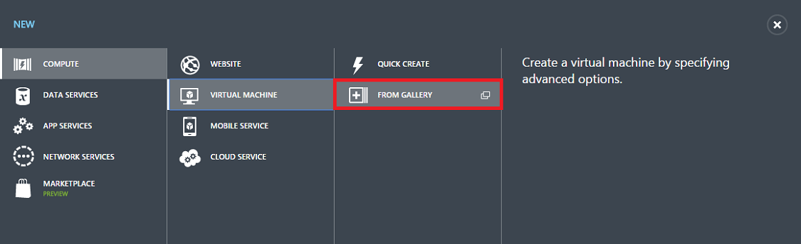
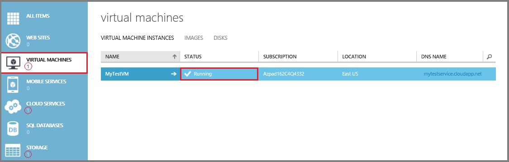

1. Melden Sie sich mit dem [klassischen Portal](http://manage.windowsazure.com)aus. 

2. Klicken Sie auf der Befehlsleiste am unteren Rand des Fensters auf **neu**.

3. Klicken Sie unter **zu berechnen**klicken Sie auf **virtuellen Computern**, und klicken Sie dann auf **Aus Galerie**.

    

4. Im erste Bildschirm innerhalb der folgenden können Sie für den virtuellen Computer aus der Liste der verfügbaren Bilder **Wählen Sie ein Bild aus** . Können Sie ein Bild aus dem Katalog auswählen oder auswählen von Bildern und Datenträger, die Sie hochgeladen haben. Die verfügbaren Bilder können je nach Abonnement unterscheiden, die Sie verwenden.

5. Im zweiten Fenster können Sie einen Computernamen, der Größe und der administrativen Benutzernamen und ein Kennwort auswählen. Verwenden Sie die Ebene und die Größe, die zum Ausführen Ihrer app oder Arbeitsbelastung an. Hier sind einige Tipps:

    - **Name des virtuellen Computers** kann nur Buchstaben, Zahlen und Bindestriche enthalten. Sie müssen auch mit einem Buchstaben beginnen und enden mit einem Buchstaben oder einer Zahl zurück.
    - **Neuer Benutzername** bezieht sich auf das Administratorkonto, die Sie mit den Server zu verwalten. Das Kennwort muss 8-123 Zeichen lang sein und mindestens drei der folgenden haben: Kleinbuchstaben, Großbuchstaben, Zahl und ein Sonderzeichen. **Sie benötigen den Benutzernamen und Ihr Kennwort ein, um eine Verbindung aus, und melden Sie sich bei der virtuellen Computern**.
    - Größe des virtuellen Computers wirkt sich auf die Kosten der Verwendung, sowie Konfigurationsoptionen wie wie viele Daten Datenträger Sie anfügen können. Details finden Sie unter [Größe für virtuelle Computer](virtual-machines-windows-sizes.md).

6. Der dritte Bildschirm können Sie Ressourcen für Netzwerke, Speicher und Verfügbarkeit zu konfigurieren. Hier sind einige Tipps:

    - Der **Cloud Service DNS-Name** ist der globalen DNS-Name, die Teil des URIS wird, mit dem des virtuellen Computers wenden Sie sich an. Sie müssen mit Ihren eigenen Name der Cloud-Dienst stammen, da es in Azure eindeutig sein muss. Cloud-Dienste, die für Szenarien mit [mehreren virtuellen Computern](virtual-machines-windows-classic-connect-vms.md)wichtig sind.

    - Verwenden Sie für **Region/Zugehörigkeit Gruppe/virtuellen Netzwerk**einen Bereich, der in Ihrem Verzeichnis auf geeignet ist. Sie können auch auswählen, um ein virtuelles Netzwerk stattdessen anzugeben.

    - Wenn Sie eine virtuellen Computern ein virtuelles Netzwerk verwenden möchten, angeben **müssen** Sie das virtuelle Netzwerk, beim Erstellen des virtuellen Computers. Sie können nicht mit einem virtuellen Netzwerk des virtuellen Computers teilnehmen, nachdem Sie den virtuellen Computer erstellt haben. Weitere Informationen finden Sie unter [Azure virtuelle Network (Übersicht)](virtual-networks-overview.md).
    
    - Ausführliche Informationen zum Konfigurieren von Endpunkten finden Sie unter [Festlegen von Endpunkte eines virtuellen Computers](virtual-machines-windows-classic-setup-endpoints.md).

7. Der vierte Konfigurationsbildschirm können Sie der Agent virtuellen Computer installieren und konfigurieren einige der verfügbaren Erweiterungen.

    >[AZURE.NOTE] Der virtueller Computer-Agent bietet die Umgebung für Erweiterungen, die Ihnen helfen, die interagieren oder Verwalten des virtuellen Computers zu installieren. Details finden Sie unter [zu virtueller Computer-Agents und Erweiterungen](virtual-machines-windows-classic-agents-and-extensions.md).  

8. Nach der Erstellung des virtuellen Computers Listet das klassische Portal der neuen virtuellen Computern unter **virtuellen Computern**an. Das zugehörige Cloud-Dienst und Speicher Konto auch erstellt werden und werden in den Abschnitten aufgeführt. Sowohl die virtuellen Computern und Cloud-Dienst werden automatisch gestartet, und deren Status als **ausgeführt**aufgeführt ist.

    
