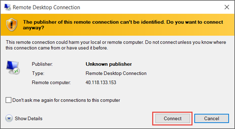

<properties services="virtual-machines" title="How to Log on to a Virtual Machine Running Windows Server" authors="cynthn" solutions="" manager="timlt" editor="tysonn" />

4. Durch Klicken auf **Verbinden** erstellt und downloads eine Remote Desktop Protocol-Datei (RDP-Datei). Klicken Sie auf **Öffnen** , wenn Sie diese Datei verwenden.

5. Sie erhalten eine Warnung, die die RDP von einem unbekannten Herausgeber stammt. Dies ist normal. Klicken Sie auf **Verbinden** , um den Vorgang fortzusetzen, klicken Sie im Fenster Remotedesktop.

    

6. Klicken Sie im **Windows-Sicherheit** Geben Sie die Anmeldeinformationen für ein Konto des virtuellen Computers ein, und klicken Sie dann auf **OK**.

    **Lokales Konto** – Dies ist normalerweise der lokalen Benutzernamen und das Kennwort, dass Sie beim Erstellen des virtuellen Computers angegeben. In diesem Fall die Domäne ist der Name des virtuellen Computers, und es wird als *Vmname*& #92 eingegeben; *Benutzername*.  
    
    **Domäne virtueller Computer beigetreten** - Wenn Sie der virtuellen Computer zu einer Domäne gehört, geben Sie den Benutzernamen in das Format *Domäne*& #92; *Benutzername*. Das Konto muss auch entweder Berechtigungen erteilt worden remote-Zugriff auf den virtuellen Computer oder in der Gruppe Administratoren werden.
    
    **Domain Controller** – ist der virtuellen Computer eine Domänencontroller, geben Sie den Benutzernamen und das Kennwort für ein Domänenadministratorkonto für diese Domäne.

7.  Klicken Sie auf **Ja** zum Überprüfen der Identität des virtuellen Computers und Fertig stellen auf Protokollierung.

    
