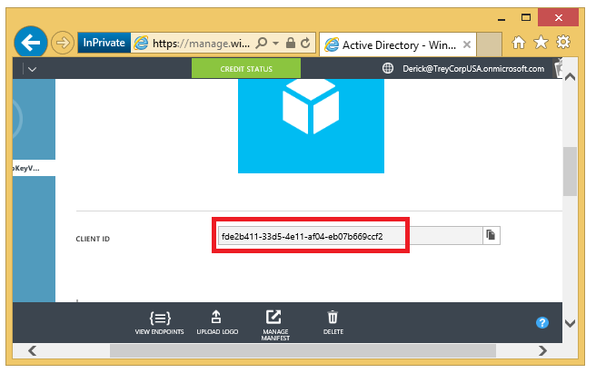

## Bereiten für AKV-Integration vor
Um Azure-Taste Tresor Integration mithilfe der SQL Server virtueller Computer konfigurieren, gibt es mehrere erforderliche Komponenten: 

1.  [Installieren von Azure Powershell](#install-azure-powershell)
2.  [Erstellen einer Azure-Active Directory](#create-an-azure-active-directory)
3.  [Erstellen eines Key Tresor](#create-a-key-vault)

Den folgenden Abschnitten werden diese erforderlichen Komponenten und die Informationen, die Sie sammeln, wenn Sie später die PowerShell-Cmdlets ausführen müssen.

### Installieren von Azure PowerShell
Stellen Sie sicher, dass Sie die neuesten Azure PowerShell SDK installiert haben. Weitere Informationen finden Sie unter [Informationen zum Installieren und konfigurieren Azure PowerShell](../articles/powershell-install-configure.md).

### Erstellen einer Azure-Active Directory
Zuerst müssen Sie eine [Azure Active Directory](https://azure.microsoft.com/trial/get-started-active-directory/) (AAD) in Ihrem Abonnement haben. Zwischen viele Vorteile können Sie zu den wichtigsten Tresor für bestimmte Benutzer und Applikationen erteilt.

Als Nächstes AAD registrieren Sie Anwendung. Dadurch erhalten ein Konto Dienst Tilgungsanteile Sie, die Ihre virtuellen Computer benötigen Zugriff auf Ihre Key Tresor verfügt. Im Artikel Azure-Taste Tresor Schritte finden Sie im Abschnitt [Registrieren einer Anwendung mit Azure Active Directory](../articles/key-vault/key-vault-get-started.md#register) oder können Sie Informationen zu den Schritten mit Screenshots in **erhalten Sie eine Identität für den Anwendungsabschnitt** von [diesem Blogbeitrag](http://blogs.technet.com/b/kv/archive/2015/01/09/azure-key-vault-step-by-step.aspx). Beachten Sie bevor Sie diese Schritte ausgeführt haben, dass Sie die folgende Informationen während dieser Erfassung zu erfassen, die später erforderlich ist, wenn Sie auf Ihrer VM SQL Azure-Taste Tresor Integration aktivieren müssen.

- Nach die Anwendung hinzugefügt wurde, finden Sie die **CLIENT-ID** , klicken Sie auf die Registerkarte **Konfigurieren** . 
    
    
    Die Client-ID wird später den Parameter **$spName** (Service Tilgungsanteile Name) in der PowerShell-Skript zum zugewiesen Azure-Taste Tresor Integration aktivieren. 
- Beim Ausführen dieser Schritte bei der Erstellung des Keys, kopieren Sie außerdem den Schlüssel für den Key wie im folgenden Screenshot angezeigt wird. Diese Schlüssel geheim wird später den Parameter **$spSecret** (Service Tilgungsanteile geheim) in der PowerShell-Skript zugewiesen.  
    
- Sie müssen diese neue Client-ID, dass die folgenden Zugriffsberechtigungen autorisieren: **Verschlüsseln**, **Entschlüsseln**, **WrapKey**, **UnwrapKey**, **Melden Sie sich**, und **Überprüfen**. Dies geschieht mit das Cmdlet " [Set-AzureRmKeyVaultAccessPolicy](https://msdn.microsoft.com/library/azure/mt603625.aspx) ". Weitere Informationen finden Sie unter [Autorisieren die Anwendung die Taste oder geheim verwenden](../articles/key-vault/key-vault-get-started.md#authorize).

### Erstellen eines Key Tresor
Azure-Taste Tresor verwenden, um die Tasten zu speichern, die Sie für die Verschlüsselung der virtuellen Computer verwendet werden, benötigen Sie Zugriff auf eine wichtige Tresor. Wenn Sie den Key Tresor noch nicht eingerichtet haben, erstellen Sie anhand der Schritte im Thema [Überfordert fühlen Azure Schlüssel Tresor](../articles/key-vault/key-vault-get-started.md) . Beachten Sie bevor Sie diese Schritte ausgeführt haben, dass einige Informationen, die Sie während dieser einrichten, sammeln müssen später erforderlich ist, wenn Sie auf Ihrer VM SQL Azure-Taste Tresor Integration aktiveren vorhanden ist.

Wenn Sie zum Erstellen ein Schritts Key Tresor gelangen, beachten Sie die zurückgegebenen **VaultUri** -Eigenschaft, die wichtigsten Tresor URL. In das Beispiel in diesem Schritt abgebildet, die wichtigsten Tresor heißt ContosoKeyVault, daher wäre die wichtigsten Tresor URL https://contosokeyvault.vault.azure.net/.

    New-AzureRmKeyVault -VaultName 'ContosoKeyVault' -ResourceGroupName 'ContosoResourceGroup' -Location 'East Asia'

Die wichtigsten Tresor URL ist später auf den Parameter **$akvURL** in der PowerShell-Skript zugeordnet Azure-Taste Tresor Integration aktivieren.
