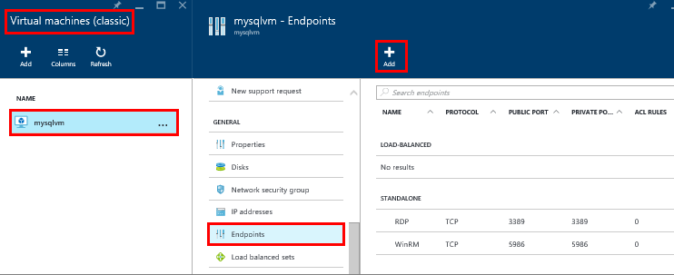

### Erstellen Sie einen TCP-Endpunkt des virtuellen Computers

Für den Zugriff auf SQL Server aus dem Internet müssen des virtuellen Computers einen Endpunkt für eingehende TCP-Kommunikation anhören. Dieser Konfigurationsschritt Azure weist eingehenden Verkehr auf TCP Port um einen TCP-, die den virtuellen Computer zugegriffen werden kann.

>[AZURE.NOTE] Wenn Sie innerhalb der gleichen Cloud-Dienst oder virtuelles Netzwerk verbunden sind, müssen Sie keinen öffentlich zugängliche Endpunkt zu erstellen. In diesem Fall könnten Sie mit dem nächsten Schritt fortfahren. Weitere Informationen finden Sie unter [Verbindungsszenarien](../articles/virtual-machines/virtual-machines-windows-classic-sql-connect.md#connection-scenarios).

1. Wählen Sie auf das Portal Azure **virtuellen Computern (klassische)**ein.

2. Wählen Sie dann SQL Server-virtuellen Computern aus.

3. Wählen Sie **Endpunkte**aus, und klicken Sie dann auf die Schaltfläche **Hinzufügen** am oberen Rand der Blade Endpunkte.

    

4. Klicken Sie auf das **Hinzufügen Endpunkt** Blade bieten Sie einen **Namen** ein, beispielsweise SQLEndpoint aus.

5. Wählen Sie für das **Protokoll** **TCP** aus.

6. Geben Sie für **Öffentliche Port**eine Port-Nummer, z. B. **57500**ein.

7. Geben Sie für **Private Port**SQL Server überwachenden Port, die standardmäßig **1433**verfügt.

6. Klicken Sie auf **Ok,** um den Endpunkt zu erstellen.
