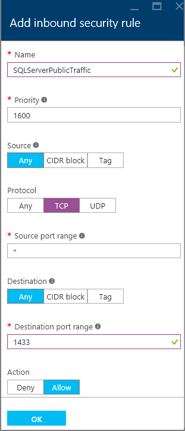

### Konfigurieren einer Sicherheitsgruppe Netzwerk eingehenden Regel für den virtuellen Computer

Wenn die Verbindung zu SQL Server über das Internet hergestellt werden soll, müssen Sie eine eingehende Regel auf der Netzwerk-Sicherheitsgruppe für den Port zu konfigurieren, die überwacht Ihrer SQL Server-Instanz aus. Dies ist standardmäßig TCP-Port 1433.

1. Klicken Sie im Portal wählen Sie **virtuellen Computern**, und wählen Sie dann Ihre SQL Server virtueller Computer.

3. Wählen Sie dann die **Nework Schnittstellen**.

    

4. Wählen Sie dann die Netzwerk-Benutzeroberfläche für Ihre virtuellen Computer an.

4. Klicken Sie auf den Link **Network-Sicherheitsgruppe** .

    

6. Erweitern Sie in den Eigenschaften der Sicherheitsgruppe Netzwerk **eingehende Sicherheitsregeln**aus.

5. Klicken Sie auf die Schaltfläche **Hinzufügen** .

6. Bereitstellen eines **namens** "SQLServerPublicTraffic".

7. Ändern Sie **Protokoll** **TCP**.

8. Geben Sie einen **Port Zielbereich** 1433 (oder den Port, dem SQL Server-Instanz überwacht) ein.

9. Stellen Sie sicher, dass die **Aktion** auf **Zulassen**festgelegt ist. Der Regel Sicherheitsdialog sollte ähnlich wie der folgende Screenshot aussehen.

    

9. Klicken Sie auf **OK** , um die Regel für Ihre virtuellen Computer zu speichern.

>[AZURE.NOTE] Es ist möglich, dass eine zweite Netzwerk-Sicherheitsgruppe Ihrem Subnetz gehören (Dies ist von der Netzwerk-Sicherheitsgruppe des virtuellen Computers getrennt) zugeordnet. Dies ist standardmäßig nicht für Sie möglich. Wenn Sie eine Netzwerksicherheitsgruppe in Ihrem Subnetz erstellt, Sie jedoch müssen öffnen Port 1433 auf des Subnetzes des und des virtuellen Computers Netzwerk-Sicherheitsgruppe. 
