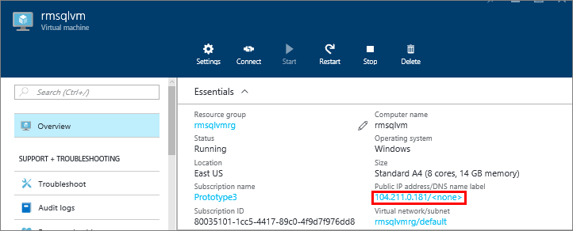
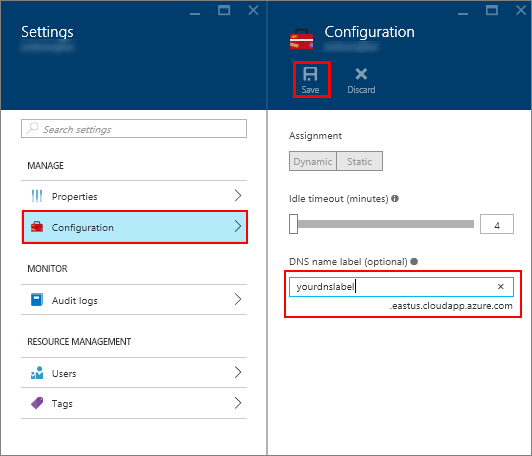
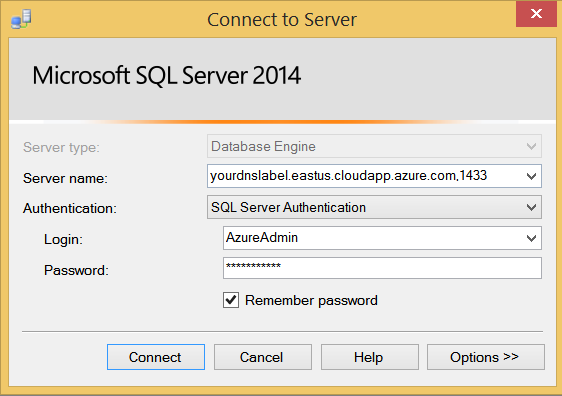

### Konfigurieren eines DNS-Bezeichnung für die öffentliche IP-Adresse

Um mit der SQL Server-Datenbank-Engine aus dem Internet verbinden möchten, müssen Sie zuerst konfigurieren Sie eine Bezeichnung DNS für Ihre öffentliche IP-Adresse.

> [AZURE.NOTE] DNS-Etiketten sind nicht erforderlich, wenn Sie nur mit SQL Server-Instanz innerhalb der gleichen virtuellen Netzwerk oder nur lokal verbinden möchten.

Wählen Sie zum Erstellen einer Bezeichnung DNS- **virtuellen Computern** zuerst im Portal aus. Wählen Sie aus der SQL Server virtueller Computer, um dessen Eigenschaften zu öffnen.

1. Wählen Sie das Blade virtuellen Computers Ihrer **öffentliche IP-Adresse.**

    

2. Erweitern Sie in den Eigenschaften für Ihre öffentliche IP-Adresse **Konfiguration**aus.

3. Geben Sie einen Namen für die DNS-Bezeichnung. Dieser Name wird eines A-Datensatzes, die verwendet werden können die Verbindung zu Ihrer SQL Server virtueller Computer anhand des Namens statt der IP-Adresse direkt an.

4. Klicken Sie auf die Schaltfläche **Speichern** .

    

### Verbinden Sie mit der Datenbank-Engine von einem anderen computer

1. Öffnen Sie auf einem Computer mit dem Internet verbunden ist SQL Server Management Studio (SSMS) ein.

2. Das Dialogfeld **mit Server verbinden** oder **Verbinden mit Datenbank-Engine** bearbeiten Sie den Wert für **Servername angezeigt** . Geben Sie den vollständigen DNS-Namen des virtuellen Computers (festgelegt in den vorherigen Vorgang) aus.

3. Wählen Sie im Feld **Authentifizierung** **SQL Server-Authentifizierung**ein.

5. Geben Sie im Feld **Benutzername** den Namen für einen gültigen SQL-Benutzernamen ein.

6. Geben Sie im Feld **Kennwort** das Kennwort des Benutzernamens ein.

7. Klicken Sie auf **Verbinden**.

    
