### Öffnen Sie TCP-in die Windows-Firewall für die standardmäßige Instanz der Datenbank-Engine

1. Verbinden Sie mit dem virtuellen Computer mit dem Remotedesktop. Detaillierte Informationen zum Herstellen einer Verbindung mit dem virtuellen Computer finden Sie unter [Öffnen eines SQL virtuellen Computers mit Remotedesktop](virtual-machines-windows-portal-sql-server-provision.md#open-the-vm-with-remote-desktop).

1. Nach der Anmeldung, bei dem Startbildschirm **WF.msc**Geben Sie ein, und drücken Sie dann die EINGABETASTE.

    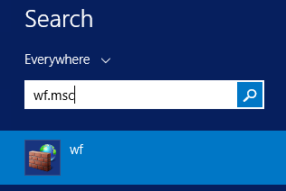

2. In der **Windows-Firewall mit erweiterter Sicherheit**, im linken Bereich mit der rechten Maustaste **Eingehende Regeln**, und klicken Sie dann im Aktivitätsbereich auf **Neue Regel** .

    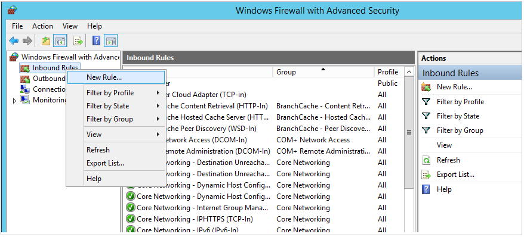

3. Klicken Sie im Dialogfeld **Neue eingehende Regel-Assistenten** unter **Regeltyp**wählen Sie **Port**aus, und klicken Sie dann auf **Weiter**.

4. Verwenden Sie im Dialogfeld **Protokoll und Ports** die Standardeinstellung **TCP**aus. Geben Sie dann im Feld **bestimmte lokale Ports** die Port-Nummer der Instanz der Datenbank-Engine (**1433** für die Standardinstanz) oder Ihrer Wahl für den privaten Port Endpunkt Schritt.

    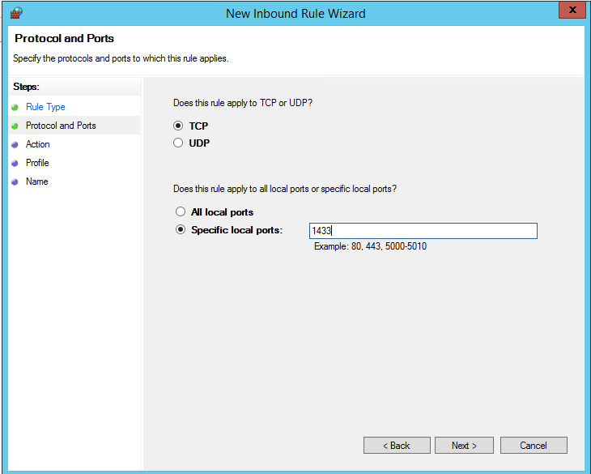

5. Klicken Sie auf **Weiter**.

6. Klicken Sie im Dialogfeld **Aktion** wählen Sie **Zulassen die Verbindung**aus, und klicken Sie dann auf **Weiter**.

    **Sicherheitshinweis:** Auswählen der **Verbindung zulassen, wenn sie sicher ist** , kann zusätzliche Sicherheit bieten. Wählen Sie diese Option, wenn Sie weitere Sicherheitsoptionen in Ihrer Umgebung konfigurieren möchten.

    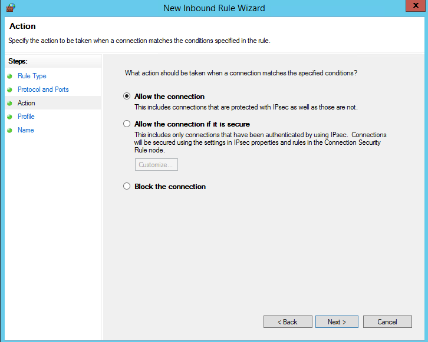

7. Wählen Sie im Dialogfeld **Profil** **öffentlich**, **Privat**oder **Domäne**ein. Klicken Sie dann auf **Weiter**.

    **Sicherheitshinweis:**  Auswählen von **öffentlichen** ermöglicht Zugriff über das Internet. Wann immer möglich, wählen Sie ein restriktiverem Profil ein.

    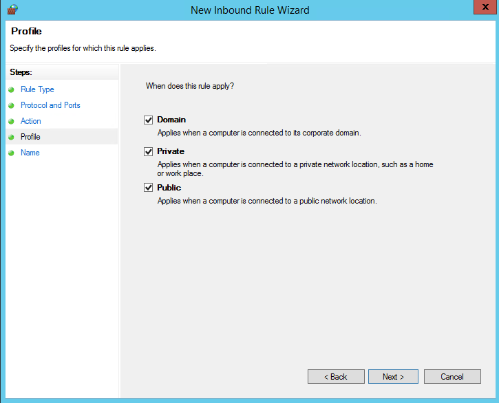

8. Klicken Sie im Dialogfeld **Name** Geben Sie einen Namen und eine Beschreibung für diese Regel ein, und klicken Sie dann auf **Fertig stellen**.

    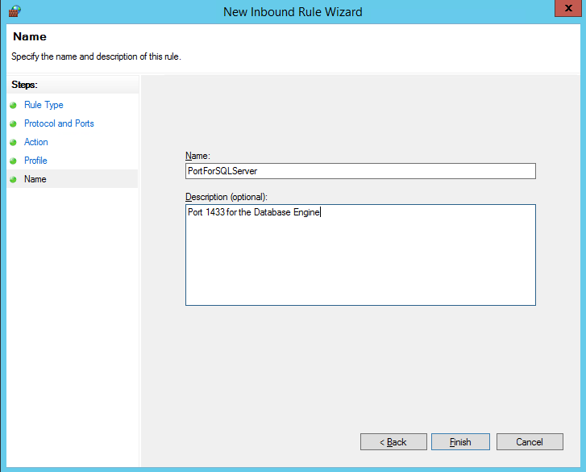

Öffnen Sie zusätzliche Ports für andere unsichere Komponenten, je nach Bedarf. Weitere Informationen finden Sie unter [Konfigurieren der Windows-Firewall für SQL Server-Zugriff](http://msdn.microsoft.com/library/cc646023.aspx).

### Konfigurieren von SQL Server, um das TCP-Protokoll Abhören

1. Während der Verbindung mit den virtuellen Computern, auf der Startseite, geben Sie die **SQL Server-Konfigurations-Manager** , und drücken Sie die EINGABETASTE.

    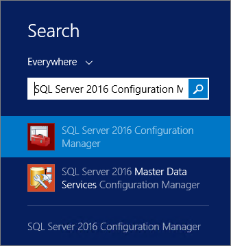

2. Erweitern Sie in SQL Server-Konfigurations-Manager, im Bereich Konsole **SQL Server-Netzwerkkonfiguration**aus.

3. Klicken Sie im Bereich Konsole auf **Protokolle für MSSQLSERVER** (He Instanz Standardnamen). Mit der rechten Maustaste **TCP** des Detailbereichs und klicken Sie auf **Aktivieren** , falls es noch nicht aktiviert ist.

    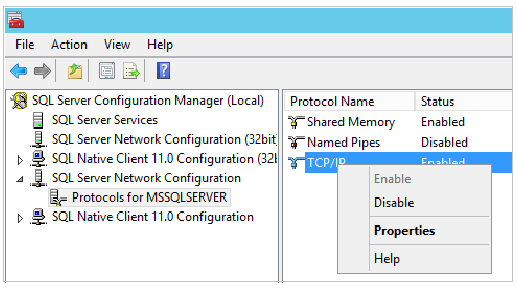

5. Klicken Sie im Bereich Konsole auf **SQL Server-Dienste**. Im Bereich Details mit der rechten Maustaste in **SQL Server (_Instanznamen_)** (die Standardinstanz ist **SQL Server (MSSQLSERVER)**), und klicken Sie dann auf **neu starten**, um beenden, und starten die Instanz von SQL Server.

    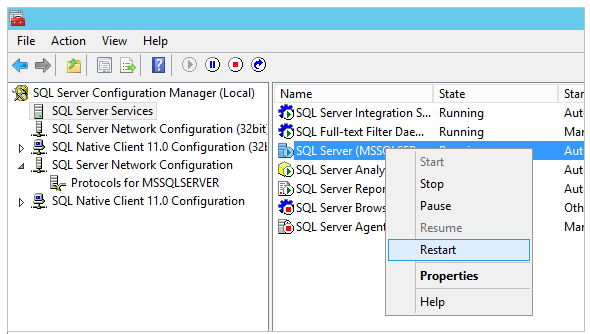

7. Schließen Sie den SQL Server-Konfigurations-Manager.

Weitere Informationen zum Aktivieren von Protokolle für die SQL Server-Datenbank-Engine finden Sie unter [Aktivieren oder deaktivieren Sie ein Netzwerk-Server-Protokoll](http://msdn.microsoft.com/library/ms191294.aspx).

### Konfigurieren von SQL Server für gemischten Authentifizierungsmodus

Die SQL Server-Datenbank-Engine können keine Windows-Authentifizierung ohne Domäne-Umgebung verwenden. Konfigurieren von SQL Server für gemischten Authentifizierungsmodus zum Verbinden mit der Datenbank-Engine von einem anderen Computer. Gemischten Authentifizierungsmodus kann sowohl SQL Server-Authentifizierung und Windows-Authentifizierung.

>[AZURE.NOTE] Konfigurieren von gemischten Authentifizierungsmodus ist möglicherweise nicht erforderlich, wenn Sie ein Azure-virtuellen Netzwerk mit einer Umgebung konfigurierten Domänen konfiguriert haben.

1. Während der Verbindung mit den virtuellen Computern, auf der Startseite, geben Sie **SQL Server Management Studio** , und klicken Sie auf das ausgewählte Symbol.

    Zum ersten Mal öffnen von Management Studio müssen sie die Benutzer Management Studio-Umgebung zu erstellen. Dies kann einige Minuten dauern.

2. Management Studio zeigt das Dialogfeld **mit Server verbinden** . Geben Sie im Feld **Servername** den Namen des virtuellen Computers in Verbindung mit der Datenbank-Engine mit Objekt-Explorer (anstelle der Name des virtuellen Computers können Sie auch **(lokal)** oder ein Punkt als **Servername**). Wählen Sie die **Windows-Authentifizierung**, und lassen Sie ** _Your_VM_name_\your_local_administrator** in das Feld **Benutzername** ein. Klicken Sie auf **Verbinden**.

    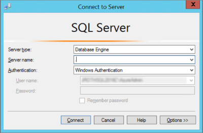

3. In SQL Server Management Studio Objekt-Explorer mit der rechten Maustaste in des Namens der Instanz von SQL Server (der Name des virtuellen Computers) aus, und klicken Sie dann auf **Eigenschaften**.

    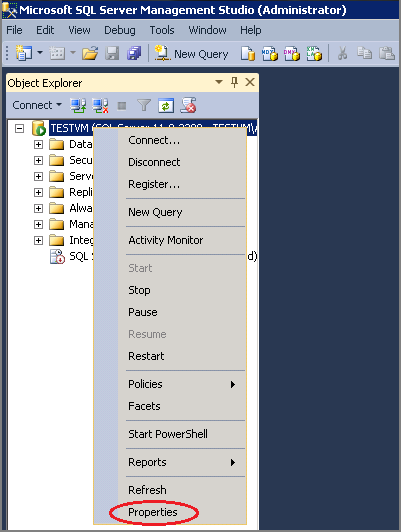

4. Wählen Sie auf der Seite **Sicherheit** unter **Serverauthentifizierung** **SQL Server und Windows-Authentifizierungsmodus**aus, und klicken Sie dann auf **OK**.

    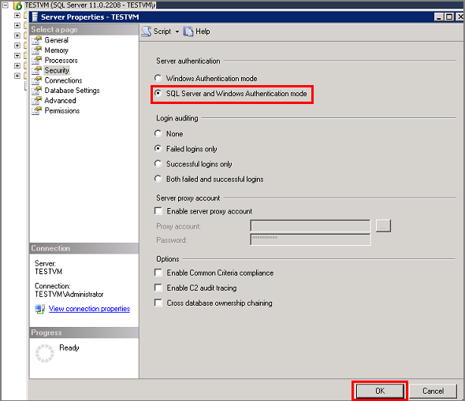

5. Klicken Sie im Dialogfeld SQL Server Management Studio klicken Sie auf **OK** , um die Anforderung zum Neustart von SQL Server zu bestätigen.

6. Im Objekt-Explorer mit der rechten Maustaste in des Servers, und klicken Sie dann auf **neu starten**. (Wenn SQL Server-Agent ausgeführt wird, müssen sie auch gestartet.)

    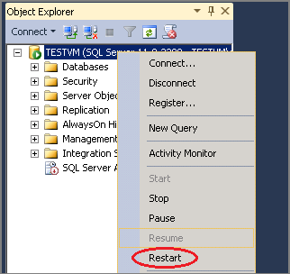

7. Klicken Sie auf **Ja** , um zu bestätigen, dass Sie SQL Server neu starten möchten, klicken Sie im Dialogfeld SQL Server Management Studio.

### Erstellen von SQL Server-Authentifizierung Benutzernamen

Zum Verbinden mit der Datenbank-Engine von einem anderen Computer müssen Sie mindestens eine SQL Server-Authentifizierung Login erstellen.

1. Erweitern Sie in SQL Server Management Studio Objekt-Explorer den Ordner, der die Server-Instanz, in der Sie den neuen Benutzernamen erstellen möchten.

2. Mit der rechten Maustaste in des Ordners **Sicherheit** , zeigen Sie auf **neu**, und wählen Sie **Login...**aus.

    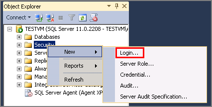

3. Geben Sie in das Dialogfeld **Anmeldung - neu** , klicken Sie auf der Seite " **Allgemein** " den Namen des neuen Benutzers in das Feld **Login Name** ein.

4. Wählen Sie **SQL Server-Authentifizierung**aus.

5. Geben Sie in das Feld **Kennwort** ein Kennwort für den neuen Benutzer ein. Geben Sie das Kennwort erneut in das Feld **Kennwort bestätigen** ein.

6. Wählen Sie die Durchsetzung Kennwortoptionen erforderlich (**Kennwortrichtlinien erzwingen**, **Erzwingen des Kennwortablaufs**und **Benutzer muss Kennwort bei der nächsten Anmeldung ändern**). Wenn Sie diese Anmeldung für sich selbst verwenden, müssen Sie nicht zu eine Änderung des Kennworts bei der nächsten Anmeldung erforderlich.

9. Wählen Sie aus der Liste **Standard-Datenbank** aus einer Standarddatenbank für die Anmeldung. **Master** -Datenbank das Standardformat für diese Option ist. Wenn Sie eine Benutzerdatenbank noch nicht erstellt haben, behalten Sie die **Gestaltungsvorlage**.

    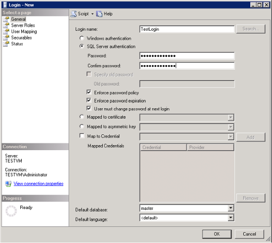

11. Ist dies das erste Login zu erstellende, möchten Sie möglicherweise diese Anmeldung als Administrator SQL Server zu bestimmen. Ist dies der Fall ist, aktivieren Sie auf der Seite **Serverrollen** **Sysadmin**ein.

    >[AZURE.NOTE] Mitglieder der festen Rolle Sysadmin haben vollständige Kontrolle über die Datenbank-Engine. Sie sollten die Mitgliedschaft in diese Rolle sorgfältig beschränken.

    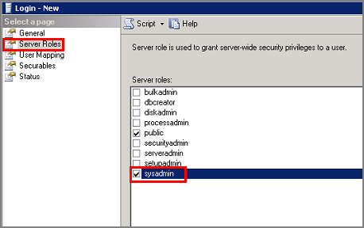

12. Klicken Sie auf OK.

Weitere Informationen zu SQL Server-Benutzernamen finden Sie unter [Erstellen einer Login](http://msdn.microsoft.com/library/aa337562.aspx).
