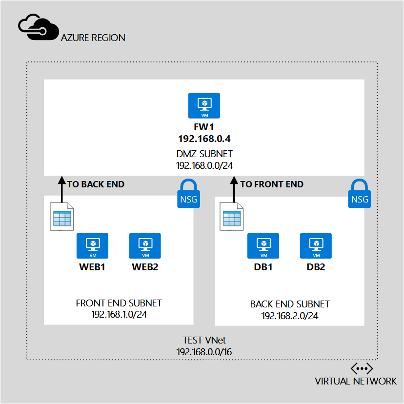

## Szenario

Um zum Erstellen UDRs besser zu veranschaulichen, wird dieses Dokument folgenden Szenario verwenden.

In diesem Szenario erstellen eine UDR für die *Front-End Subnetz* und einem anderen UDR für die *Back-End-Subnetz* , Sie wie nachstehend beschrieben: 

- **UDR-Front-End**. Der front-End-UDR mit dem *Front-End* -Subnetz angewendet werden, und eine Routing enthalten:  
    - **RouteToBackend**. Diese Routing sendet gesamten Verkehr auf dem Back-End Subnetz **FW1** virtuellen Computers.
- **UDR-Back-End**. Die Back-End-UDR mit dem *Back-End-* Subnetz angewendet werden, und eine Routing enthalten: 
    - **RouteToFrontend**. Diese Routing sendet gesamten Verkehr auf dem front-End Subnetz **FW1** virtuellen Computers.

Die Kombination dieser leitet wird Stellen Sie sicher, dass alle Datenverkehr aus einem Subnetz in ein anderes **FW1** virtuellen Computer weitergeleitet werden als eine virtuelle Einheit dient. Sie müssen außerdem aktivieren IP-Weiterleitung für diesen virtuellen Computer, um sicherzustellen, dass er anderen virtuellen Computern Datenverkehr empfangen kann.
